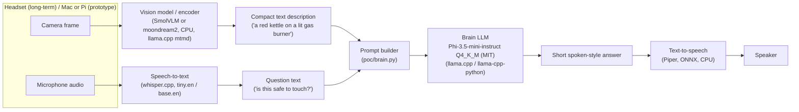

# 2. Vision-aware architecture

The design goal here is **"possible and sane," not "fast."** The vision
step can be slow (seconds), lossy, and run occasionally (only when the user
actually asks a question), because the brain LLM only ever needs a compact
**text description** of what the camera saw — not a live video feed, not
raw embeddings the LLM was never trained to consume.

## Why text, not raw embeddings, into the brain LLM

Phi-3.5-mini-instruct (like Qwen2.5-1.5B and every other candidate in
`docs/01-model-choice.md`) is a **text-only** model — it has no vision
tower and can't consume arbitrary image embeddings. Two realistic ways to
bridge vision → this brain:

1. **Caption/describe, then hand off text** (recommended). A small
   vision-language model (VLM) looks at the frame and produces a short
   natural-language description ("a stovetop with a pot boiling, the burner
   knob is turned to high, steam is visible"). That string is inserted into
   the same prompt template the brain already expects. This is what the PoC
   in `poc/` is built around, and it's the only approach that works with an
   off-the-shelf, text-only instruct LLM.
2. **Swap the whole stack for a single end-to-end VLM later** (optional,
   future work). Some vision-language models (Gemma 3, Qwen2-VL, SmolVLM2)
   can take image + text question directly and answer in one pass, skipping
   a separate "brain" LLM entirely. This is worth revisiting once you've
   validated the two-stage pipeline, but it means re-doing the safety/prompt
   tuning work against a different model family, so it's explicitly *not*
   the near-term plan.

## Pipeline sketch



Concretely, on the target hardware:

1. **Camera frame** — on the headset this is a Pi Camera Module (CSI) or
   USB camera; captured via `libcamera`/`picamera2` on Raspberry Pi OS. On
   the Mac prototype, any webcam frame or a static test image works
   identically since the vision model only cares about the image bytes.
2. **Vision model/encoder** — runs locally, produces a short text caption or
   answer-to-a-fixed-question ("describe what's in this image in one
   sentence"). This is the piece you'll prototype on the Mac first (fast
   iteration, Apple Silicon has plenty of headroom for a <1B-2B VLM), then
   port to the Pi 5 CPU build of the same `llama.cpp` toolchain.
3. **Text description** — a single string, capped at roughly 1–2 sentences
   (~30–60 tokens) so it doesn't eat the brain LLM's limited context budget
   on a memory-constrained Pi.
4. **Prompt builder** — combines the vision description + the transcribed
   question into the exact user-message template used in `poc/brain.py`
   (see `docs/03-mac-poc.md`). This is the seam that makes the brain LLM
   swappable and the vision model swappable independently.
5. **Brain LLM** — unchanged from part 1: Phi-3.5-mini-instruct Q4_K_M (MIT).
6. **TTS** — Piper (VITS models exported to ONNX) for offline, real-time,
   CPU-only speech synthesis; runs comfortably on Pi 5, sub-second per
   sentence.

## Candidate vision models for Pi 5 (via `llama.cpp`)

`llama.cpp` has first-class multimodal support (`libmtmd`, exposed via the
`llama-mtmd-cli` and `llama-server` tools) that runs entirely on CPU — the
same binary you already build for the brain LLM can also run vision models,
which keeps the toolchain identical between the two stages.

### 1. SmolVLM / SmolVLM2 (HuggingFaceTB) — recommended first candidate

- **Link:** https://huggingface.co/HuggingFaceTB/SmolVLM-500M-Instruct
  (also 256M and 2.2B variants; family: https://huggingface.co/HuggingFaceTB)
- **Pre-quantized GGUF + mmproj:** https://huggingface.co/ggml-org/SmolVLM-500M-Instruct-GGUF
  (also `ggml-org/SmolVLM-256M-Instruct-GGUF` for an even smaller/faster option)
- **Why it fits:** SmolVLM was explicitly designed by Hugging Face for
  edge/on-device deployment, and its `llama.cpp` support (`mtmd`) is
  official and actively maintained (not a community reverse-engineering
  effort). The 256M variant is tiny enough to caption a frame in a few
  seconds on a Pi 5 CPU; the 500M variant trades some speed for materially
  better caption/VQA quality. Both output plain text, which slots directly
  into the brain LLM's prompt.
- **Run it (once you have the two GGUF files — model + mmproj):**

  ```bash
  llama-mtmd-cli -m SmolVLM-500M-Instruct-Q4_K_M.gguf \
    --mmproj mmproj-SmolVLM-500M-Instruct-f16.gguf \
    --image frame.jpg \
    -p "Describe what is in this image in one short sentence."
  ```

  Or, simplest of all, let `llama.cpp` pull the pre-quantized pair straight
  from Hugging Face:

  ```bash
  llama-mtmd-cli -hf ggml-org/SmolVLM-500M-Instruct-GGUF \
    --image frame.jpg \
    -p "Describe what is in this image in one short sentence."
  ```

### 2. moondream2 (m87 labs / vikhyat) — secondary/experimental candidate

- **Link:** https://huggingface.co/vikhyatk/moondream2
- **Why it's interesting:** moondream2 (~1.6–1.9B depending on revision) was
  purpose-built as a small, efficient VLM for edge devices and is
  particularly good at focused visual question answering ("what color is
  the object in the person's left hand?") rather than generic captioning —
  which maps well onto "point the headset at something and ask about it."
- **Caveat (be aware before committing):** unlike SmolVLM, moondream2's
  `llama.cpp` support has historically been community-maintained and
  reported as inconsistent — some users found output quality noticeably
  worse via `llama.cpp` than via the native PyTorch/Transformers path,
  likely due to preprocessing/projector differences (tracked in upstream
  GitHub issues). Treat it as "worth prototyping on the Mac with
  Transformers first" rather than "assume the GGUF path is production
  quality on day one." If quality via `llama.cpp` disappoints, SmolVLM is
  the safer default for the Pi build.

### Practical note on speed

Neither model needs to be fast. The interaction loop is "user points and
asks → a few seconds pass → spoken answer" — a 2–8 second vision step on a
Pi 5 CPU (SmolVLM-256M/500M, quantized) is acceptable UX for this product,
especially since you can play a short audio/haptic "thinking" cue while it
runs. Optimize for reliability and small memory footprint first; revisit
speed once the pipeline works end-to-end.

## Memory budget sanity check (Pi 5, 8 GB)

| Component | Approx. resident RAM |
|---|---|
| Raspberry Pi OS + services | ~0.5–0.8 GB |
| Brain LLM (Phi-3.5-mini-instruct Q4_K_M, ~2–4K ctx) | ~3.0 GB |
| Vision model (SmolVLM-256M/500M, Q4_K_M) | ~0.3–0.6 GB |
| whisper.cpp (tiny.en or base.en) | ~0.3–0.4 GB |
| Piper TTS (ONNX, medium voice) | ~0.2–0.3 GB |
| **Total** | **~4.0–5.1 GB**, leaving ~3+ GB headroom on an 8 GB Pi 5 |

This assumes the four models are **not all resident at once forever** —
realistically you load the brain LLM once and keep it warm, and load/unload
the vision model and STT model around each capture-and-ask event, or keep
all four resident if you profile and find you have room (which the table
above suggests you do, even in the worst case).
