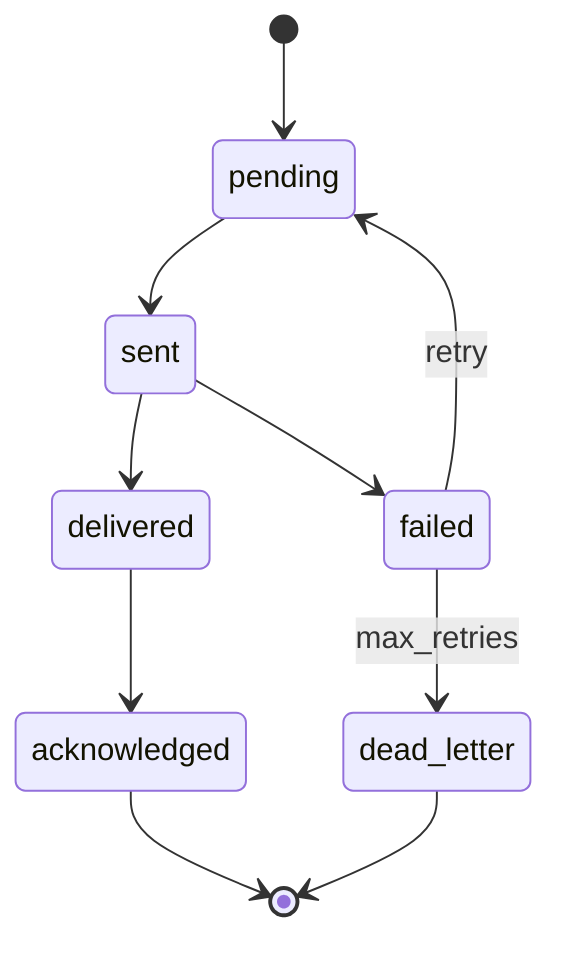

# OGM Agent Communication Protocol (ACP) v1.0

**Status:** draft Phase 5 specification  
**Audience:** engineers building agents, department workers, the Agent Control Center, CKO supervision layer, and future distributed Foundry execution  
**Relationship to Phase 1:** carries references to Knowledge Objects, sources, artifacts, packs, and provenance without replacing pack formats  
**Relationship to Phase 2:** extends the Agent Control Center event and audit model with a standardized inter-agent message language  
**Relationship to Phase 3:** formalizes Knowledge Foundry inter-agent communication beyond ad hoc envelopes  
**Relationship to Phase 4:** supports CKO mission routing, coverage updates, debt events, and supervisory reporting  
**Primary purpose:** provide a durable, replayable, versioned communication layer for five agents today and hundreds tomorrow  

---

## 1. Purpose

The Agent Communication Protocol (ACP) is the standardized language every
Offgrid Minds agent uses to communicate. Agents SHOULD exchange structured
ACP messages rather than direct function calls whenever practical.

ACP is the communication layer. It is not a research agent, not a pack
builder, and not a replacement for human approval.

---

## 2. Design Principles

- Every message MUST be logged.
- Every message MUST be replayable.
- Every message MUST be versioned.
- Every message MUST be JSON-serializable.
- Messages MUST reference artifacts rather than embed large payloads.
- Messages MUST preserve mission context.
- Messages MUST support audit and provenance.
- Transport MUST be swappable without changing message schemas.
- The protocol MUST work in-process today and distributed tomorrow.

---

## 3. Message Envelope

Every ACP message MUST use the v1 envelope.

```json
{
  "version": "1.0",
  "message_id": "msg:2026-07-06T18:00:00Z:abc123",
  "timestamp": "2026-07-06T18:00:00Z",
  "message_type": "SourceDiscovered",
  "agent_id": "agent:research:004",
  "department": "research",
  "mission_id": "mission:outdoor-pack:trees-001",
  "priority": "high",
  "status": "sent",
  "payload": {
    "source_candidate_id": "artifact:source-candidate:001",
    "title": "USDA Field Guide to Trees",
    "url": "https://example.invalid/guide"
  },
  "references": {
    "artifact_ids": ["artifact:source-candidate:001"],
    "work_order_id": "wo:2026-07-06:research:001",
    "correlation_id": "corr:mission:outdoor-pack:trees-001:001",
    "reply_to": null
  },
  "errors": [],
  "retry_count": 0
}
```

### 3.1 Required fields

| Field | Requirement |
|---|---|
| `version` | ACP schema version. v1 uses `"1.0"`. |
| `message_id` | Globally unique within the log namespace. |
| `timestamp` | ISO 8601 UTC timestamp. |
| `message_type` | Canonical event type. |
| `agent_id` | Sending agent identity. |
| `department` | Sending department. |
| `mission_id` | Mission context. Use `mission:system` only for system events. |
| `priority` | `critical`, `high`, `medium`, `low`. |
| `status` | Delivery/processing status. |
| `payload` | Type-specific structured body. |
| `references` | Artifact, work order, correlation, and reply links. |
| `errors` | Array of structured errors. Empty when none. |
| `retry_count` | Non-negative integer. |

### 3.2 Optional routing fields

Optional fields MAY be added without breaking v1 readers:

- `to_department`
- `to_agent_id`
- `requires_ack`
- `ttl_seconds`
- `trace_id`

Unknown fields MUST be preserved.

---

## 4. Message Types

### 4.1 Mission lifecycle

- `MissionCreated`
- `MissionAccepted`
- `MissionStarted`
- `MissionPaused`
- `MissionCompleted`
- `MissionFailed`

### 4.2 Source lifecycle

- `SourceDiscovered`
- `SourceRejected`
- `SourceApproved`

### 4.3 Production lifecycle

- `OCRCompleted`
- `DiagramExtracted`
- `EntityCreated`
- `KnowledgeObjectCreated`
- `KnowledgeObjectUpdated`

### 4.4 Validation and quality

- `ValidationPassed`
- `ValidationFailed`
- `CoverageUpdated`
- `KnowledgeDebtCreated`
- `KnowledgeDebtResolved`

### 4.5 Pack lifecycle

- `PackCompiled`
- `PackPublished`

### 4.6 Human approval

- `HumanApprovalRequested`
- `HumanApprovalGranted`
- `HumanApprovalDenied`

### 4.7 System types

- `AgentRegistered`
- `AgentHeartbeat`
- `MessageAcknowledged`
- `MessageFailed`
- `MessageDeadLettered`

New message types MAY be added in v1 minor revisions if payloads remain
backward compatible or are ignored by older consumers.

---

## 5. Payload Schemas

Payloads MUST be objects. Large binary content MUST NOT be embedded.

### 5.1 `SourceDiscovered`

```json
{
  "source_candidate_id": "artifact:source-candidate:001",
  "title": "USDA Field Guide to Trees",
  "url": "https://example.invalid/guide",
  "source_type": "government_publication",
  "target_module_id": "module:species/plants/trees",
  "relevance_score": 0.91
}
```

### 5.2 `KnowledgeObjectCreated`

```json
{
  "object_id": "ko:ogm.pack.north-american-outdoor:species:acer-rubrum",
  "object_type": "species",
  "title": "Red Maple",
  "status": "pending",
  "citation_count": 2
}
```

### 5.3 `HumanApprovalRequested`

```json
{
  "approval_target_type": "source",
  "approval_target_id": "src:usda-trees-001",
  "requested_action": "approve_for_intake",
  "reason": "Authoritative government field guide."
}
```

### 5.4 `ValidationFailed`

```json
{
  "validation_profile": "pack-level-m3",
  "blocker_count": 3,
  "warning_count": 7,
  "report_artifact_id": "artifact:validation-report:001"
}
```

---

## 6. Message Status Lifecycle



Status values:

- `pending`
- `sent`
- `delivered`
- `acknowledged`
- `failed`
- `dead_letter`
- `replayed`

Rules:

- Producers create messages in `pending` or `sent`.
- Transports move messages to `delivered`.
- Consumers acknowledge successful handling.
- Failed messages increment `retry_count`.
- Dead-lettered messages remain in the log forever.

---

## 7. Event Lifecycle

ACP events follow this pattern:

1. Agent creates message with mission context and references.
2. Router selects destination department or agent.
3. Message is appended to the immutable log.
4. Transport delivers message.
5. Consumer processes message.
6. Consumer emits acknowledgement or failure message.
7. Audit trail links parent and child messages through `references.correlation_id`.

Human approval events MUST NOT imply automatic publication.

---

## 8. Retry Logic

Retry policy is deterministic and configurable per mission.

Default v1 policy:

```yaml
retry_policy:
  max_retries: 5
  initial_backoff_ms: 1000
  backoff_multiplier: 2.0
  max_backoff_ms: 60000
  retryable_error_codes:
    - transport_timeout
    - consumer_busy
    - transient_store_error
  non_retryable_error_codes:
    - policy_violation
    - schema_invalid
    - forbidden_source
    - approval_denied
```

Rules:

- `retry_count` MUST increment on each retry attempt.
- Retries MUST preserve `message_id` or create a child retry record linked through `references.reply_to`.
- v1 RECOMMENDS preserving the original `message_id` and incrementing `retry_count`.
- Non-retryable failures MUST move to `dead_letter`.
- Retry scheduling MUST be logged.

---

## 9. Failure Handling

Structured errors:

```json
{
  "code": "schema_invalid",
  "message": "payload.source_candidate_id is required",
  "retryable": false,
  "details": {
    "field": "payload.source_candidate_id"
  }
}
```

Failure classes:

- `schema_invalid`
- `policy_violation`
- `transport_timeout`
- `consumer_busy`
- `consumer_error`
- `approval_denied`
- `artifact_missing`
- `mission_not_found`
- `agent_not_found`
- `dead_letter`

Failed messages MUST emit `MessageFailed` or transition to dead letter with
errors populated.

---

## 10. Logging and Audit Trail

Every ACP message MUST be appended to an immutable log before or during
delivery.

Log requirements:

- append-only
- JSON Lines format recommended
- checksum optional per file rotation
- replayable in timestamp order
- searchable by mission, agent, department, message type, correlation ID

Audit trail links:

- parent message ID
- correlation ID
- work order ID
- artifact IDs
- approval target IDs
- retry lineage

Audit logs MUST NOT be editable by agents.

---

## 11. Agent Discovery

Agents register through `AgentRegistered` messages and a local registry.

Registration record:

```json
{
  "agent_id": "agent:research:004",
  "department": "research",
  "role": "research",
  "capabilities": ["read_web", "write_candidate"],
  "status": "idle",
  "endpoint": null,
  "registered_at": "2026-07-06T18:00:00Z"
}
```

Rules:

- Registry is authoritative for routing in v1 in-process deployments.
- Future distributed deployments MAY use registry snapshots plus heartbeat
  messages.
- Agents MUST send periodic `AgentHeartbeat` messages when active.
- Stale agents MUST be marked unavailable, not deleted.

---

## 12. Mission Routing

Mission routing selects consumers based on:

- `mission_id`
- `message_type`
- `to_department`
- department subscriptions
- agent availability
- mission policy permissions

Routing rules:

- Deny-by-default outside mission policy.
- CKO messages MAY route across departments.
- Department workers SHOULD only receive messages for their department unless explicitly subscribed.
- Human approval messages route to review queues, not to autonomous publishers.

Example route table:

| Message type | Default route |
|---|---|
| `SourceDiscovered` | `licensing` |
| `SourceApproved` | `acquisition` |
| `OCRCompleted` | `knowledge_engineering` |
| `KnowledgeObjectCreated` | validation + review queue |
| `ValidationPassed` | `compilation` |
| `PackCompiled` | review queue + CKO |
| `HumanApprovalRequested` | human review queue |

---

## 13. Future Distributed Execution

ACP v1 MUST remain transport-agnostic.

Supported v1 transport:

- in-process queue
- append-only local log

Future transports MAY include:

- Unix domain sockets
- NATS or JetStream
- Redis streams
- SQLite-backed queue
- peer Foundry node links

Requirements for future transports:

- preserve message envelope
- preserve ordering per mission when possible
- preserve idempotency via `message_id`
- preserve replay from log
- support at-least-once delivery with consumer acknowledgement

Distributed execution MUST NOT require message schema changes.

---

## 14. Security and Permissions

ACP does not replace mission policy.

Rules:

- Agents MAY only publish message types allowed by their department and mission.
- Research agents MUST NOT emit `SourceApproved`.
- Department agents MUST NOT emit `PackPublished`.
- Only human-approved workflows may emit official publication events.
- Policy violations MUST produce non-retryable `policy_violation` errors.

---

## 15. Reference Implementation

Phase 5 includes a reusable Python package:

```text
internal_tools/ogm_acp/
```

The package provides:

- envelope construction and validation
- message type constants
- append-only JSONL log store
- replay support
- in-process bus
- agent registry
- mission router
- retry policy helpers

This package is the reference implementation, not the only allowed one.

---

## 16. Compatibility

- v1 readers MUST ignore unknown envelope fields.
- v1 readers MUST reject unknown required payload fields only when strict mode is enabled.
- Breaking changes require ACP v2.
- Message logs MUST remain readable by future versions whenever possible.

---

## 17. Long-Term Goals

ACP should support:

- five agents in a single process today
- dozens of agents across departments on one machine
- hundreds of agents across distributed Foundry nodes
- full mission replay for debugging
- decade-long auditability
- seamless migration from in-process to distributed transport

The end goal is a professional manufacturing communication fabric for trusted
portable expertise.
