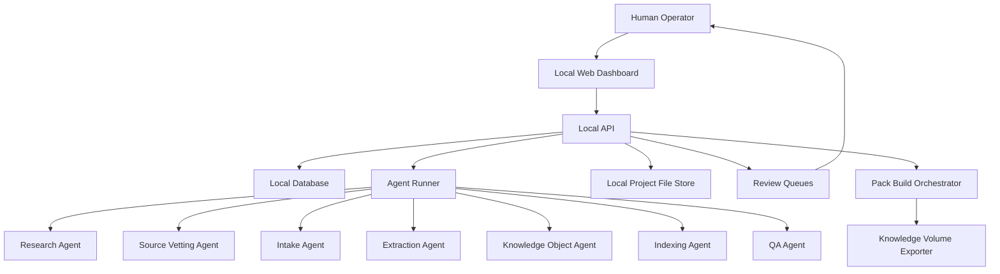
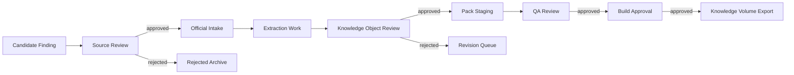
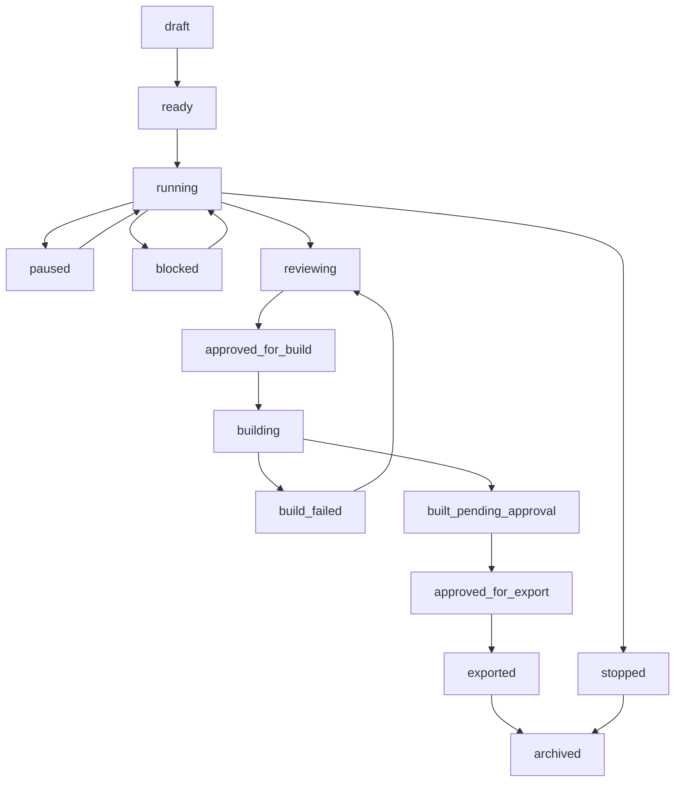

# OGM Agent Control Center Specification v1.0

**Status:** draft Phase 2 specification  
**Audience:** engineers building the local dashboard, agent orchestration layer, review workflows, and pack-building workbench  
**Relationship to Phase 1:** extends the Expert Pack, Knowledge Object, Metadata, Entity, Retrieval, Build Pipeline, and Marketplace specifications without replacing them  
**Primary runtime target:** local desktop web dashboard, offline-capable control plane, export to Knowledge Volumes  

---

## 1. Purpose

The Agent Control Center is the local operating console for building Offgrid
Minds Expert Packs. It lets a human operator create agents, assign missions,
monitor progress, review sources, inspect citations, approve or reject work,
and export compiled packs to Knowledge Volumes such as microSD, USB SSD, or a
local folder.

Agents may research, propose, extract, transform, index, and validate. Agents
MUST NOT publish, mark a source official, compile an official pack, or export
to a Knowledge Volume without human approval.

---

## 2. Product Spec

### 2.1 Product definition

Agent Control Center is a local-first desktop web application with a local
database and a controlled agent runner. It is designed to manage Phase 3
Research Agents, Phase 4 Pack Builder agents, and Phase 5 QA approval gates.

The application is not the Expert Pack runtime. It is the workshop used to
create trusted packs.

### 2.2 Primary jobs

- Create and configure AI agents.
- Assign missions to agents.
- Bind missions to target Expert Packs or modules.
- Define allowed websites, source repositories, and local folders.
- Define forbidden websites, source types, and license categories.
- Monitor agent progress and intermediate findings.
- Review files, sources, citations, extraction results, and proposed objects.
- Approve or reject sources before intake.
- Approve or reject Knowledge Objects before official inclusion.
- Approve or reject final pack builds before export.
- Pause, resume, stop, and archive agents and missions.
- Maintain a complete audit trail.
- Export finished pack artifacts to a Knowledge Volume.

### 2.3 Non-goals

- Agents do not bypass human approval.
- The dashboard does not replace Phase 1 Expert Pack specs.
- The dashboard does not require a cloud account.
- The MVP does not need a public marketplace.
- The MVP does not need multi-user enterprise permissions.
- The MVP does not need autonomous pack publication.

### 2.4 Operating modes

| Mode | Network | Purpose |
|---|---|---|
| `offline` | none | Review, extraction, indexing, QA, export, local import. |
| `research-online` | operator-approved domains only | Research Agent source discovery and allowed downloads. |
| `maintenance` | optional | Update agent tools, local models, and validation rules. |

Network access MUST be mission-scoped. Research-online mode MUST NOT give all
agents unrestricted internet access.

---

## 3. System Architecture



### 3.1 Core components

| Component | Responsibility |
|---|---|
| Dashboard UI | Human control surface for missions, agents, review queues, logs, sources, objects, builds, and exports. |
| Local API | Only interface used by the dashboard and agent runner to mutate system state. |
| Local Database | Durable state for missions, agents, sources, approvals, files, objects, indexes, builds, logs, and audit events. |
| Agent Runner | Executes agents under mission policy, records outputs, enforces pause/stop, and emits events. |
| Policy Engine | Enforces allowed/forbidden sources, license rules, network rules, tool permissions, and approval gates. |
| File Store | Stores originals, downloaded files, extracted artifacts, working objects, logs, and build outputs. |
| Review Queue | Presents source, license, citation, object, QA, and build approval tasks to the human operator. |
| Pack Build Orchestrator | Runs approved pack build steps and refuses unofficial inputs. |
| Knowledge Volume Exporter | Copies approved pack artifacts to selected local storage targets. |

### 3.2 Approval invariant

No data moves from one trust zone to the next without an explicit approval
record.



---

## 4. Dashboard Screens

### 4.1 Home / Command Center

Purpose: high-level operational overview.

Shows:

- active missions
- running agents
- paused agents
- errors needing attention
- pending source approvals
- pending Knowledge Object approvals
- pack build status
- export readiness
- recent audit events

Primary actions:

- create mission
- create agent
- pause all agents
- resume mission
- open review queue
- start pack build if eligible

### 4.2 Missions

Purpose: create, inspect, and control missions.

Mission screen sections:

- mission brief
- target Expert Pack
- target module/folder
- assigned agents
- allowed sources
- forbidden sources
- license rules
- current phase
- progress timeline
- findings
- blockers
- approvals
- logs

Primary actions:

- create mission
- assign agent
- pause mission
- resume mission
- stop mission
- duplicate mission
- archive mission

### 4.3 Mission Builder

Purpose: structured mission creation.

Fields:

- mission title
- mission objective
- target pack ID
- target module path
- target taxonomy nodes
- agent types to assign
- allowed domains
- forbidden domains
- allowed local folders
- source priority list
- license policy
- safety domain flags
- maximum network scope
- output expectations
- review strictness

Mission creation MUST produce an immutable mission policy snapshot.

### 4.4 Agent Roster

Purpose: manage agent definitions and active agent instances.

Shows:

- agent name
- role
- status
- current mission
- permissions
- last heartbeat
- current task
- tool access
- error state

Primary actions:

- create agent
- assign mission
- pause agent
- resume agent
- stop agent
- view logs
- view outputs
- retire agent

### 4.5 Agent Detail

Purpose: inspect one agent.

Shows:

- role and permission profile
- mission policy
- current state
- step timeline
- proposed actions
- files touched
- findings submitted
- errors
- logs
- resource usage

Agents that request elevated action, such as downloading a file from a new
domain, MUST produce an approval request rather than acting.

### 4.6 Source Discovery Board

Purpose: review candidate sources found by Research Agents.

Shows:

- title
- URL or local path
- source type
- discovered by
- target module
- relevance score
- trust estimate
- license estimate
- source age
- duplicate status
- proposed use
- citation preview

Primary actions:

- approve for vetting
- reject
- mark duplicate
- request more evidence
- move to different module
- add note

### 4.7 Source Vetting Queue

Purpose: approve or reject sources before official intake.

Shows:

- source metadata
- reliability assessment
- license assessment
- copyright status
- redistribution rights
- local-use rights
- excerpt rights
- age/freshness
- relevance to target pack
- risks
- agent recommendation
- citation examples

Primary actions:

- approve for intake
- reject
- approve local-only
- require manual license review
- require replacement source
- add operator note

### 4.8 Intake Library

Purpose: inspect approved originals and imported files.

Shows:

- official source ID
- original file path
- checksum
- file type
- size
- intake status
- locator scheme
- license record
- extraction readiness
- preservation status

Primary actions:

- open original
- verify checksum
- re-run intake validation
- send to extraction
- quarantine file

### 4.9 Extraction Workbench

Purpose: inspect OCR, text, tables, diagrams, images, and metadata extraction.

Shows:

- extraction jobs
- page/block preview
- OCR confidence
- table candidates
- diagram candidates
- image assets
- extracted captions
- metadata candidates
- source locators
- extraction errors

Primary actions:

- approve extraction batch
- reject extraction batch
- request re-OCR
- correct metadata
- split or merge blocks
- flag low-confidence region

### 4.10 Knowledge Object Review

Purpose: review pending Knowledge Objects before official pack staging.

Shows:

- object type
- title
- summary
- body or structured payload
- citations
- warnings
- relationships
- entities
- confidence dimensions
- source locators
- conflicts
- related objects

Primary actions:

- approve object
- reject object
- request revision
- merge duplicate
- mark unsafe
- change target module
- edit metadata

### 4.11 Folder / Module Organizer

Purpose: show how a pack is organized before compilation.

Shows:

- target pack
- taxonomy tree
- module/folder tree
- source counts
- approved object counts
- pending object counts
- warning coverage
- media coverage
- index readiness

Primary actions:

- create module
- move source
- move object
- assign taxonomy node
- inspect module coverage
- lock module for build

### 4.12 Citation Inspector

Purpose: verify that claims trace back to sources.

Shows:

- claim text
- Knowledge Object
- source title
- source locator
- page/section/figure preview
- OCR block
- extraction confidence
- citation status
- broken or weak citations

Primary actions:

- approve citation
- reject citation
- mark needs stronger source
- open source page
- compare duplicate citation

### 4.13 QA Console

Purpose: inspect validation results before official build.

Shows:

- duplicate object findings
- missing citations
- broken relationships
- bad metadata
- unsafe guidance
- outdated source warnings
- license blockers
- index consistency issues
- retrieval smoke test results

Primary actions:

- approve QA result
- create fix task
- assign agent to repair
- block build
- waive warning with reason

Waivers MUST require operator note and audit entry.

### 4.14 Build Center

Purpose: compile approved content into a pack candidate.

Shows:

- pack manifest preview
- approved source count
- approved object count
- index build status
- validation status
- artifact paths
- checksums
- build logs
- build eligibility blockers

Primary actions:

- start build candidate
- stop build
- approve final pack
- reject build
- compare builds
- generate release notes

### 4.15 Knowledge Volume Export

Purpose: export approved pack artifacts to user-owned storage.

Shows:

- detected volumes
- local folders
- storage class
- free space
- existing packs
- selected pack version
- expected export size
- checksum verification status

Primary actions:

- select export target
- export pack
- verify export
- eject volume
- open exported folder

Export MUST require an approved final build.

### 4.16 Logs and Audit

Purpose: inspect what happened, when, and why.

Shows:

- timeline
- actor
- agent
- mission
- event type
- changed fields
- before/after summaries
- approval notes
- errors
- retry history

Primary actions:

- filter logs
- export audit bundle
- inspect event detail
- replay mission timeline

---

## 5. Agent Roles and Permissions

### 5.1 Permission model

Agents receive explicit capabilities. Capabilities are scoped to a mission and
recorded in an immutable mission policy snapshot.

Capability classes:

- `read_web`
- `read_local`
- `download_candidate`
- `write_candidate`
- `write_extraction`
- `write_pending_object`
- `write_pending_index`
- `write_qa_report`
- `request_approval`
- `read_approved_source`
- `read_pending_object`
- `run_local_tool`

Agents MUST NOT receive:

- `approve_source`
- `approve_object`
- `approve_build`
- `export_pack`
- `publish_pack`
- `modify_audit_log`
- `change_mission_policy`

Only the human operator can perform approval capabilities.

### 5.2 Research Agent

Purpose: find candidate sources.

Allowed:

- search allowed websites
- inspect allowed public pages
- propose sources
- capture bibliographic metadata
- summarize source relevance
- identify likely module placement
- request permission for unknown domains

Forbidden:

- official intake
- license approval
- source approval
- pack compilation
- downloading from forbidden sources

Outputs:

- candidate source records
- relevance notes
- source type classification
- citation candidates
- duplicate hints

### 5.3 Source Vetting Agent

Purpose: assess source quality, reliability, copyright/license status, age,
relevance, and risk.

Allowed:

- read candidate source records
- inspect license pages and terms where allowed
- identify copyright concerns
- estimate trust tier
- flag outdated or weak sources
- recommend approval state

Forbidden:

- final license approval
- official intake
- changing source trust tier without review

Outputs:

- vetting report
- license recommendation
- trust recommendation
- risk flags
- questions for human review

### 5.4 Intake Agent

Purpose: import approved sources and preserve originals.

Allowed:

- download or import approved sources only
- compute checksums
- store originals
- create intake records
- quarantine suspicious files

Forbidden:

- importing unapproved sources
- modifying originals after checksum
- changing license approvals

Outputs:

- official source file records
- checksums
- storage paths
- intake validation report

### 5.5 Extraction Agent

Purpose: extract text, tables, diagrams, images, captions, metadata, and
locators.

Allowed:

- read approved intake files
- run OCR and extraction tools
- write extraction artifacts
- propose extraction corrections

Forbidden:

- approving extraction for official object generation
- deleting originals
- suppressing low-confidence regions

Outputs:

- extracted text blocks
- OCR confidence
- table candidates
- image/diagram candidates
- metadata candidates
- extraction diagnostics

### 5.6 Knowledge Object Agent

Purpose: transform approved extraction artifacts into pending Knowledge
Objects.

Allowed:

- read approved extraction artifacts
- propose Knowledge Objects
- propose relationships
- propose entities
- attach citations
- identify warnings and specifications

Forbidden:

- marking Knowledge Objects official
- omitting citations for answerable objects
- changing approved source metadata

Outputs:

- pending Knowledge Objects
- pending relationships
- pending entity updates
- citation maps
- confidence estimates

### 5.7 Indexing Agent

Purpose: build pending indexes optimized for retrieval on Raspberry Pi 5 with
8 GB RAM.

Allowed:

- read approved sources and approved Knowledge Objects
- build candidate metadata, keyword, entity, graph, vector, image, diagram,
  table, procedure, and warning indexes
- write index diagnostics
- run index memory tests

Forbidden:

- indexing rejected or unapproved objects into official pack staging
- approving index validation
- exporting compiled packs

Outputs:

- candidate indexes
- memory profile
- retrieval smoke test candidates
- index consistency report

### 5.8 QA Agent

Purpose: find defects before official build.

Allowed:

- read approved and pending pack artifacts
- detect duplicates
- detect missing citations
- detect unsupported claims
- detect bad metadata
- detect unsafe guidance
- detect outdated sources
- detect broken references
- produce QA reports

Forbidden:

- approving its own findings
- waiving errors
- compiling official pack

Outputs:

- QA report
- blocker list
- warnings
- suggested fixes
- retrieval test results

---

## 6. Mission Lifecycle

### 6.1 Mission states

| State | Meaning |
|---|---|
| `draft` | Mission is being configured. No agents may run. |
| `ready` | Mission policy is complete and can be started. |
| `running` | One or more agents are active. |
| `paused` | Agents are suspended without losing state. |
| `blocked` | Mission requires human decision or policy change. |
| `reviewing` | Agent work is complete and awaiting approvals. |
| `approved_for_build` | Required reviews are complete. |
| `building` | Pack candidate build is running. |
| `build_failed` | Build failed validation or execution. |
| `built_pending_approval` | Build artifact exists but is not final. |
| `approved_for_export` | Human approved final build. |
| `exported` | Pack was exported to a Knowledge Volume. |
| `stopped` | Mission was intentionally stopped. |
| `archived` | Mission is closed and read-only. |

### 6.2 Mission flow



### 6.3 Mission policy

Mission policy MUST include:

- target pack ID
- target module/folder
- allowed domains
- forbidden domains
- allowed local paths
- forbidden source types
- license rules
- safety domains
- agent roles
- tool permissions
- network mode
- maximum run time
- approval requirements

Mission policy MUST be immutable after mission start. Changes create a new
policy revision and audit event.

---

## 7. Source Approval Workflow

### 7.1 Source states

| State | Meaning |
|---|---|
| `candidate_found` | Research Agent found the source. |
| `pending_vetting` | Candidate is ready for vetting. |
| `vetted_pending_human` | Vetting Agent produced a recommendation. |
| `approved_for_intake` | Human approved intake. |
| `approved_local_only` | Human approved private/local use only. |
| `rejected` | Source cannot be used. |
| `needs_license_review` | Human must resolve licensing. |
| `intaked` | Approved file was imported and checksummed. |
| `quarantined` | File is suspicious or invalid. |

### 7.2 Approval requirements

A source cannot become official unless:

- source metadata is present
- license state is known or explicitly local-only
- source is not forbidden by mission policy
- source relevance is documented
- duplicate status is checked
- human approval record exists

Human approval record MUST include:

- approver
- timestamp
- decision
- source ID
- license decision
- allowed use
- notes

### 7.3 Rejection reasons

Common rejection reasons:

- forbidden domain
- unreliable source
- license incompatible
- copyright unclear
- duplicate
- outdated
- irrelevant
- unsafe or misleading
- low quality
- source unavailable

Rejected sources remain visible in audit history and MUST NOT be silently
deleted.

---

## 8. Folder / Module Workflow

### 8.1 Pack workspace structure

The Control Center maintains a working pack workspace before compilation.

```text
workspace/
  missions/
  packs/
    ogm.pack.small-engine-repair/
      planning/
      sources/
        candidates/
        approved/
        rejected/
      intake/
        originals/
        quarantine/
      extraction/
        text/
        tables/
        media/
        metadata/
      objects/
        pending/
        approved/
        rejected/
      indexes/
        candidate/
        approved/
      qa/
      builds/
      exports/
```

This is a working layout, not the final Expert Pack layout. The compiled pack
MUST conform to the Phase 1 Expert Pack Specification.

### 8.2 Module states

| State | Meaning |
|---|---|
| `planned` | Module exists but has no approved sources. |
| `collecting_sources` | Agents are finding candidate sources. |
| `vetting_sources` | Sources are under review. |
| `extracting` | Approved sources are being processed. |
| `object_review` | Pending Knowledge Objects are under review. |
| `qa` | Module is being validated. |
| `locked_for_build` | Module cannot accept new changes without unlock. |
| `built` | Module was included in a pack build. |

### 8.3 Module rules

- Sources and Knowledge Objects MUST have a target module.
- Moving official items between modules requires audit entry.
- Locked modules cannot accept new official objects.
- Agents may suggest module changes, but only humans can approve official
  reorganization.

---

## 9. Logs and Audit Trail

### 9.1 Event types

Audit events MUST be append-only.

Event types:

- `mission_created`
- `mission_policy_changed`
- `mission_started`
- `mission_paused`
- `mission_resumed`
- `mission_stopped`
- `agent_created`
- `agent_assigned`
- `agent_started`
- `agent_paused`
- `agent_resumed`
- `agent_stopped`
- `source_found`
- `source_vetted`
- `source_approved`
- `source_rejected`
- `file_intaked`
- `file_quarantined`
- `extraction_completed`
- `object_proposed`
- `object_approved`
- `object_rejected`
- `qa_completed`
- `qa_waived`
- `build_started`
- `build_failed`
- `build_completed`
- `build_approved`
- `export_started`
- `export_completed`
- `export_failed`

### 9.2 Audit record

```json
{
  "event_id": "evt:2026-07-06:abc123",
  "timestamp": "2026-07-06T17:00:00Z",
  "actor_type": "human",
  "actor_id": "operator:local",
  "mission_id": "mission:small-engine-carburetors",
  "event_type": "source_approved",
  "target_type": "source",
  "target_id": "src:briggs-service-manual-1234",
  "summary": "Approved source for local intake.",
  "before": {
    "state": "vetted_pending_human"
  },
  "after": {
    "state": "approved_for_intake"
  },
  "reason": "Authoritative manufacturer manual; local-use license accepted."
}
```

### 9.3 Log classes

| Log | Purpose |
|---|---|
| Agent step log | Agent reasoning summaries, actions, and tool results. |
| Mission log | Mission timeline and state transitions. |
| System log | API errors, runner errors, database errors, filesystem errors. |
| Build log | Pack build steps and validation output. |
| Audit log | Append-only human and system decisions. |

Audit logs MUST NOT be editable from the dashboard.

---

## 10. Local Database Design

The MVP SHOULD use a local relational database such as SQLite. The design must
remain portable to a larger database later.

### 10.1 Core tables

#### `agents`

| Field | Purpose |
|---|---|
| `id` | Stable agent ID. |
| `name` | Human label. |
| `role` | Agent role. |
| `status` | idle, running, paused, stopped, error, retired. |
| `permission_profile_json` | Allowed capabilities. |
| `created_at` | Creation time. |
| `retired_at` | Retirement time. |

#### `missions`

| Field | Purpose |
|---|---|
| `id` | Mission ID. |
| `title` | Mission title. |
| `objective` | Mission brief. |
| `target_pack_id` | Target Expert Pack. |
| `target_module_id` | Target module/folder. |
| `status` | Mission state. |
| `created_at` | Creation time. |
| `started_at` | Start time. |
| `completed_at` | Completion time. |

#### `mission_policies`

| Field | Purpose |
|---|---|
| `id` | Policy revision ID. |
| `mission_id` | Mission. |
| `revision` | Monotonic revision number. |
| `policy_json` | Allowed sources, forbidden sources, licenses, tools. |
| `created_at` | Creation time. |
| `created_by` | Human operator or system. |

#### `mission_agents`

| Field | Purpose |
|---|---|
| `mission_id` | Mission. |
| `agent_id` | Agent. |
| `assigned_role` | Role for this mission. |
| `status` | Assignment status. |

#### `sources`

| Field | Purpose |
|---|---|
| `id` | Source ID. |
| `mission_id` | Mission that discovered it. |
| `target_pack_id` | Target pack. |
| `target_module_id` | Target module. |
| `title` | Source title. |
| `url_or_path` | Candidate URL or local path. |
| `source_type` | manual, book, dataset, etc. |
| `status` | Source state. |
| `license_state` | unknown, approved, local_only, rejected, needs_review. |
| `trust_tier` | Proposed or approved trust tier. |
| `relevance_score` | Agent estimate. |
| `created_at` | Discovery time. |

#### `source_vetting_reports`

| Field | Purpose |
|---|---|
| `id` | Report ID. |
| `source_id` | Source. |
| `agent_id` | Vetting agent. |
| `reliability_json` | Reliability assessment. |
| `license_json` | License assessment. |
| `risk_json` | Risk flags. |
| `recommendation` | approve, reject, needs_review, local_only. |

#### `approvals`

| Field | Purpose |
|---|---|
| `id` | Approval ID. |
| `target_type` | source, extraction, object, qa, build, export. |
| `target_id` | Target record. |
| `decision` | approved, rejected, needs_revision, waived. |
| `approver` | Human operator. |
| `reason` | Required note for high-impact decisions. |
| `created_at` | Decision time. |

#### `files`

| Field | Purpose |
|---|---|
| `id` | File ID. |
| `source_id` | Source. |
| `path` | Local file path. |
| `kind` | original, extracted_text, table, image, diagram, build_artifact. |
| `checksum_sha256` | Integrity. |
| `size_bytes` | Size. |
| `status` | active, quarantined, deleted_from_workspace. |

#### `extraction_artifacts`

| Field | Purpose |
|---|---|
| `id` | Artifact ID. |
| `source_id` | Source. |
| `file_id` | Source file. |
| `artifact_type` | text_block, table, image, diagram, caption, metadata. |
| `locator_json` | Page, bounding box, figure, timestamp. |
| `confidence` | Extraction confidence. |
| `payload_path` | Artifact file or JSON path. |
| `status` | pending, approved, rejected, needs_revision. |

#### `knowledge_objects`

| Field | Purpose |
|---|---|
| `id` | Knowledge Object ID. |
| `target_pack_id` | Target pack. |
| `target_module_id` | Module. |
| `object_type` | Procedure, Part, Warning, etc. |
| `title` | Object title. |
| `status` | pending, approved, rejected, needs_revision. |
| `object_json` | Full object payload. |
| `confidence_json` | Confidence dimensions. |

#### `citations`

| Field | Purpose |
|---|---|
| `id` | Citation ID. |
| `knowledge_object_id` | Object. |
| `source_id` | Source. |
| `locator_json` | Locator. |
| `claim_scope` | What the citation supports. |
| `status` | pending, approved, rejected, broken. |

#### `builds`

| Field | Purpose |
|---|---|
| `id` | Build ID. |
| `target_pack_id` | Pack. |
| `version` | Pack version. |
| `content_revision` | Content revision. |
| `status` | pending, running, failed, built_pending_approval, approved, exported. |
| `artifact_path` | Build output. |
| `validation_report_path` | Validation report. |
| `created_at` | Build start. |

#### `exports`

| Field | Purpose |
|---|---|
| `id` | Export ID. |
| `build_id` | Build. |
| `target_volume` | Knowledge Volume path or ID. |
| `status` | running, completed, failed. |
| `checksum_verified` | Boolean. |
| `created_at` | Export time. |

#### `audit_events`

Append-only audit event table as defined in section 9.

### 10.2 Database invariants

- Approvals MUST reference existing targets.
- Official intake requires source approval.
- Approved Knowledge Objects require approved citations.
- Build approval requires passing QA or explicit human waivers.
- Export requires approved build.
- Audit events MUST be written for every state transition.

---

## 11. API Design

The Local API SHOULD be HTTP+JSON for dashboard simplicity. It MAY later add
local event streams for live progress.

### 11.1 API principles

- All mutations go through the Local API.
- Agents cannot write directly to the database.
- Every mutation creates an audit event.
- APIs enforce mission policy.
- Approval endpoints require human actor.
- Long-running operations return job IDs.

### 11.2 Mission APIs

```text
GET    /api/missions
POST   /api/missions
GET    /api/missions/{mission_id}
POST   /api/missions/{mission_id}/start
POST   /api/missions/{mission_id}/pause
POST   /api/missions/{mission_id}/resume
POST   /api/missions/{mission_id}/stop
POST   /api/missions/{mission_id}/archive
GET    /api/missions/{mission_id}/timeline
GET    /api/missions/{mission_id}/logs
```

### 11.3 Agent APIs

```text
GET    /api/agents
POST   /api/agents
GET    /api/agents/{agent_id}
POST   /api/agents/{agent_id}/assign
POST   /api/agents/{agent_id}/pause
POST   /api/agents/{agent_id}/resume
POST   /api/agents/{agent_id}/stop
GET    /api/agents/{agent_id}/logs
GET    /api/agents/{agent_id}/outputs
```

### 11.4 Source APIs

```text
GET    /api/sources
GET    /api/sources/{source_id}
POST   /api/sources/{source_id}/vetting-request
POST   /api/sources/{source_id}/approve
POST   /api/sources/{source_id}/reject
POST   /api/sources/{source_id}/approve-local-only
POST   /api/sources/{source_id}/request-license-review
GET    /api/sources/{source_id}/files
GET    /api/sources/{source_id}/citations
```

Approval request body:

```json
{
  "decision": "approved_for_intake",
  "allowed_use": "local_use_and_indexing",
  "license_state": "approved",
  "reason": "Authoritative manual with local indexing permitted.",
  "target_module_id": "module:fuel-system"
}
```

### 11.5 Extraction APIs

```text
GET    /api/extractions
GET    /api/extractions/{artifact_id}
POST   /api/extractions/{artifact_id}/approve
POST   /api/extractions/{artifact_id}/reject
POST   /api/extractions/{artifact_id}/request-rerun
```

### 11.6 Knowledge Object APIs

```text
GET    /api/knowledge-objects
GET    /api/knowledge-objects/{object_id}
POST   /api/knowledge-objects/{object_id}/approve
POST   /api/knowledge-objects/{object_id}/reject
POST   /api/knowledge-objects/{object_id}/request-revision
POST   /api/knowledge-objects/{object_id}/move-module
GET    /api/knowledge-objects/{object_id}/citations
```

### 11.7 Build and export APIs

```text
GET    /api/builds
POST   /api/builds
GET    /api/builds/{build_id}
POST   /api/builds/{build_id}/approve
POST   /api/builds/{build_id}/reject
GET    /api/builds/{build_id}/validation-report

GET    /api/volumes
POST   /api/exports
GET    /api/exports/{export_id}
POST   /api/exports/{export_id}/verify
```

### 11.8 Event stream APIs

```text
GET /api/events/stream
```

Event stream emits:

- mission state changes
- agent heartbeats
- source findings
- review queue changes
- extraction progress
- build progress
- errors

---

## 12. Implementation Plan

### 12.1 Phase 2A: Local control foundation

Build:

- local database
- Local API skeleton
- mission CRUD
- agent CRUD
- mission policy model
- audit event system
- dashboard shell
- Home, Missions, Agent Roster, Logs screens

Exit criteria:

- operator can create a mission
- operator can create agents
- mission policies are stored immutably
- audit events are generated

### 12.2 Phase 2B: Source discovery and approval

Build:

- Source Discovery Board
- Source Vetting Queue
- source records
- vetting report records
- source approval/rejection workflow
- allowed/forbidden source policy enforcement

Exit criteria:

- Research Agent outputs candidate sources
- Source Vetting Agent outputs recommendations
- human can approve/reject sources
- unapproved sources cannot enter intake

### 12.3 Phase 2C: Intake and extraction workbench

Build:

- Intake Library
- file store
- checksums
- quarantine flow
- Extraction Workbench
- extraction artifact records
- extraction approval flow

Exit criteria:

- approved sources can be imported
- originals are checksummed
- extraction artifacts can be reviewed

### 12.4 Phase 2D: Knowledge Object and citation review

Build:

- Knowledge Object Review
- Citation Inspector
- pending object store
- object approval/rejection workflow
- module assignment

Exit criteria:

- Knowledge Object Agent can submit pending objects
- human can inspect citations
- only approved objects enter pack staging

### 12.5 Phase 2E: QA, build, and export

Build:

- QA Console
- Build Center
- Knowledge Volume Export
- candidate index records
- build records
- export records
- final approval gates

Exit criteria:

- QA Agent can produce reports
- build cannot start with blockers
- build requires human approval
- export requires approved build

---

## 13. MVP Version

The MVP should prove the approval-gated workflow before building every agent.

### 13.1 MVP scope

MVP agents:

- Research Agent
- Source Vetting Agent
- Intake Agent

MVP screens:

- Home / Command Center
- Mission Builder
- Missions
- Agent Roster
- Source Discovery Board
- Source Vetting Queue
- Intake Library
- Logs and Audit

MVP workflows:

- create mission
- define allowed and forbidden sources
- assign Research Agent
- collect candidate source records
- run source vetting
- approve/reject sources
- intake approved files
- compute checksums
- view audit trail

### 13.2 MVP exclusions

MVP does not need:

- OCR
- Knowledge Object generation
- vector indexes
- pack compilation
- export
- marketplace integration
- multi-user permissions

### 13.3 MVP success criteria

The MVP is successful when:

- agents can find candidate sources under mission policy
- forbidden sources are blocked
- humans can approve or reject each source
- approved sources can be safely intaked
- rejected sources remain auditable
- every state transition is logged
- no agent can mark a source official without approval

---

## 14. Design Rules for Cursor Implementation

When implementation begins:

- Start with local-only operation.
- Use a simple local database before introducing distributed infrastructure.
- Keep agents behind the Local API.
- Enforce approval gates in the API, not only in the UI.
- Model every long-running task as a job with status and logs.
- Keep file paths abstracted through workspace and Knowledge Volume records.
- Treat agent outputs as proposals until approved.
- Preserve originals and checksums.
- Make audit events append-only from day one.
- Build the MVP around source approval before extraction or pack building.

---

## 15. Long-Term Compatibility

The Control Center should last through later phases by preserving these
stable boundaries:

- agents propose, humans approve
- missions own policy
- sources move through explicit states
- originals are preserved
- Knowledge Objects remain pending until reviewed
- builds are candidates until approved
- exports require approved builds
- audit history is append-only

This design allows later systems to add more capable agents, cloud-assisted
research, distributed workers, marketplace submission, and multi-device
collaboration without changing the core trust model.
