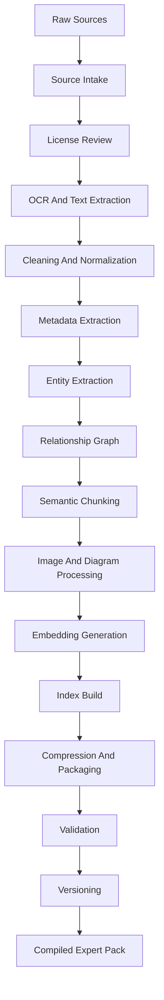

# OGM Build Pipeline v1.0

**Status:** draft v1.0 specification  
**Audience:** engineers building ingestion, extraction, indexing, validation, release, and distribution tooling  
**Primary runtime target:** compiled Expert Packs for offline Raspberry Pi 5 retrieval  

---

## 1. Purpose

The OGM Build Pipeline turns raw information into compiled Expert Packs. It
must be deterministic, auditable, reproducible where licensing allows, and
strict enough that generated knowledge does not silently become trusted
knowledge.

Expert Packs are treated like compiled software: source inputs enter a build
system, transformations are recorded, validation gates run, and only passing
artifacts are released.

---

## 2. Pipeline Overview



Each stage MUST produce artifacts and diagnostics that can be inspected
without rerunning the whole build.

---

## 3. Build Invariants

- Raw sources MUST be cataloged before processing.
- Licensing MUST be evaluated before redistribution.
- Generated content MUST remain linked to source locators.
- Every answerable object MUST have source attribution.
- Every index MUST be traceable to object and source revisions.
- Validation MUST run before a pack can be marked release-ready.
- Build outputs MUST declare pipeline versions and processing models.
- Build failures MUST be explicit and recoverable.

---

## 4. Source Intake

Source intake registers raw inputs.

Accepted input classes:

- PDFs
- scanned images
- EPUB or HTML books
- manuals
- standards
- tables and spreadsheets
- image sets
- videos
- field notes
- expert-authored structured files
- public datasets
- user-provided private documents

Source intake record:

```yaml
source_id: "src:briggs-service-manual-1234"
input_path: "intake/manuals/briggs-1234.pdf"
title: "Service Manual for Model 1234 Engines"
source_type: "manual"
language_hint: "en-US"
received_at: "2026-07-06T17:00:00Z"
checksum_sha256: "..."
redistribution_candidate: false
operator_notes: "Manufacturer manual supplied by pack author."
```

Rules:

- Each raw source MUST receive a source ID before extraction.
- Source checksums MUST be recorded when files are available.
- Intake MUST preserve original files when licensing and storage policy allow.
- Intake MUST not depend on internet access at runtime.

---

## 5. License Review

License review determines what the pack may contain and how answers may cite
or excerpt source material.

Outputs:

- source license records
- redistribution permission
- derivative indexing permission
- excerpt limits
- attribution requirements
- marketplace eligibility

Rules:

- Sources with unknown license MAY be used for private user packs but MUST be
  blocked from public marketplace distribution.
- The build pipeline MUST distinguish local use, indexing, excerpt display,
  and redistribution rights.
- License decisions MUST be stored in `LICENSES/source-licenses.yaml`.
- Validation MUST fail release builds with unresolved license records.

---

## 6. OCR and Text Extraction

OCR and text extraction convert source pages, images, and documents into
machine-readable text while preserving locators.

Outputs:

- page text
- layout blocks
- table candidates
- figure candidates
- OCR confidence
- source locators

Requirements:

- The original source locator MUST be preserved for every extracted block.
- OCR confidence MUST be recorded.
- Low-confidence OCR MUST be marked for review or excluded from high-risk
  procedural grounding.
- Extraction tools and versions MUST be recorded in build metadata.

Example block:

```json
{
  "source_id": "src:manual-001",
  "block_id": "blk:manual-001:p42:b7",
  "locator": {
    "type": "bounding_box",
    "page": 42,
    "x": 0.10,
    "y": 0.22,
    "w": 0.76,
    "h": 0.09
  },
  "text": "Disconnect the spark plug wire before servicing.",
  "ocr_confidence": 0.97
}
```

---

## 7. Cleaning and Normalization

Cleaning improves retrieval quality without destroying source fidelity.

Allowed cleaning:

- Unicode normalization
- whitespace normalization
- header/footer detection
- hyphenation repair
- OCR artifact tagging
- unit normalization as derived metadata
- table boundary detection

Rules:

- Cleaned text MUST remain linked to original extracted blocks.
- Cleaning MUST NOT remove warnings, footnotes, revision notes, or legal
  restrictions.
- Destructive summarization MUST NOT replace source-aligned text.
- Cleaning rules MUST be versioned.

---

## 8. Metadata Extraction

Metadata extraction creates pack, source, taxonomy, locale, and license
metadata.

Outputs:

- source catalog
- taxonomy candidates
- document hierarchy
- source revision records
- author and publisher fields
- locale detection
- trust tier recommendations

Rules:

- Automatically extracted metadata MUST be marked as machine-extracted until
  reviewed.
- Source hierarchy SHOULD preserve manual chapters, sections, figures, and
  tables.
- Trust tier assignment MUST be conservative.

---

## 9. Entity Extraction

Entity extraction identifies canonical entities and aliases.

Inputs:

- cleaned text
- source hierarchy
- tables
- diagram labels
- captions
- existing entity registries

Outputs:

- `entities/entities.jsonl.zst`
- aliases
- normalization diagnostics
- ambiguity records
- entity-to-object references

Rules:

- Entity extraction MUST preserve observed strings and normalized values.
- Part numbers and model numbers MUST be handled with domain-specific
  normalizers where available.
- Ambiguous entities MUST produce disambiguation records.
- High-impact entities SHOULD require review before release.

---

## 10. Relationship Graph Construction

Relationship graph construction creates typed edges between entities and
Knowledge Objects.

Relationship sources:

- explicit document structure
- tables
- procedure step dependencies
- diagram labels
- compatibility charts
- expert-authored structured input
- validated extraction models

Rules:

- Relationship edges MUST be typed.
- Relationship confidence MUST be recorded.
- Safety, compatibility, and replacement relationships MUST include source
  locators.
- Inferred relationships MUST be marked as inferred.
- Graph validation MUST check dangling endpoints.

---

## 11. Semantic Chunking

Semantic chunking produces retrieval chunks aligned with source structure and
Knowledge Objects.

Chunking requirements:

- chunks MUST preserve source locators
- chunks SHOULD align with headings, steps, paragraphs, tables, or figures
- chunks MUST avoid mixing unrelated procedures
- chunks SHOULD be small enough for prompt assembly
- chunks MUST reference parent Knowledge Objects where applicable

Chunk record:

```json
{
  "chunk_id": "chk:manual-001:p42:clean-jet-001",
  "object_id": "ko:...:procedure:clean-carburetor-main-jet",
  "source_id": "src:manual-001",
  "locator": {
    "type": "page_range",
    "start_page": 42,
    "end_page": 43
  },
  "text": "...",
  "token_count": 186,
  "chunk_type": "procedure_steps"
}
```

Rules:

- Chunks are retrieval units, not authoritative objects by themselves unless
  promoted to Knowledge Objects.
- Chunking parameters MUST be recorded.
- Chunk IDs SHOULD be deterministic for stable source structure.

---

## 12. Knowledge Object Compilation

Object compilation converts cleaned, source-aligned extraction outputs into
Knowledge Objects.

Compilation may create:

- procedures
- warnings
- parts
- tools
- materials
- specifications
- diagrams
- images
- tables
- troubleshooting cases
- entity profiles

Rules:

- Every answerable object MUST include source attribution.
- Object summaries MUST be generated or authored as retrieval aids, not as
  replacement evidence.
- Warnings MUST be separate objects when they apply across multiple
  procedures.
- Object confidence MUST combine source quality, extraction quality, and
  validation quality.

---

## 13. Image and Diagram Processing

Image processing extracts media metadata without requiring runtime loading of
large images.

Outputs:

- media records
- captions
- labels
- bounding boxes
- thumbnails
- OCR text from diagrams
- diagram-object links
- image embeddings when supported

Rules:

- Media processing MUST preserve source locators.
- Full-resolution media MAY be stored, but metadata and thumbnails MUST be
  retrievable independently.
- Diagrams SHOULD be linked to labeled entities.
- Image-generated captions MUST be marked as machine-generated unless
  reviewed.

---

## 14. Embedding Generation

Embeddings support semantic retrieval.

Embedding metadata MUST include:

- model name
- model digest or exact version
- dimensions
- distance metric
- text preprocessing
- chunk/object mapping
- quantization profile

Rules:

- Embeddings MUST be reproducible for the same model and input where the
  model permits.
- Embedding indexes MUST be optional at runtime.
- Vector quantization MUST include recall validation.
- Embeddings MUST NOT be treated as source evidence.

---

## 15. Index Build

Index build produces runtime search structures.

Required indexes:

- metadata facets
- keyword terms
- keyword postings
- source locators
- entity records
- relationship edges

Recommended optional indexes:

- semantic vectors
- graph binary index
- image index
- diagram index
- table index
- procedure step index
- warning index

Rules:

- Indexes MUST be built from compiled objects and metadata, not directly from
  unvalidated raw sources.
- Indexes MUST include checksums.
- Index-object consistency MUST be validated.
- Indexes SHOULD support paged or memory-mapped access on Pi 5.

---

## 16. Compression and Packaging

Compression packages objects and indexes without discarding knowledge.

Rules:

- JSONL exchange records SHOULD use Zstandard.
- Large runtime indexes SHOULD use independently compressed shards.
- Compression settings MUST be recorded.
- Pack archives MUST expand to the canonical Expert Pack layout.
- Packaging MUST generate `checksums.sha256`.

---

## 17. Validation Gates

Validation is staged. Release builds MUST pass all required gates.

Required gates:

1. Source catalog completeness.
2. License reference completeness.
3. Metadata schema validation.
4. Object schema validation.
5. Source locator validation.
6. Entity and alias validation.
7. Relationship endpoint validation.
8. Index consistency validation.
9. Citation completeness.
10. Retrieval smoke tests.
11. Low-memory profile test.
12. Capability manifest consistency.

High-risk packs SHOULD also pass:

- expert review
- safety warning review
- conflict review
- localization review
- adversarial retrieval tests

---

## 18. Retrieval Tests

Builds SHOULD generate retrieval tests from source headings, procedures,
known entities, and expert-authored test cases.

Test case:

```json
{
  "test_id": "rt:replace-spark-plug",
  "query": "how do I replace the spark plug on this mower",
  "required_objects": [
    "ko:...:procedure:replace-mower-spark-plug"
  ],
  "required_warnings": [
    "ko:...:warning:accidental-start"
  ],
  "minimum_score": 0.80
}
```

Rules:

- Tests MUST run against compiled pack indexes.
- Tests MUST verify citations, not only object IDs.
- Failed tests MUST block release unless explicitly waived with reason.

---

## 19. Versioning and Release

Release steps:

1. Determine schema version.
2. Assign pack semantic version.
3. Assign content revision.
4. Write revision history.
5. Generate checksums.
6. Sign artifacts when required.
7. Produce release notes.
8. Archive build diagnostics.

Rules:

- Version numbers MUST reflect user-visible compatibility.
- Content revisions MUST reflect source corpus changes.
- Delta updates MUST declare base version and checksum.
- Release artifacts MUST be immutable.

---

## 20. Reproducibility

A build SHOULD be reproducible when all inputs and model versions are
available.

Build metadata MUST record:

- source checksums
- pipeline version
- extraction tool versions
- model digests
- normalizer versions
- configuration digests
- build environment profile

If a build is not fully reproducible because of proprietary tools, stochastic
models, or unavailable sources, `metadata/build-info.yaml` MUST declare that
limitation.

---

## 21. Private User Packs

Users may compile private packs from documents they own.

Rules:

- Private packs MAY contain non-redistributable sources for local use.
- Private packs MUST still preserve licensing metadata.
- Private packs SHOULD pass structural validation.
- Private packs MUST remain exportable by the user.
- Private packs MUST NOT be silently uploaded or enrolled in marketplace
  publication.

---

## 22. Failure Handling

Build failures MUST be actionable.

Failure records SHOULD include:

- stage
- source or object ID
- error class
- severity
- retryability
- suggested remediation

Release builds MUST fail on:

- missing source attribution
- unresolved license metadata
- invalid object schema
- dangling required relationships
- corrupted indexes
- missing required files
- failed retrieval smoke tests

---

## 23. Long-Term Evolution

The pipeline may adopt better OCR, extraction models, embedding models, graph
engines, media processors, and compression formats over time. These changes
MUST be recorded as build metadata and capability declarations so old packs
remain readable and new packs remain auditable.
