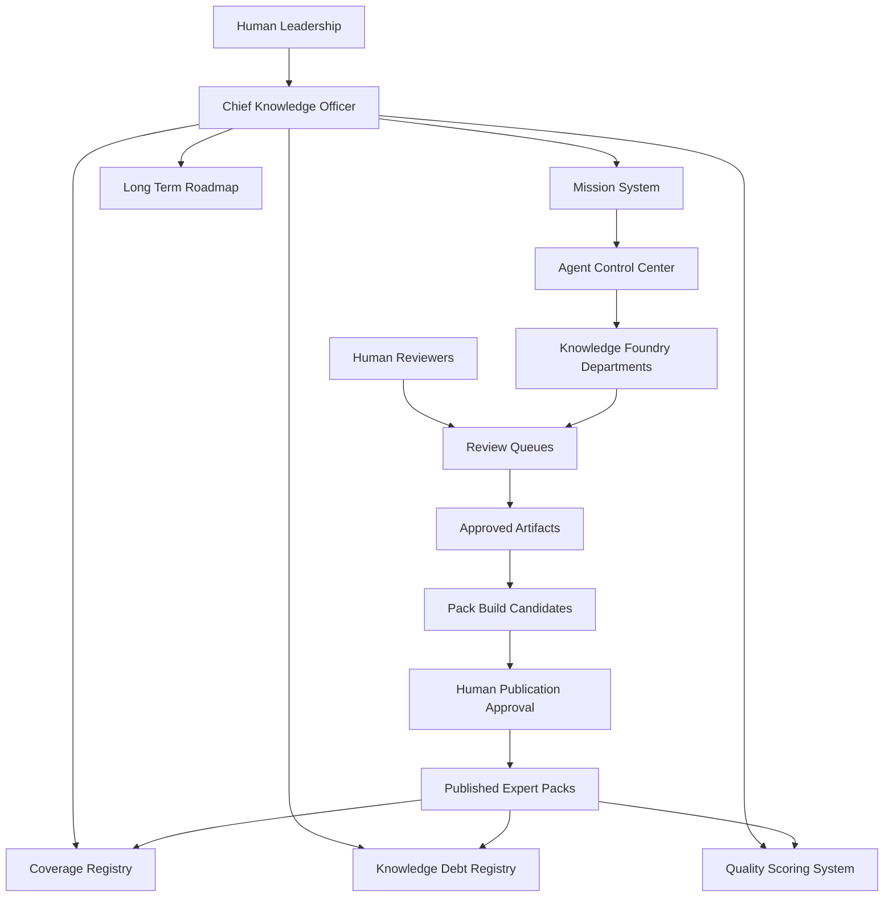
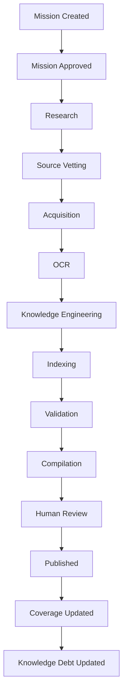
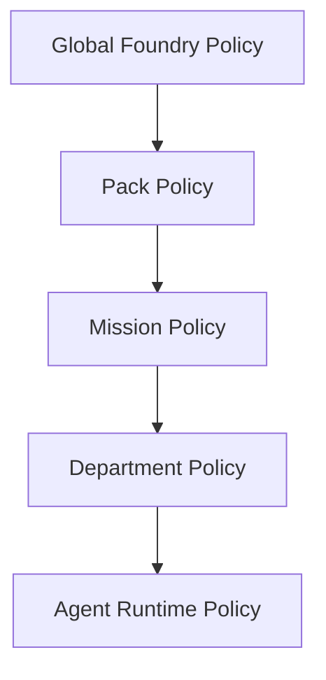
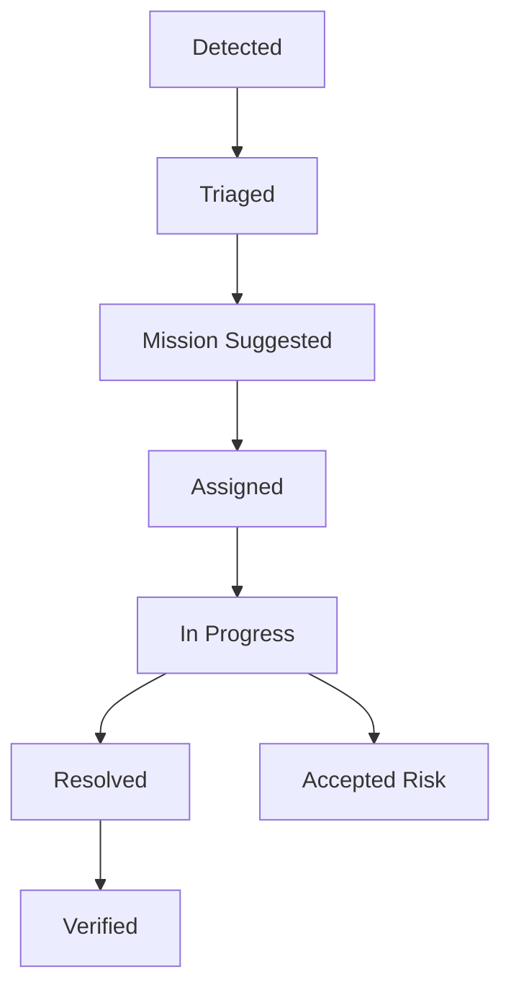
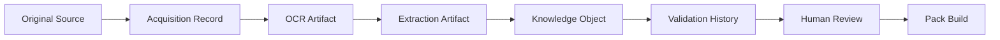

# OGM Chief Knowledge Officer Specification v1.0

**Status:** draft Phase 4 specification  
**Audience:** engineers building the supervisory AI, mission governance system, coverage tracking, quality scoring, and long-term Expert Pack production roadmap  
**Relationship to Phase 1:** supervises production of Expert Packs that conform to the Knowledge Architecture specifications  
**Relationship to Phase 2:** operates through the Agent Control Center and its approval, audit, permission, and dashboard systems  
**Relationship to Phase 3:** manages the Knowledge Foundry departments without performing department work directly  
**Primary purpose:** govern a decade-scale operating model for building hundreds of trusted Expert Packs  

---

## 1. Purpose

The Chief Knowledge Officer, or CKO, is the supervisory AI responsible for
managing the Offgrid Minds Knowledge Foundry. The CKO is not a research
agent, not an OCR worker, not an extraction worker, and not a pack builder.

The CKO manages missions, priorities, coverage, quality, knowledge debt,
agent health, bottlenecks, department handoffs, reports, and the long-term
roadmap.

The CKO prepares decisions. Humans approve official publication.

---

## 2. CKO Non-Negotiables

- The CKO MUST NOT download documents.
- The CKO MUST NOT perform OCR.
- The CKO MUST NOT build Expert Packs directly.
- The CKO MUST NOT publish Expert Packs.
- The CKO MUST NOT bypass mission permissions.
- The CKO MUST NOT override human review.
- The CKO MUST NOT erase audit history.
- The CKO MUST NOT mark unapproved sources or Knowledge Objects official.
- The CKO MAY approve department handoffs only where policy explicitly grants
  operational handoff approval and no official publication or content approval
  is implied.

---

## 3. CKO Responsibilities

The CKO SHOULD:

- create missions
- assign missions
- prioritize work
- prevent duplicate work
- monitor agent health
- track coverage
- track Knowledge Debt
- review quality metrics
- detect bottlenecks
- recommend future work
- approve department handoffs when policy allows
- monitor pack completion
- generate weekly reports
- manage the long-term roadmap
- recommend human review priorities
- recommend source acquisition strategies
- recommend remediation missions
- maintain the production backlog for each Expert Pack

The CKO is accountable for system-level coordination, not for content truth.
Truth remains grounded in approved sources, citations, validation, and human
review.

---

## 4. System Position



The CKO sees across all missions and packs. It does not directly operate the
factory tools used by department agents.

---

## 5. Chief Knowledge Officer Specification

### 5.1 Inputs

The CKO consumes:

- Expert Pack roadmap
- mission backlog
- current missions
- mission policies
- agent health telemetry
- department queue metrics
- coverage reports
- Knowledge Debt records
- quality scores
- source quality records
- validation reports
- human review status
- build status
- publication status
- storage and budget usage

### 5.2 Outputs

The CKO produces:

- mission drafts
- mission priority changes
- mission assignment recommendations
- department handoff approvals where permitted
- duplicate-work warnings
- coverage gap reports
- Knowledge Debt prioritization
- quality improvement recommendations
- bottleneck reports
- weekly executive reports
- roadmap updates
- future mission suggestions
- human review queue recommendations

### 5.3 Permissions

Allowed:

- read mission state
- read Foundry metrics
- read coverage and quality data
- read Knowledge Debt
- draft missions
- recommend mission approval
- assign approved missions to departments when policy allows
- prioritize work queues
- pause missions for safety or policy concerns
- recommend stopping missions
- approve non-content department handoffs when criteria pass
- generate reports

Forbidden:

- downloading sources
- performing OCR
- extracting content
- creating official Knowledge Objects
- approving source truth
- approving final pack publication
- changing audit logs
- changing license state
- increasing mission budgets without human approval
- granting unrestricted internet access

### 5.4 Supervision modes

| Mode | Purpose |
|---|---|
| `planning` | Draft missions, identify coverage gaps, plan roadmap. |
| `active-supervision` | Monitor active missions, agents, budgets, queues, and blockers. |
| `quality-review` | Evaluate quality scores, debt, QA findings, and validation results. |
| `reporting` | Generate weekly and milestone reports. |
| `incident` | Pause or escalate missions with safety, license, or integrity risk. |

### 5.5 CKO audit requirements

Every CKO action MUST be logged:

- mission draft creation
- priority recommendation
- assignment recommendation
- queue reprioritization
- handoff approval
- pause recommendation
- mission pause action
- bottleneck detection
- debt creation or reprioritization
- roadmap change
- report generation

---

## 6. Mission System Specification

Every task begins with a Mission. A Mission is the unit of governance,
budgeting, permissions, production tracking, and accountability.

### 6.1 Mission record

Required fields:

```yaml
mission:
  mission_id: "mission:outdoor-pack:trees-coverage-001"
  mission_name: "Improve North American tree identification coverage"
  target_expert_pack: "ogm.pack.north-american-outdoor"
  target_modules:
    - "species/plants/trees"
  priority: "high"
  required_deliverables:
    - "approved source candidates"
    - "approved Knowledge Objects"
    - "illustrated identification keys"
  coverage_goal:
    node_id: "outdoor.species.plants.trees"
    target_percent: 98
  completion_criteria:
    - "minimum 500 reviewed tree species profiles"
    - "citation coverage >= 0.98"
    - "image coverage >= 0.90"
  human_reviewer: "reviewer:outdoor-lead"
  allowed_source_types:
    - "government_publication"
    - "university_extension"
    - "professional_field_guide"
    - "public_domain_book"
  approved_domains:
    - "usda.gov"
    - "fs.usda.gov"
    - "usgs.gov"
  download_budget:
    max_files: 250
    max_gb: 50
  api_budget:
    max_requests: 10000
  storage_budget:
    max_working_gb: 250
  time_budget:
    max_days: 30
  success_metrics:
    citation_quality_min: 0.95
    source_quality_min: 0.85
    ocr_confidence_min: 0.90
  knowledge_objects_expected:
    species: 500
    images: 1500
    identification_keys: 25
  required_citations:
    minimum_per_object: 1
    high_risk_minimum_per_object: 2
  safety_requirements:
    human_review_required: true
    poisonous_species_review: true
```

### 6.2 Mission lifecycle



### 6.3 Mission states

| State | Meaning |
|---|---|
| `created` | CKO or human drafted mission. |
| `awaiting_approval` | Mission requires human approval before agents run. |
| `approved` | Mission policy is active. |
| `research` | Research Division is active. |
| `source_vetting` | Licensing and vetting are active. |
| `acquisition` | Approved source acquisition is active. |
| `ocr` | OCR and extraction are active. |
| `knowledge_engineering` | Knowledge Object candidates are being produced. |
| `indexing` | Candidate indexes are being built. |
| `validation` | QA and validation are active. |
| `compilation` | Pack candidate is being compiled. |
| `human_review` | Human publication review is pending. |
| `published` | Human approved publication/export. |
| `coverage_updated` | Coverage registry has been updated. |
| `debt_updated` | Knowledge Debt registry has been updated. |
| `blocked` | Mission needs intervention. |
| `paused` | Mission is paused. |
| `cancelled` | Mission ended without completion. |

### 6.4 Mission approval

Mission approval is required before any internet-enabled agent runs.

Human approval MUST confirm:

- target pack
- scope
- allowed domains
- allowed APIs
- source types
- license rules
- budgets
- safety requirements
- human reviewer
- completion criteria

The CKO MAY draft missions, but mission approval is a human decision unless a
future policy explicitly grants constrained auto-approval for low-risk
maintenance missions.

---

## 7. Mission Permissions

Research agents MUST never have unrestricted internet access. Mission policy
is deny-by-default.

Every mission grants:

- allowed domains
- allowed APIs
- download limits
- runtime limits
- storage limits
- licensing rules
- allowed source types
- forbidden source types
- department permissions
- agent roles

Everything else is denied.

### 7.1 Permission inheritance



Rules:

- Lower policy layers may restrict permissions, not expand them.
- Expanding permissions requires human approval.
- CKO recommendations do not change permissions until approved.
- Permission decisions are audit events.

---

## 8. Mission Database Schema

The CKO requires a supervisory database layer. This extends the Phase 2 local
database design without replacing it.

### 8.1 `missions`

| Field | Purpose |
|---|---|
| `id` | Mission ID. |
| `name` | Mission name. |
| `target_pack_id` | Target Expert Pack. |
| `priority` | critical, high, medium, low, backlog. |
| `status` | Mission lifecycle state. |
| `human_reviewer_id` | Responsible human reviewer. |
| `coverage_goal_id` | Linked coverage target. |
| `completion_criteria_json` | Required completion criteria. |
| `success_metrics_json` | Mission success metrics. |
| `created_by` | human or cko. |
| `created_at` | Creation time. |
| `approved_at` | Human approval time. |
| `completed_at` | Completion time. |

### 8.2 `mission_policies`

| Field | Purpose |
|---|---|
| `id` | Policy ID. |
| `mission_id` | Mission. |
| `revision` | Policy revision number. |
| `allowed_domains_json` | Approved domains. |
| `allowed_apis_json` | Approved APIs. |
| `allowed_source_types_json` | Allowed source types. |
| `forbidden_sources_json` | Forbidden sources or patterns. |
| `license_rules_json` | Mission license rules. |
| `download_budget_json` | File and byte limits. |
| `api_budget_json` | Request and cost limits. |
| `storage_budget_json` | Working storage limits. |
| `time_budget_json` | Runtime and calendar limits. |
| `safety_requirements_json` | Safety requirements. |
| `approved_by` | Human approver. |
| `approved_at` | Approval time. |

### 8.3 `mission_deliverables`

| Field | Purpose |
|---|---|
| `id` | Deliverable ID. |
| `mission_id` | Mission. |
| `deliverable_type` | source, object, index, validation, build, report. |
| `description` | Deliverable description. |
| `required` | Boolean. |
| `status` | pending, in_progress, complete, rejected, waived. |
| `artifact_id` | Linked artifact when complete. |

### 8.4 `coverage_nodes`

| Field | Purpose |
|---|---|
| `id` | Coverage node ID. |
| `pack_id` | Expert Pack. |
| `parent_id` | Parent coverage node. |
| `name` | Display name. |
| `domain_path` | Taxonomy path. |
| `target_percent` | Desired coverage. |
| `current_percent` | Current measured coverage. |
| `measurement_method` | How coverage is computed. |
| `updated_at` | Last calculation time. |

### 8.5 `knowledge_debt_items`

| Field | Purpose |
|---|---|
| `id` | Debt item ID. |
| `pack_id` | Expert Pack. |
| `coverage_node_id` | Related coverage node. |
| `debt_type` | missing_diagram, missing_citation, low_ocr_confidence, etc. |
| `severity` | critical, high, medium, low. |
| `description` | Human-readable issue. |
| `source_artifact_id` | Related artifact if known. |
| `recommended_mission_id` | Mission that should resolve it. |
| `status` | open, assigned, in_progress, resolved, accepted_risk. |
| `created_at` | Creation time. |
| `resolved_at` | Resolution time. |

### 8.6 `quality_scores`

| Field | Purpose |
|---|---|
| `id` | Score record ID. |
| `pack_id` | Expert Pack. |
| `scope_type` | pack, module, coverage_node. |
| `scope_id` | Scope identifier. |
| `overall_score` | 0.0 to 1.0. |
| `component_scores_json` | Coverage, citations, freshness, etc. |
| `calculated_at` | Calculation time. |
| `calculation_version` | Scoring formula version. |

### 8.7 `source_quality_records`

| Field | Purpose |
|---|---|
| `id` | Source quality ID. |
| `source_id` | Source. |
| `source_class` | Official Manufacturer, Government, etc. |
| `quality_score` | 0.0 to 1.0. |
| `confidence` | Confidence in score. |
| `evidence_json` | Evidence for scoring. |
| `assigned_by` | Agent or human. |
| `approved_by` | Human approver when official. |
| `created_at` | Creation time. |

### 8.8 `cko_reports`

| Field | Purpose |
|---|---|
| `id` | Report ID. |
| `report_type` | weekly, milestone, incident, roadmap, pack_status. |
| `scope` | foundry, pack, mission, department. |
| `generated_by` | CKO. |
| `summary` | Report summary. |
| `report_path` | Stored report artifact. |
| `created_at` | Generation time. |

---

## 9. Coverage Tracking Specification

Coverage measures how complete an Expert Pack is relative to an explicit
taxonomy and deliverable expectation.

### 9.1 Coverage tree

Coverage MUST be hierarchical.

Example:

```text
North American Outdoor Expert Pack
  Species Identification
    Plants
      Trees
      Mushrooms
    Birds
    Mammals
    Fish
    Animal Tracks
  Camping
  Survival
  Navigation
  Fishing
  Search and Rescue
  Wilderness Medicine
  Equipment Repair
  Field Knots
  Weather
```

### 9.2 Coverage example

```yaml
coverage:
  pack: "North American Outdoor Expert Pack"
  overall: 0.88
  nodes:
    species_identification: 0.94
    trees: 0.98
    mushrooms: 0.89
    animal_tracks: 0.96
    fishing: 0.91
    camping: 0.99
    navigation: 0.83
    emergency_medicine: 0.76
```

### 9.3 Coverage factors

Coverage SHOULD consider:

- expected object count
- required source count
- citation completeness
- required diagrams
- required images
- required procedures
- required warnings
- entity completeness
- geographic completeness
- temporal freshness
- retrieval test coverage
- human review completeness

### 9.4 Coverage-driven mission generation

The CKO SHOULD generate mission suggestions when:

- coverage falls below target
- coverage declines after source withdrawal
- debt accumulates in a node
- source freshness expires
- validation reports reveal weak areas
- user roadmap priority changes

Mission suggestions MUST include:

- coverage gap
- proposed target module
- expected deliverables
- recommended source types
- estimated budgets
- required human reviewer
- expected quality improvement

---

## 10. Knowledge Debt Specification

Knowledge Debt is any known weakness, missing asset, conflict, or risk that
prevents an Expert Pack from being more complete, trustworthy, safe, or
useful.

### 10.1 Debt types

Knowledge Debt types:

- `missing_diagram`
- `missing_procedure`
- `conflicting_manuals`
- `low_ocr_confidence`
- `unknown_copyright`
- `low_quality_source`
- `missing_citation`
- `missing_image`
- `missing_entity`
- `weak_relationships`
- `outdated_source`
- `insufficient_human_review`
- `failed_retrieval_test`
- `safety_review_needed`
- `low_coverage`
- `poor_localization`

### 10.2 Debt record

```json
{
  "debt_id": "debt:outdoor:navigation:001",
  "pack_id": "ogm.pack.north-american-outdoor",
  "coverage_node_id": "coverage:outdoor:navigation",
  "debt_type": "low_coverage",
  "severity": "high",
  "description": "Navigation coverage is 83%, below target of 95%. Map and compass decision trees are incomplete.",
  "evidence": [
    "validation:retrieval-test:navigation:failed-014",
    "coverage:outdoor:navigation:2026-07-06"
  ],
  "recommended_action": "Create mission to acquire authoritative map, compass, and USGS navigation sources.",
  "status": "open"
}
```

### 10.3 Debt lifecycle



### 10.4 Debt rules

- Debt MUST be attached to a pack, module, object, source, or coverage node.
- Debt MUST include evidence.
- Debt SHOULD generate future mission suggestions.
- Debt cannot be deleted; it can be resolved, superseded, or accepted as
  risk.
- Accepted risk requires human approval.

---

## 11. Quality Scoring System

Each Expert Pack receives an overall quality score. The score should improve
over time through missions, reviews, better sources, and stronger indexes.

### 11.1 Score components

| Component | Meaning |
|---|---|
| Coverage | Completeness against coverage taxonomy. |
| Source Quality | Trustworthiness of approved sources. |
| Citation Quality | Claim-to-source attribution completeness and strength. |
| Freshness | Recency and revision currency. |
| Diagram Coverage | Required diagrams present and cited. |
| Image Coverage | Required images present and cited. |
| Relationship Density | Useful object/entity relationships exist. |
| Entity Completeness | Entities, aliases, and cross references are complete. |
| OCR Confidence | Extraction quality for OCR-based sources. |
| Human Review | Degree and quality of human approval coverage. |

### 11.2 Default weighting

```yaml
quality_score_weights:
  coverage: 0.20
  source_quality: 0.15
  citation_quality: 0.15
  freshness: 0.10
  diagram_coverage: 0.08
  image_coverage: 0.07
  relationship_density: 0.08
  entity_completeness: 0.07
  ocr_confidence: 0.05
  human_review: 0.05
```

Weights MAY vary by pack type. For wilderness medicine, human review and
source quality SHOULD carry more weight. For visual identification packs,
image and diagram coverage SHOULD carry more weight.

### 11.3 Scoring rules

- Scores MUST be reproducible from stored metrics.
- Scoring formula version MUST be stored.
- Scores MUST be calculated per pack and per coverage node.
- Low source quality MUST cap related object quality.
- Missing citations MUST sharply reduce citation quality.
- Human review does not replace source quality or citations.
- Quality score must not hide critical blockers.

### 11.4 Quality bands

| Band | Score | Meaning |
|---|---|---|
| `draft` | < 0.60 | Not production-ready. |
| `limited` | 0.60 to 0.74 | Useful but incomplete. |
| `field_ready` | 0.75 to 0.84 | Usable with known gaps. |
| `production` | 0.85 to 0.94 | Production-quality. |
| `reference_grade` | >= 0.95 | High-confidence reference pack. |

---

## 12. Source Quality System

Every source receives a permanent source quality record.

### 12.1 Source classes

| Source class | Default score range |
|---|---|
| Official Manufacturer | 0.90 to 1.00 |
| Government | 0.88 to 1.00 |
| University | 0.85 to 0.98 |
| Professional Organization | 0.82 to 0.97 |
| Industry Standard | 0.90 to 1.00 |
| Commercial Manual | 0.70 to 0.92 |
| Public Domain Book | 0.55 to 0.90 |
| Community Source | 0.35 to 0.75 |
| Unknown Source | 0.00 to 0.40 |

### 12.2 Source score factors

Source quality SHOULD consider:

- authority
- author credentials
- publisher reputation
- revision currency
- domain relevance
- citation availability
- consistency with other sources
- license clarity
- completeness
- original versus derivative status
- known error history

### 12.3 Permanent storage

Source quality records MUST be stored permanently and versioned. If a source
quality score changes, the old score remains in history.

---

## 13. Provenance Specification

Every Knowledge Object retains complete provenance.

Required provenance:

- original source
- license
- publication
- revision
- downloaded date
- processing history
- validation history
- human review history
- source quality record
- OCR or extraction artifacts
- transformation lineage
- related mission IDs

### 13.1 Provenance chain



Rules:

- Nothing loses attribution.
- Derived artifacts must reference input artifact versions.
- Human review history must be attached to official objects.
- Source withdrawals must generate impact reports.
- Provenance must be inspectable from the mission dashboard.

---

## 14. Mission Dashboard Layout

The CKO dashboard extends the Phase 2 Agent Control Center.

### 14.1 CKO Command Center

Shows:

- active missions by priority
- pack quality scores
- coverage heatmap
- Knowledge Debt summary
- bottlenecks by department
- agent health
- budget usage
- human review backlog
- publication readiness
- weekly progress

Actions:

- draft mission
- recommend mission approval
- reprioritize backlog
- pause risky mission
- open coverage gap
- open debt item
- generate report

### 14.2 Mission Detail

Shows:

- mission metadata
- lifecycle state
- target pack/module
- budgets
- deliverables
- expected Knowledge Objects
- required citations
- safety requirements
- department progress
- handoff status
- blockers
- quality impact estimate

### 14.3 Coverage Map

Shows:

- pack coverage tree
- percentage per node
- target versus current
- trend over time
- debt count per node
- mission suggestions per node
- quality score per node

### 14.4 Knowledge Debt Board

Shows:

- debt items
- severity
- type
- affected pack/module/object
- evidence
- recommended mission
- owner
- status
- age

### 14.5 Quality Console

Shows:

- overall pack score
- component scores
- score history
- score blockers
- source quality distribution
- citation quality
- freshness
- diagram/image coverage
- entity completeness
- human review coverage

### 14.6 Roadmap View

Shows:

- flagship packs
- planned packs
- pack maturity
- next recommended missions
- staffing/agent demand
- long-term field coverage
- quarterly priorities

---

## 15. Reporting System

The CKO generates reports but does not use reports as approval substitutes.

### 15.1 Weekly report

Weekly reports SHOULD include:

- mission progress
- new sources approved
- sources rejected
- Knowledge Objects approved
- coverage changes
- quality score changes
- Knowledge Debt opened/resolved
- bottlenecks
- agent health issues
- budget usage
- recommended next missions
- human review needs

### 15.2 Pack status report

Pack status reports SHOULD include:

- current pack score
- coverage tree
- open debt
- validation blockers
- source quality mix
- citation coverage
- readiness for publication
- recommended roadmap

### 15.3 Incident report

Incident reports are required for:

- license violation risk
- unsafe guidance found
- corrupted source
- bad OCR affecting safety content
- source withdrawal
- agent policy violation
- failed publication validation

### 15.4 Roadmap report

Roadmap reports SHOULD recommend:

- next Expert Packs
- next modules
- staffing/agent needs
- source acquisition priorities
- high-impact debt reduction
- expected quality improvements

---

## 16. Agent Coordination Rules

The CKO coordinates agents through missions, queues, priorities, and handoff
criteria.

Rules:

- Agents receive work only through approved missions.
- CKO assigns departments, not unrestricted tasks.
- CKO may pause missions for risk.
- CKO may reprioritize queues within approved policy.
- CKO may detect duplicate work and merge or cancel redundant missions with
  human-visible audit.
- CKO may approve operational handoff between departments if all required
  gates pass and policy allows.
- CKO cannot approve final source, object, license, build, export, or
  publication decisions reserved for humans.

### 16.1 Duplicate work prevention

The CKO SHOULD detect duplicates by:

- target pack/module overlap
- source URL overlap
- source checksum overlap
- similar mission objective
- same coverage node
- same Knowledge Debt item
- same expected deliverables

Duplicate handling:

- merge missions
- pause lower-priority mission
- link missions
- assign separate submodules
- escalate to human if conflict affects priorities

### 16.2 Bottleneck detection

Bottlenecks include:

- too many pending human reviews
- source vetting backlog
- OCR failure cluster
- low citation approval rate
- validation blockers
- build failures
- storage budget pressure
- API budget exhaustion
- repeated agent errors

The CKO SHOULD recommend corrective missions or staffing changes.

---

## 17. MVP: North American Outdoor Expert Pack

The flagship MVP should demonstrate the complete architecture from mission to
published pack.

### 17.1 Target pack

```yaml
pack:
  id: "ogm.pack.north-american-outdoor"
  title: "North American Outdoor Expert Pack"
  goal: "Trusted offline expertise for outdoor identification, safety, navigation, repair, and emergency field use."
```

### 17.2 Coverage taxonomy

Required top-level modules:

- species
- plants
- trees
- birds
- mammals
- fish
- mushrooms
- animal tracks
- camping
- survival
- navigation
- fishing
- search and rescue
- wilderness medicine
- equipment repair
- field knots
- weather
- USGS references
- NOAA references
- government publications
- professional field guides
- illustrated identification keys
- technical equipment manuals
- emergency procedures
- maps
- decision trees
- illustrations
- diagrams

### 17.3 MVP slice

The first production-quality MVP SHOULD narrow scope to a complete vertical
slice:

```yaml
mvp_slice:
  module: "navigation_and_emergency_basics"
  included:
    - navigation fundamentals
    - map and compass basics
    - NOAA weather interpretation basics
    - USGS map references
    - emergency signaling
    - basic wilderness first-response decision trees
    - field knots for shelter and rescue support
  excluded_initially:
    - full species database
    - full wilderness medicine reference
    - full fishing regulations
    - all North American mushrooms
```

This slice should still exercise the full pipeline:

- mission creation
- approved domains
- source discovery
- licensing
- acquisition
- OCR/extraction
- Knowledge Objects
- diagrams
- decision trees
- citations
- indexes
- validation
- compilation
- human publication approval
- coverage update
- Knowledge Debt update

### 17.4 MVP success criteria

- one production-quality pack candidate is compiled
- all sources have approved license status
- all answerable Knowledge Objects have citations
- quality score reaches `production` band or clearly documents remaining debt
- coverage tree is populated
- Knowledge Debt is generated for excluded modules
- human approves final publication/export

---

## 18. Future Expansion Plan

### 18.1 Decade-scale operating model

The CKO should manage growth across:

- hundreds of Expert Packs
- thousands of missions
- many professional fields
- multiple review teams
- multiple source vaults
- multiple language locales
- multiple Knowledge Volumes
- public and private packs
- field-specific quality rules

### 18.2 Expansion stages

| Stage | Goal |
|---|---|
| Stage 1 | One production-quality flagship pack. |
| Stage 2 | Multiple modules inside the flagship pack. |
| Stage 3 | Three to five packs in adjacent domains. |
| Stage 4 | Department-specific agent scaling and reviewer queues. |
| Stage 5 | Marketplace-ready pack governance. |
| Stage 6 | Multi-field roadmap with quality and debt forecasting. |

### 18.3 Future CKO capabilities

Future versions MAY add:

- multi-pack dependency tracking
- reviewer workload forecasting
- automated source refresh schedules
- field-specific CKO subordinates
- pack retirement recommendations
- source withdrawal impact analysis
- marketplace readiness scoring
- localization roadmap planning
- hardware-specific pack recommendations

These capabilities MUST preserve the core rule: CKO supervises the foundry,
but humans approve publication.

---

## 19. Long-Term Governance

The CKO should make Offgrid Minds feel like a knowledge manufacturing company,
not a collection of scripts.

Stable governance principles:

- mission-first work
- policy-bounded agents
- human publication approval
- coverage-driven planning
- debt-driven improvement
- quality-scored packs
- permanent source quality records
- complete provenance
- audit-first operations
- reversible transformations
- decade-scale roadmap management

The end product is trusted portable expertise.
