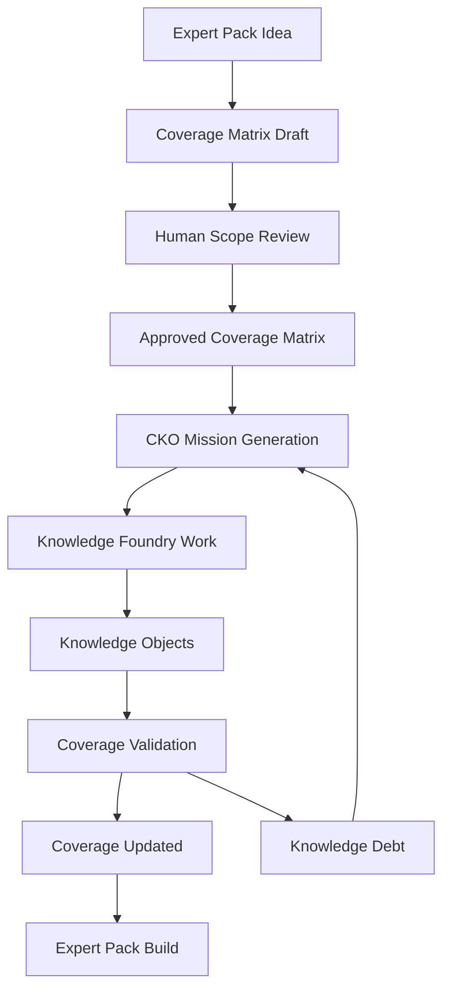

# OGM Coverage Matrix Specification v1.0

**Status:** draft Phase 6.5 specification  
**Audience:** Offgrid Minds founders, CKO designers, Knowledge Foundry operators, pack architects, curators, validators, dashboard builders, and human reviewers  
**Relationship to Phase 1:** defines the completeness plan that Expert Packs and Knowledge Objects must satisfy  
**Relationship to Phase 2:** supplies dashboard and work queue structure for the Agent Control Center  
**Relationship to Phase 3:** supplies the production backlog that Foundry departments fulfill  
**Relationship to Phase 4:** gives the Chief Knowledge Officer a deterministic source for future missions and Knowledge Debt  
**Relationship to Phase 5:** produces ACP events such as `CoverageUpdated`, `KnowledgeDebtCreated`, and mission creation messages  
**Relationship to Phase 6:** makes Gold Standard completeness measurable before research begins  
**Primary purpose:** prevent important knowledge from being omitted because it is uncommon, difficult to find, obscure, regional, low-volume, or not obvious to a curator  

---

## 1. Purpose

Every Offgrid Minds Expert Pack begins with a **Coverage Matrix**.

The Coverage Matrix defines what knowledge should exist before any research,
source acquisition, extraction, or pack building begins. It is the pack's
completeness contract.

The Curator never decides what is important. The Coverage Matrix defines
importance, completeness, required source classes, required Knowledge Objects,
and future update rules. Curators and agents fulfill missing Coverage Objects.

---

## 2. Core Principle

Offgrid Minds must not confuse "easy to find" with "important."

A good Expert Pack includes common, uncommon, regional, obscure, hazardous,
regulated, historical, model-specific, and edge-case knowledge when the domain
requires it.

The Coverage Matrix exists to ensure:

- important knowledge is declared before research begins
- missing knowledge becomes visible
- difficult topics become missions, not omissions
- curators cannot shrink scope silently
- CKO mission generation is systematic
- every pack has an honest completeness score

---

## 3. Definitions

- **Coverage Matrix:** The structured completeness map for an Expert Pack.
- **Coverage Object:** A single required coverage unit inside the matrix.
- **Coverage Dimension:** A field used to define coverage scope, such as
  manufacturer, model, species, region, season, subsystem, denomination, or
  year.
- **Required Knowledge Object:** A Knowledge Object type or specific object
  that must exist for a Coverage Object to be considered complete.
- **Coverage Gap:** Missing, stale, low-confidence, unreviewed, or insufficient
  knowledge required by a Coverage Object.
- **Coverage Mission:** A mission generated by the CKO from incomplete Coverage
  Objects.
- **Curator:** A human or agent-assisted operator who fulfills Coverage Objects
  but does not invent pack scope.

---

## 4. Matrix Lifecycle



Rules:

- A pack MUST NOT begin production without an approved Coverage Matrix.
- The Coverage Matrix MUST be versioned.
- Changes to the Coverage Matrix MUST be auditable.
- Coverage Objects MUST be addressable by stable IDs.
- Incomplete Coverage Objects SHOULD generate CKO missions.
- Publishing MUST report coverage limits and open Knowledge Debt.

---

## 5. Coverage Matrix Record

Every matrix MUST include a top-level record.

```yaml
coverage_matrix:
  matrix_id: "cm:ogm.pack.north-american-outdoor:v1"
  pack_id: "ogm.pack.north-american-outdoor"
  title: "North American Outdoor Coverage Matrix"
  schema_version: "1.0"
  matrix_version: "1.0.0"
  status: "approved"
  scope_statement: "Professional outdoor reference coverage for North America."
  owner: "ogm.publisher.offgrid-minds"
  created_at: "2026-07-06T19:00:00Z"
  updated_at: "2026-07-06T19:00:00Z"
  approved_by: "human:pack-architect:001"
  coverage_object_count: 0
  completeness_target: 0.95
  risk_blocking_thresholds:
    critical: 1.0
    high: 0.95
    medium: 0.85
    low: 0.70
```

Matrix statuses:

- `draft`
- `scope_review`
- `approved`
- `active`
- `superseded`
- `archived`

---

## 6. Coverage Object Schema

Every Coverage Object MUST use the standard v1 schema.

```json
{
  "coverage_object_id": "cov:ogm.pack.north-american-outdoor:outdoor:species:trees:acer-rubrum:eastern-us",
  "schema_version": "1.0",
  "pack_id": "ogm.pack.north-american-outdoor",
  "matrix_id": "cm:ogm.pack.north-american-outdoor:v1",
  "domain": "outdoor",
  "category": "species",
  "subcategory": "trees",
  "dimensions": {
    "species": "Acer rubrum",
    "family": "Sapindaceae",
    "region": "eastern-north-america",
    "season": "all"
  },
  "required_knowledge_objects": [
    {
      "object_type": "SpeciesProfile",
      "minimum_count": 1,
      "required": true
    },
    {
      "object_type": "IdentificationKey",
      "minimum_count": 1,
      "required": true
    },
    {
      "object_type": "ImageReference",
      "minimum_count": 4,
      "required": true
    },
    {
      "object_type": "LookalikeComparison",
      "minimum_count": 1,
      "required": true
    }
  ],
  "required_source_types": [
    "government_publication",
    "university_extension",
    "professional_field_guide"
  ],
  "coverage_status": "partial",
  "coverage_percentage": 0.62,
  "priority": "high",
  "risk_level": "medium",
  "last_updated": "2026-07-06T19:00:00Z",
  "related_objects": [
    "ko:ogm.pack.north-american-outdoor:species:acer-rubrum"
  ],
  "dependencies": [
    "cov:ogm.pack.north-american-outdoor:outdoor:taxonomy:trees:sapindaceae"
  ],
  "future_update_rules": {
    "refresh_interval_days": 365,
    "trigger_events": [
      "taxonomy_change",
      "range_change",
      "new_regulation",
      "new_high_quality_source"
    ],
    "requires_human_review_on_update": true
  },
  "notes": "Needs improved winter bark and twig identification imagery."
}
```

### 6.1 Required fields

- `coverage_object_id`
- `schema_version`
- `pack_id`
- `matrix_id`
- `domain`
- `category`
- `subcategory`
- `required_knowledge_objects`
- `required_source_types`
- `coverage_status`
- `coverage_percentage`
- `priority`
- `last_updated`
- `related_objects`
- `dependencies`
- `future_update_rules`

### 6.2 Recommended fields

- `dimensions`
- `risk_level`
- `review_required`
- `assigned_department`
- `minimum_confidence`
- `minimum_source_count`
- `regional_applicability`
- `temporal_applicability`
- `known_gaps`
- `blocking_reasons`
- `notes`

---

## 7. Coverage Object Identity

Coverage Object IDs MUST be stable and deterministic.

Recommended format:

```text
cov:<pack_id>:<domain>:<category>:<subcategory>:<stable-key>
```

Examples:

```text
cov:ogm.pack.north-american-outdoor:outdoor:species:trees:acer-rubrum:eastern-us
cov:ogm.pack.auto-toyota-corolla:automotive:toyota:corolla:e210:2020:brakes
cov:ogm.pack.us-coins:collectibles:coin:us-mint:morgan-dollar:1881-s
```

Rules:

- IDs MUST NOT include local storage paths.
- IDs SHOULD use lowercase ASCII kebab-case for non-scientific stable keys.
- Species names MAY preserve scientific binomial keys in normalized lowercase.
- If scope is split, child Coverage Objects MUST reference the parent.
- If scope is merged, the replacement object MUST reference superseded IDs.

---

## 8. Coverage Status

Coverage status values:

- `not_started`
- `researching`
- `sources_found`
- `source_blocked`
- `in_extraction`
- `objects_created`
- `needs_review`
- `partial`
- `complete`
- `stale`
- `blocked`
- `not_applicable`

Status rules:

- `complete` requires all required Knowledge Objects, required source types,
  confidence thresholds, validation checks, and human review gates.
- `partial` means usable but incomplete.
- `stale` means previously complete but update rules were triggered.
- `blocked` means production cannot continue without human, legal, licensing,
  source, or scope intervention.
- `not_applicable` requires a human-reviewed reason.

---

## 9. Required Knowledge Objects

Coverage Objects define what Knowledge Objects must exist.

Each requirement SHOULD include:

```yaml
required_knowledge_object:
  object_type: "Procedure"
  minimum_count: 1
  required: true
  minimum_confidence: 0.90
  requires_human_review: true
  required_relationships:
    - "cites"
    - "has_warning"
    - "has_quick_reference"
```

Requirements MAY specify exact object IDs when scope is known:

```yaml
required_knowledge_object:
  object_id: "ko:ogm.pack.north-american-outdoor:protocol:hypothermia"
  object_type: "EmergencyProtocol"
  required: true
```

Coverage validation MUST compare the matrix against actual Knowledge Objects in
the pack candidate.

---

## 10. Required Source Types

Coverage Objects MUST define the kinds of sources needed before content can be
trusted.

Recommended source type vocabulary:

- `government_publication`
- `official_manual`
- `manufacturer_manual`
- `university_reference`
- `university_extension`
- `professional_field_guide`
- `scientific_paper`
- `technical_standard`
- `regulation`
- `public_dataset`
- `museum_or_archive_catalog`
- `expert_review`
- `photographic_reference`
- `map_dataset`
- `weather_or_geospatial_agency`

Rules:

- High-risk content MUST require authoritative source types.
- Regulations MUST require official government or agency sources.
- Equipment repair SHOULD require manufacturer manuals when available.
- Species identification SHOULD require multiple source classes for high-risk
  edible, toxic, venomous, or legally protected species.
- Collectibles valuation and identification SHOULD separate market sources from
  authoritative catalog sources.

---

## 11. Coverage Scoring

Coverage percentage MUST be computed from weighted evidence, not simple object
count.

Recommended scoring components:

```yaml
coverage_score:
  required_object_completion: 0.40
  required_source_completion: 0.20
  relationship_completion: 0.10
  review_completion: 0.10
  confidence_completion: 0.10
  freshness_completion: 0.05
  media_or_map_completion: 0.05
```

Default formula:

```text
coverage_percentage =
  required_object_completion * 0.40 +
  required_source_completion * 0.20 +
  relationship_completion * 0.10 +
  review_completion * 0.10 +
  confidence_completion * 0.10 +
  freshness_completion * 0.05 +
  media_or_map_completion * 0.05
```

Coverage classes:

- `complete`: 0.95-1.00 and no blockers
- `strong`: 0.85-0.94
- `partial`: 0.50-0.84
- `weak`: 0.10-0.49
- `missing`: 0.00-0.09

Critical Coverage Objects MAY require 100% completion before publication.

---

## 12. Mission Generation Rules

The Chief Knowledge Officer MUST use Coverage Objects as the source of future
mission generation.

Curators never invent scope. They fulfill Coverage Objects.

### 12.1 Mission generation triggers

The CKO SHOULD generate missions when:

- `coverage_status` is `not_started`, `partial`, `stale`, `blocked`, or
  `source_blocked`
- `coverage_percentage` falls below target
- required Knowledge Objects are missing
- required source types are missing
- human review is incomplete
- confidence drops below threshold
- update rules are triggered
- a dependency becomes complete and unlocks downstream work
- a pack approaches publication with unresolved high-priority gaps

### 12.2 Mission types

Recommended generated mission types:

- `coverage-research`
- `source-acquisition`
- `licensing-review`
- `object-extraction`
- `media-acquisition`
- `map-acquisition`
- `relationship-completion`
- `human-review`
- `freshness-review`
- `blocked-scope-resolution`
- `validation-remediation`

### 12.3 Mission draft payload

```yaml
mission:
  mission_id: "mission:coverage:auto-toyota-corolla-2020-brakes-001"
  mission_type: "coverage-research"
  source: "coverage_matrix"
  target_expert_pack: "ogm.pack.auto-toyota-corolla"
  target_coverage_objects:
    - "cov:ogm.pack.auto-toyota-corolla:automotive:toyota:corolla:e210:2020:brakes"
  objective: "Find authoritative sources required to complete brake subsystem coverage."
  required_outputs:
    - "SourceDiscovered"
    - "SourceApproved"
    - "KnowledgeObjectCreated"
    - "CoverageUpdated"
  priority: "high"
  blocking_reason: "required manufacturer manual source missing"
```

### 12.4 Prioritization

Priority SHOULD be computed from:

- safety risk
- user value
- dependency count
- publication blocker status
- regulatory/legal sensitivity
- rarity or difficulty of source acquisition
- number of downstream Coverage Objects unlocked
- age since last update

The CKO SHOULD favor high-risk and high-dependency gaps over easy low-impact
coverage.

---

## 13. Dependency Rules

Coverage Objects MAY depend on other Coverage Objects.

Dependency types:

- `requires_taxonomy`
- `requires_model_identity`
- `requires_generation_identity`
- `requires_source_approval`
- `requires_regulation_framework`
- `requires_map_layer`
- `requires_media_reference`
- `requires_review_panel`
- `requires_parent_category`

Rules:

- Dependent objects SHOULD NOT be marked complete until required dependencies
  are complete.
- Dependency completion MAY automatically generate downstream missions.
- Blocked dependencies MUST be visible in dashboards.
- Cyclic dependencies MUST fail validation.

---

## 14. Future Update Rules

Coverage Objects MUST define how they stay current.

Update triggers:

- new model year
- new product generation
- manufacturer service bulletin
- regulation change
- taxonomy change
- range shift
- new official source
- source license change
- safety alert
- recall
- market catalog revision
- map dataset update
- weather/geological agency dataset update
- human reviewer request

Refresh intervals SHOULD vary by domain:

```yaml
refresh_intervals:
  emergency_protocols_days: 180
  regulations_days: 90
  manufacturer_service_info_days: 180
  species_taxonomy_days: 365
  maps_days: 365
  collectibles_catalogs_days: 365
  historical_references_days: 1095
```

If an update rule triggers, the object SHOULD become `stale` or `needs_review`
depending on risk.

---

## 15. Coverage Dashboard

The Coverage Dashboard SHOULD be available in the Agent Control Center.

Required dashboard views:

- pack-level completeness
- domain completeness
- category/subcategory completeness
- high-priority gaps
- blocked Coverage Objects
- stale Coverage Objects
- source-type gaps
- human-review gaps
- dependency blockers
- publication blockers
- Knowledge Debt generated from coverage gaps
- trend over time

Dashboard fields:

```yaml
dashboard_card:
  coverage_object_id: "cov:..."
  title: "2020 Toyota Corolla brake subsystem"
  status: "partial"
  coverage_percentage: 0.68
  priority: "high"
  blocker_count: 2
  missing_required_objects:
    - "Procedure"
    - "TechnicalManual"
  missing_source_types:
    - "manufacturer_manual"
  next_recommended_mission: "source-acquisition"
```

The dashboard MUST make obscure gaps as visible as common gaps.

---

## 16. Relationship to Expert Packs

An Expert Pack is the product. The Coverage Matrix is the product's planned
knowledge boundary.

Rules:

- Every Expert Pack SHOULD include its approved Coverage Matrix or a compact
  matrix manifest.
- Pack publication MUST include a coverage report generated from the matrix.
- Pack manifests SHOULD reference the matrix ID and version.
- Pack updates SHOULD identify which Coverage Objects changed.
- Marketplace listings SHOULD expose high-level coverage completeness and
  known limitations.

Recommended manifest extension:

```yaml
coverage:
  matrix_id: "cm:ogm.pack.north-american-outdoor:v1"
  matrix_version: "1.0.0"
  overall_coverage_percentage: 0.91
  critical_coverage_complete: true
  open_coverage_debt_count: 42
```

---

## 17. Relationship to Knowledge Objects

Knowledge Objects fulfill Coverage Objects.

Rules:

- Knowledge Objects SHOULD reference the Coverage Objects they satisfy.
- Coverage Objects SHOULD reference related Knowledge Objects.
- One Knowledge Object MAY satisfy multiple Coverage Objects.
- One Coverage Object usually requires multiple Knowledge Objects.
- Coverage validation MUST detect orphan Knowledge Objects that do not map to
  any approved coverage.
- Curators MAY propose new Coverage Objects when real scope gaps are
  discovered, but they MUST NOT fulfill invented scope until approved.

Recommended Knowledge Object metadata:

```yaml
coverage:
  satisfies:
    - "cov:ogm.pack.north-american-outdoor:outdoor:species:trees:acer-rubrum:eastern-us"
  coverage_role: "primary"
  coverage_validation_status: "accepted"
```

---

## 18. Relationship to Knowledge Debt

Coverage gaps become Knowledge Debt when they remain unresolved.

Debt should be generated for:

- missing required Knowledge Objects
- missing required source types
- insufficient confidence
- missing human review
- stale content
- blocked licensing
- missing diagrams, maps, images, or decision trees
- incomplete relationships
- unresolved dependencies

Knowledge Debt MUST preserve the source Coverage Object so the CKO can create
future missions.

---

## 19. Domain Examples

### 19.1 Automotive

Automotive coverage dimensions:

- manufacturer
- model
- generation
- year
- trim
- engine
- transmission
- subsystem
- part group
- service interval
- market region

Example Coverage Object:

```yaml
coverage_object_id: "cov:ogm.pack.auto-toyota-corolla:automotive:toyota:corolla:e210:2020:brakes"
domain: "automotive"
category: "toyota"
subcategory: "corolla"
dimensions:
  manufacturer: "Toyota"
  model: "Corolla"
  generation: "E210"
  year: 2020
  subsystem: "brakes"
  market_region: "north-america"
required_knowledge_objects:
  - object_type: "SubsystemOverview"
    minimum_count: 1
  - object_type: "Procedure"
    minimum_count: 4
  - object_type: "TechnicalManual"
    minimum_count: 1
  - object_type: "TroubleshootingTree"
    minimum_count: 1
required_source_types:
  - "manufacturer_manual"
  - "official_manual"
  - "technical_service_bulletin"
coverage_status: "partial"
coverage_percentage: 0.68
priority: "high"
dependencies:
  - "cov:ogm.pack.auto-toyota-corolla:automotive:toyota:corolla:e210:identity"
future_update_rules:
  refresh_interval_days: 180
  trigger_events: ["service_bulletin", "recall", "manual_revision"]
```

### 19.2 Outdoor

Outdoor coverage dimensions:

- species
- family
- region
- season
- habitat
- risk level
- use case
- regulation region
- map layer

Example Coverage Object:

```yaml
coverage_object_id: "cov:ogm.pack.north-american-outdoor:outdoor:species:fungi:amanita-bisporigera:eastern-us"
domain: "outdoor"
category: "species"
subcategory: "fungi"
dimensions:
  species: "Amanita bisporigera"
  family: "Amanitaceae"
  region: "eastern-north-america"
  season: "summer-fall"
  risk_level: "critical"
required_knowledge_objects:
  - object_type: "SpeciesProfile"
    minimum_count: 1
  - object_type: "IdentificationKey"
    minimum_count: 1
  - object_type: "LookalikeComparison"
    minimum_count: 3
  - object_type: "EmergencyProtocol"
    minimum_count: 1
required_source_types:
  - "university_reference"
  - "professional_field_guide"
  - "public_health_agency"
coverage_status: "needs_review"
coverage_percentage: 0.74
priority: "critical"
future_update_rules:
  refresh_interval_days: 365
  trigger_events: ["taxonomy_change", "new_toxicology_reference"]
  requires_human_review_on_update: true
```

### 19.3 Collectibles

Collectibles coverage dimensions:

- category
- manufacturer or mint
- edition
- year
- country
- denomination
- material
- variant
- grade range
- authentication markers

Example Coverage Object:

```yaml
coverage_object_id: "cov:ogm.pack.us-coins:collectibles:coin:us-mint:morgan-dollar:1881-s"
domain: "collectibles"
category: "coin"
subcategory: "morgan-dollar"
dimensions:
  manufacturer: "United States Mint"
  country: "US"
  denomination: "one-dollar"
  edition: "Morgan Dollar"
  year: 1881
  mint_mark: "S"
required_knowledge_objects:
  - object_type: "ItemProfile"
    minimum_count: 1
  - object_type: "AuthenticationGuide"
    minimum_count: 1
  - object_type: "VariantReference"
    minimum_count: 1
  - object_type: "ConditionGuide"
    minimum_count: 1
required_source_types:
  - "museum_or_archive_catalog"
  - "professional_catalog"
  - "expert_review"
coverage_status: "not_started"
coverage_percentage: 0.0
priority: "medium"
future_update_rules:
  refresh_interval_days: 365
  trigger_events: ["catalog_revision", "counterfeit_alert", "market_standard_change"]
```

### 19.4 Technical Equipment

Technical equipment coverage dimensions:

- manufacturer
- product family
- model
- revision
- year
- subsystem
- part
- failure mode
- consumable
- safety hazard

Example Coverage Object:

```yaml
coverage_object_id: "cov:ogm.pack.field-equipment:technical-equipment:msr:whisperlite:stove:fuel-line-repair"
domain: "technical_equipment"
category: "camp-stove"
subcategory: "fuel-system"
dimensions:
  manufacturer: "MSR"
  product_family: "WhisperLite"
  subsystem: "fuel-line"
  failure_mode: "leak-or-clog"
required_knowledge_objects:
  - object_type: "EquipmentProfile"
    minimum_count: 1
  - object_type: "EquipmentRepairGuide"
    minimum_count: 1
  - object_type: "ExplodedDiagram"
    minimum_count: 1
  - object_type: "SafetyWarning"
    minimum_count: 1
required_source_types:
  - "manufacturer_manual"
  - "official_manual"
  - "photographic_reference"
coverage_status: "partial"
coverage_percentage: 0.55
priority: "high"
future_update_rules:
  refresh_interval_days: 180
  trigger_events: ["manual_revision", "safety_alert", "part_revision"]
```

---

## 20. Curator Rules

Curators MUST operate inside the matrix.

Allowed:

- fulfill existing Coverage Objects
- report blockers
- propose new Coverage Objects
- propose scope splits or merges
- attach discovered Knowledge Objects to approved Coverage Objects
- improve source quality for existing coverage

Not allowed without approval:

- silently remove Coverage Objects
- mark difficult topics as not important
- replace required source types with weaker sources
- lower priority to avoid difficult work
- publish objects outside approved scope as official
- mark coverage complete without required review

---

## 21. ACP Events

Coverage Matrix workflows SHOULD use ACP messages.

Recommended message types:

- `CoverageObjectCreated`
- `CoverageObjectUpdated`
- `CoverageObjectCompleted`
- `CoverageObjectBlocked`
- `CoverageMatrixApproved`
- `CoverageGapDetected`
- `CoverageMissionGenerated`
- `CoverageUpdated`
- `KnowledgeDebtCreated`
- `KnowledgeDebtResolved`

These extend Phase 5 and do not require replacing existing ACP messages.

---

## 22. Publication Rules

Before publication, the CKO and validators MUST answer:

- What Coverage Matrix version defines this pack?
- Which Coverage Objects are complete?
- Which Coverage Objects are partial?
- Which Coverage Objects are blocked?
- Which high-risk Coverage Objects remain incomplete?
- Which gaps were accepted by humans?
- Which update rules are due soon?
- Which Knowledge Debt records are still open?

Publication may proceed with partial coverage only when:

- critical required coverage is complete
- incomplete coverage is disclosed
- open Knowledge Debt is tracked
- human publication approval accepts the scope limits

---

## 23. Company-Level Standard

The Coverage Matrix becomes a permanent architectural layer for Offgrid Minds.

Its role is to ensure that the company builds complete, trustworthy expertise
instead of merely assembling whatever knowledge was easiest to find.

Every future Expert Pack MUST begin by asking:

- What should exist?
- How do we know it exists?
- What source types prove it?
- What Knowledge Objects fulfill it?
- What is missing?
- What is stale?
- What missions should be generated next?

The answer is the Coverage Matrix.
