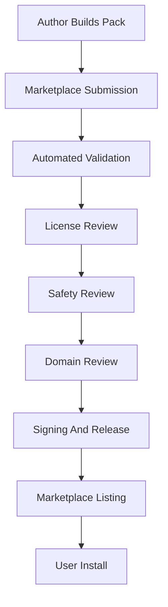

# OGM Future Expert Marketplace Specification v1.0

**Status:** draft v1.0 planning specification  
**Audience:** marketplace engineers, trust and safety reviewers, pack authors, runtime engineers, and product leadership  
**Primary runtime target:** offline-owned Expert Packs installable on user-controlled hardware  

---

## 1. Purpose

The OGM Expert Marketplace will let outside experts publish Expert Packs
without compromising the core Offgrid Minds promise: the user owns the pack,
the knowledge works offline, and answers remain attributable to trusted
sources.

The marketplace is a distribution and trust layer. It is not the runtime
source of knowledge and must never become required for local use.

---

## 2. Marketplace Principles

- Accounts MAY help purchase or update packs, but runtime use MUST remain
  offline.
- Purchased or installed packs MUST remain usable without a subscription
  unless the purchase terms explicitly identify time-limited access.
- Users MUST be able to back up and move their packs according to license
  terms.
- Pack quality MUST be validated before publication.
- Source attribution and licensing MUST be disclosed before purchase.
- Marketplace review MUST never replace technical validation.
- Revocation MUST be possible for safety and legal reasons, but local user
  ownership must be handled with clear policy and offline transparency.

---

## 3. Roles

### User

Owns hardware, user memory, installed packs, and local data.

### Pack Author

Creates source material, Knowledge Objects, review notes, or domain-specific
structure.

### Publisher

Packages, signs, distributes, and supports a pack. May be the same as the
author.

### Reviewer

Validates technical, licensing, safety, and domain quality.

### OGM Marketplace Operator

Maintains marketplace infrastructure, trust policy, signing systems,
discovery, payments, and revocation metadata.

---

## 4. Publishable Artifact

The marketplace publishes Expert Packs that conform to:

- OGM Expert Pack Specification v1.0
- OGM Knowledge Object Specification v1.0
- OGM Metadata Standard v1.0
- OGM Entity Specification v1.0
- OGM Build Pipeline v1.0 validation requirements

Marketplace submissions MUST include:

- compiled pack
- validation report
- build metadata
- source catalog
- license records
- author and publisher identity
- release notes
- support contact
- safety disclosures
- sample retrieval tests

---

## 5. Publisher Identity

Publisher identity MUST be stable and auditable.

Publisher record:

```yaml
publisher:
  publisher_id: "ogm.publisher.example"
  display_name: "Example Repair Library"
  legal_name: "Example Repair Library LLC"
  verification_status: "verified"
  contact: "support@example.invalid"
  public_key_id: "key:publisher:example:001"
  specialties:
    - "small_engine_repair"
  trust_history:
    packs_published: 4
    critical_incidents: 0
```

Rules:

- Marketplace-distributed packs MUST be signed by a publisher key or OGM
  release key.
- Publisher display name MUST not be used as the unique identity.
- High-risk domains SHOULD require stronger publisher verification.

---

## 6. Pack Listing Metadata

A marketplace listing MUST disclose:

- pack title
- pack ID
- pack version
- content revision
- publisher
- summary
- domains
- source types
- source trust tiers
- licensing constraints
- offline capability
- approximate installed size
- recommended storage class
- supported locales
- validation level
- safety domain coverage
- update policy
- refund or support policy where applicable

Listing example:

```yaml
listing:
  pack_id: "ogm.pack.small-engine-repair"
  version: "1.0.0"
  title: "Small Engine Repair"
  offline_use: true
  installed_size_gb: 84
  recommended_storage: ["usb_ssd", "nvme"]
  validation_level: "marketplace-reviewed"
  source_trust_summary:
    authoritative: 72
    reviewed: 18
    community: 0
  license_summary:
    local_use: true
    backup_allowed: true
    redistribution_allowed: false
```

---

## 7. Submission Workflow



Required workflow stages:

1. Submission intake.
2. Malware and archive safety checks.
3. Structural pack validation.
4. Metadata validation.
5. License validation.
6. Source attribution audit.
7. Retrieval test execution.
8. Safety review for high-risk domains.
9. Domain review where required.
10. Signing and listing approval.

---

## 8. Quality Gates

Marketplace packs MUST pass:

- required file validation
- manifest compatibility validation
- checksum validation
- object schema validation
- entity validation
- relationship validation
- source locator validation
- license completeness validation
- retrieval smoke tests
- citation completeness tests
- low-memory Pi 5 retrieval profile test
- package safety scan

High-risk packs MUST also pass:

- warning coverage review
- expert domain review
- conflict review
- localization safety review if translated
- adversarial queries for unsafe procedures

High-risk domains include:

- medical
- legal
- financial
- electrical
- fire or gas
- structural
- automotive high voltage
- weapons
- chemicals
- aviation
- marine navigation

---

## 9. Trust Levels

Marketplace trust level describes review depth, not truth guarantee.

Trust levels:

- `unreviewed-private`: local user pack, not publicly listed.
- `automated-validated`: passes automated validation only.
- `publisher-reviewed`: publisher claims domain review.
- `ogm-reviewed`: OGM technical and policy review completed.
- `expert-reviewed`: qualified domain expert review completed.
- `authoritative-source`: based primarily on official source material.

Rules:

- Trust level MUST be visible in listings and runtime pack details.
- Trust level MUST NOT suppress citations or confidence.
- Trust level MAY influence ranking when multiple packs answer the same
  query.

---

## 10. Licensing and Ownership

The marketplace MUST preserve the Offgrid Minds ownership model.

User rights metadata SHOULD declare:

```yaml
user_rights:
  offline_use: true
  local_backup: true
  transfer_to_owned_devices: true
  export_manifest: true
  requires_account_at_runtime: false
  subscription_required_at_runtime: false
  redistribution_to_others: false
```

Rules:

- Runtime use MUST NOT require marketplace authentication.
- License terms MUST be available offline after install.
- Users MUST be able to see which packs they have installed without logging
  in.
- If a pack is rented or subscription-limited, that limitation MUST be
  explicit before purchase and encoded in offline-readable rights metadata.
- Free, open, purchased, and private packs MUST share the same runtime
  retrieval contract.

---

## 11. Updates

Update types:

- full pack replacement
- delta update
- index-only update
- metadata-only update
- safety advisory update
- revocation metadata update

Rules:

- Updates MUST be installable from local files.
- Online update checks MAY exist but MUST be optional.
- Delta updates MUST verify base pack version and checksum.
- Users MAY pin versions.
- Multiple versions MAY coexist.
- Updates MUST not delete user memory.

---

## 12. Revocation and Safety Advisories

Revocation is for severe legal, safety, malware, or integrity failures.

Revocation record:

```yaml
revocation:
  pack_id: "ogm.pack.example"
  affected_versions: ["1.0.0", "1.0.1"]
  reason: "critical_safety_error"
  severity: "critical"
  issued_at: "2026-07-06T17:00:00Z"
  recommended_action: "disable_for_grounded_answers"
  replacement_version: "1.0.2"
```

Rules:

- Revocation metadata MUST be cacheable and readable offline once received.
- Runtime MUST show clear local status for revoked packs.
- Critical revoked packs SHOULD be disabled for normal answer grounding by
  default, but user ownership and audit visibility MUST remain.
- Revocation MUST NOT silently delete pack files.
- Revocation policy MUST distinguish safety disablement from ownership
  removal.

---

## 13. Distribution

Distribution channels MAY include:

- marketplace download
- direct file transfer
- USB drive
- SD card image
- local NAS
- vehicle dock
- peer Offgrid Minds device
- repair-shop kiosk

Rules:

- Marketplace packs MUST remain installable from local package files.
- Distribution artifacts MUST include checksums.
- Signatures MUST be verifiable offline.
- Large packs SHOULD support resumable download and physical media
  distribution.

---

## 14. Runtime Marketplace Independence

Runtime systems MUST not depend on marketplace availability.

The runtime MAY use marketplace metadata for:

- pack discovery before install
- update checks
- revocation list refresh
- publisher trust display

The runtime MUST NOT require marketplace access for:

- opening installed packs
- retrieval
- citation display
- user memory
- local validation
- export or backup

---

## 15. Expert Authoring Requirements

Expert-authored content MUST be distinguishable from extracted source
content.

Expert notes SHOULD include:

- author identity
- credentials or experience
- date authored
- scope
- source basis
- review status
- conflicts of interest when relevant

Rules:

- Expert notes MUST not erase source citations.
- Expert-authored procedures in high-risk domains SHOULD cite supporting
  authoritative material or be labeled as expert judgment.
- Marketplace review MAY require credential verification by domain.

---

## 16. Ranking and Discovery

Marketplace discovery ranking is separate from runtime retrieval ranking.

Marketplace ranking MAY consider:

- relevance to search
- validation level
- source trust tiers
- update freshness
- user ratings
- publisher reliability
- installed size
- device compatibility

Marketplace ranking MUST NOT claim that a pack is correct merely because it
is popular. Runtime answers remain evidence-ranked and citation-grounded.

---

## 17. Security

Marketplace pack handling MUST defend against malicious packages.

Requirements:

- archive path traversal checks
- symlink escape checks
- checksum validation
- signature validation
- file count and size limits for install-time sanity
- metadata parser hardening
- no executable code in standard Expert Packs

Rules:

- v1 Expert Packs SHOULD be data-only.
- If future packs contain executable extensions, they MUST use a separate
  signed capability model and sandbox policy.
- Pack installation MUST not modify runtime code.

---

## 18. Privacy

Marketplace systems MUST not require uploading user queries, user memory, or
retrieval traces.

Allowed marketplace data MAY include:

- account purchase records when user chooses marketplace purchase
- pack download events
- update eligibility
- voluntary ratings or reviews
- crash or validation reports only if explicitly submitted

Rules:

- Runtime retrieval logs stay local by default.
- User memory MUST never be bundled into marketplace submissions unless the
  user explicitly creates and submits a private source pack.
- Telemetry MUST be optional and off by default for offline devices.

---

## 19. Compatibility Certification

Marketplace listings SHOULD declare tested device profiles:

- Raspberry Pi 5
- desktop
- mobile
- rugged handheld
- vehicle dock
- headset

Pi 5 certification SHOULD include:

- manifest load test
- metadata filter test
- entity lookup test
- keyword retrieval test
- optional semantic retrieval test
- evidence assembly test
- low-memory test
- removable-volume missing test

Certification is a performance and compatibility statement, not a guarantee
that every query will be answerable.

---

## 20. Future Extensions

Future marketplace versions MAY add:

- global entity registries
- pack bundles
- expert subscription channels
- hardware-bundled packs
- institutional pack libraries
- local shop or classroom pack servers
- verified correction workflows
- community issue reports

These extensions MUST preserve the core v1 constraints: packs work offline,
the user controls installed knowledge, and answers remain source-attributed.
