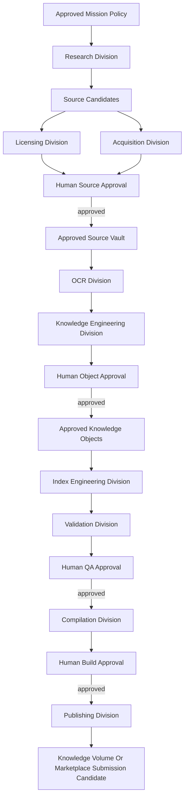
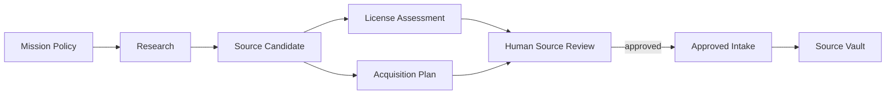

# OGM Knowledge Factory Specification v1.0

**Status:** draft Phase 3 specification  
**Audience:** engineers building internet-enabled agent departments, production pipelines, provenance systems, and scalable Expert Pack manufacturing  
**Relationship to Phase 1:** produces artifacts that conform to the Expert Pack, Knowledge Object, Metadata, Entity, Retrieval, Build Pipeline, and Marketplace specifications  
**Relationship to Phase 2:** operates under the Agent Control Center mission, approval, audit, and permission model  
**Primary purpose:** transform raw information into trusted portable expertise  

---

## 1. Purpose

The Offgrid Minds Knowledge Factory is a production system made of specialized
AI agent departments. It continuously transforms raw information into
validated, source-attributed, reviewable Expert Pack candidates.

The factory agents may use the internet during research, acquisition,
licensing review, and source verification. The final Expert Packs MUST work
without internet access.

The factory does not produce document dumps. It produces trusted portable
expertise: Knowledge Objects, relationships, citations, indexes, validation
reports, and compiled Expert Packs.

---

## 2. Core Invariants

- Every action MUST be logged.
- Every transformation MUST be reversible or reproducible from preserved
  inputs and recorded transformation metadata.
- Every answerable Knowledge Object MUST retain attribution to original
  sources.
- Internet access MUST be mission-scoped and department-scoped.
- Agents MUST NOT approve their own work.
- Agents MUST NOT mark sources official.
- Agents MUST NOT compile official packs without human approval.
- Agents MUST NOT publish packs directly.
- Source originals MUST be preserved when licensing and storage policy allow.
- Rejected and failed artifacts MUST remain auditable.
- Derived artifacts MUST point to the exact upstream artifact versions used
  to create them.
- The factory MUST scale by adding departments, workers, domains, and queues,
  not by weakening gates.

---

## 3. Raw Input Classes

The factory MUST support these source classes:

- books
- manuals
- repair guides
- scientific papers
- government publications
- owner's manuals
- technical standards
- schematics
- exploded diagrams
- photos
- illustrations
- tables
- training material
- historical references
- video transcripts
- public datasets

Each input class MUST be normalized into a Source Candidate, then into an
Approved Source only after review.

---

## 4. Factory Architecture



### 4.1 Factory layers

| Layer | Purpose |
|---|---|
| Control layer | Missions, policies, approvals, permissions, scheduling, pause/resume/stop. |
| Work order layer | Typed jobs that move artifacts between departments. |
| Artifact layer | Immutable source, extraction, object, index, QA, build, and export artifacts. |
| Provenance layer | Lineage from every derived artifact back to original source locators. |
| Quality layer | Department gates, validation gates, review queues, waivers, and metrics. |
| Storage layer | Source vault, working store, artifact store, logs, indexes, builds, exports. |

---

## 5. Production Concepts

### 5.1 Mission

A mission is the human-approved operating envelope for factory work.

Required mission fields:

- mission ID
- target Expert Pack ID
- target modules
- target professional field
- allowed source domains
- forbidden source domains
- allowed source classes
- forbidden source classes
- license policy
- safety domains
- department participation
- human approval requirements
- retry limits
- output expectations

### 5.2 Work Order

A work order is a typed, auditable unit of factory work.

```json
{
  "work_order_id": "wo:2026-07-06:research:small-engine-001",
  "mission_id": "mission:small-engine-repair",
  "department": "research",
  "task_type": "discover_sources",
  "input_artifacts": [],
  "output_contract": "source_candidate.v1",
  "policy_revision": "policy:mission:small-engine-repair:3",
  "status": "running",
  "attempt": 1,
  "created_at": "2026-07-06T17:00:00Z"
}
```

Rules:

- Work orders MUST be immutable after completion.
- Retry attempts MUST create child attempts or attempt records.
- Work orders MUST declare input artifact versions.
- Work orders MUST produce typed outputs or explicit failure records.

### 5.3 Artifact

An artifact is any durable output produced by the factory.

Artifact classes:

- source candidate
- license assessment
- acquisition package
- approved source
- OCR result
- text extraction
- table extraction
- diagram extraction
- image extraction
- metadata extraction
- entity candidate
- Knowledge Object candidate
- relationship candidate
- index candidate
- validation report
- build candidate
- export candidate

Artifact rules:

- Artifacts MUST be content-addressed or checksum-addressed.
- Artifacts MUST record producer department and agent.
- Artifacts MUST record input artifacts.
- Artifacts MUST be append-only; corrections create new versions.
- Artifacts MUST never overwrite originals.

### 5.4 Lineage Record

Lineage connects transformations.

```json
{
  "lineage_id": "lin:object:clean-carburetor-main-jet:001",
  "output_artifact_id": "artifact:ko-candidate:001",
  "input_artifacts": [
    "artifact:ocr-block:manual-001:p42:b7",
    "artifact:diagram-labels:manual-001:fig-3-12"
  ],
  "source_ids": ["src:briggs-service-manual-1234"],
  "locators": [
    {
      "source_id": "src:briggs-service-manual-1234",
      "locator": {
        "type": "page",
        "page": 42,
        "section": "Fuel System"
      }
    }
  ],
  "transformation": "knowledge-object-generation-v1",
  "producer_agent_id": "agent:knowledge-object:007",
  "created_at": "2026-07-06T17:00:00Z"
}
```

---

## 6. Department Contract

Every department MUST define:

- responsibilities
- inputs
- outputs
- quality gates
- required metadata
- logs
- performance metrics
- agent permissions
- inter-agent communication
- retry rules
- human approval requirements
- failure recovery

Department agents MUST communicate through typed artifacts, work orders, and
review queues. Agents MUST NOT pass untracked files or private state as
production inputs.

---

## 7. Research Division

### Responsibilities

The Research Division discovers candidate sources for a target Expert Pack,
module, domain, or professional field.

It finds:

- authoritative manuals
- government publications
- standards references
- public datasets
- scientific papers
- owner manuals
- diagrams and schematics
- training materials
- credible field references
- video transcripts
- historical references

### Inputs

- mission policy
- target Expert Pack metadata
- target module taxonomy
- allowed and forbidden sources
- source priority rules
- prior rejected sources
- existing pack coverage gaps

### Outputs

- source candidate artifacts
- bibliographic metadata
- relevance summaries
- source class labels
- module placement proposals
- duplicate candidates
- discovery logs

### Quality Gates

- candidate must match target mission scope
- candidate must not be from a forbidden source
- candidate must include URL or stable locator
- candidate must include source type
- candidate must include relevance rationale
- candidate must include discovery timestamp

### Required Metadata

- title
- author or issuing organization when available
- URL or locator
- source type
- publication or revision date when available
- discovered by
- target module
- relevance score
- initial trust estimate
- access method

### Logs

- search queries issued
- sites visited
- candidate pages inspected
- reasons for inclusion
- reasons for exclusion
- policy blocks
- errors and timeouts

### Performance Metrics

- candidates found per mission
- authoritative candidate ratio
- duplicate rate
- forbidden-source block count
- human approval rate
- average time to candidate
- source coverage by module

### Agent Permissions

Allowed:

- read approved internet domains
- search web within policy
- read public metadata
- create source candidates
- request new domain approval

Forbidden:

- download official files
- approve sources
- bypass robots or access controls
- use forbidden domains
- change mission policy

### Inter-Agent Communication

Research Agents publish source candidates to the Source Candidate Queue. They
MAY attach notes for Licensing and Acquisition, but MUST NOT send files
directly to those departments.

### Retry Rules

- retry transient network failures with bounded exponential backoff
- do not retry forbidden-source attempts
- do not retry paywalled or access-denied sources without human decision
- retry changed queries only as new discovery attempts

### Human Approval Requirements

Human approval is required before a candidate proceeds to official intake or
becomes an approved source.

### Failure Recovery

Failed research work orders preserve query logs, policy decisions, and partial
candidate lists. Recovery may resume from last successful query batch.

---

## 8. Acquisition Division

### Responsibilities

The Acquisition Division imports or downloads approved source candidates into
the factory's source vault.

It handles:

- downloading allowed files
- importing local files
- preserving originals
- computing checksums
- detecting file format
- quarantining suspicious files
- recording acquisition method

### Inputs

- source candidates approved for acquisition review
- mission policy
- allowed acquisition methods
- license state or pending license state
- target source vault

### Outputs

- acquisition package
- original file record
- checksum record
- file type report
- quarantine report when needed

### Quality Gates

- source must be approved for acquisition or local-only acquisition
- URL or local path must match approved source record
- checksum must be computed
- file must be stored without modifying original bytes
- malware or package safety checks must pass when applicable
- file must not exceed mission-defined limits without approval

### Required Metadata

- source ID
- acquisition timestamp
- acquisition method
- original URL or local path
- file path in source vault
- checksum
- file size
- MIME type
- detected format
- acquisition agent ID
- license state at acquisition time

### Logs

- download attempts
- redirects
- byte counts
- checksum results
- content type detection
- quarantine reasons
- retry attempts

### Performance Metrics

- acquisition success rate
- checksum failure rate
- quarantine rate
- average acquisition size
- average acquisition time
- source vault storage growth

### Agent Permissions

Allowed:

- download approved sources
- import approved local files
- write to source vault
- compute checksums
- quarantine files

Forbidden:

- download unapproved candidates
- modify originals
- delete originals
- override license state
- approve sources

### Inter-Agent Communication

Acquisition publishes acquisition packages to Licensing and OCR queues. It
MUST include checksums so downstream departments can verify inputs.

### Retry Rules

- retry incomplete downloads if server supports safe resume
- retry checksum computation locally
- do not retry sources marked forbidden, rejected, or license-blocked
- quarantine repeated inconsistent downloads

### Human Approval Requirements

Human approval is required for:

- acquiring from a new domain
- acquiring unusually large sources
- overriding quarantine
- acquiring local-only or uncertain-license material

### Failure Recovery

Partial downloads remain in temporary storage and are not promoted. Recovery
restarts from the last verified byte only when checksum validation remains
possible.

---

## 9. Licensing Division

### Responsibilities

The Licensing Division evaluates rights, restrictions, attribution
requirements, and publication eligibility.

It determines:

- local use rights
- derivative indexing rights
- redistribution rights
- excerpt display rules
- attribution text
- marketplace eligibility
- local-only status
- uncertain or blocked status

### Inputs

- source candidate records
- acquisition metadata
- license pages
- source terms
- publisher metadata
- mission license policy

### Outputs

- license assessment artifact
- source license record proposal
- risk flags
- human review questions
- recommendation: approve, reject, local-only, needs legal review

### Quality Gates

- every source must have a license assessment before official use
- assessment must distinguish local use from redistribution
- assessment must cite where terms were found
- uncertain rights must be flagged
- high-risk or commercial distribution sources require human review

### Required Metadata

- license name
- license URL or source locator
- rights fields
- attribution text
- restrictions
- assessed by
- assessment timestamp
- confidence
- recommendation

### Logs

- license pages inspected
- terms extracted
- rights matrix decisions
- uncertainty notes
- policy conflicts

### Performance Metrics

- license approval rate
- local-only rate
- rejection rate
- uncertain-license rate
- average review time
- human escalation rate

### Agent Permissions

Allowed:

- inspect source license information
- propose license metadata
- flag risk
- recommend license state

Forbidden:

- final legal approval
- changing official license state without human approval
- suppressing restrictions
- declaring redistribution rights without evidence

### Inter-Agent Communication

Licensing publishes assessments to Source Review and Acquisition. Acquisition
MUST obey license state before storing or using source files beyond candidate
handling.

### Retry Rules

- retry transient page failures
- retry license discovery with alternate official pages
- do not infer permissive rights from missing license text

### Human Approval Requirements

Human approval is required for:

- final source license state
- local-only use
- uncertain or custom license handling
- redistribution eligibility
- marketplace eligibility

### Failure Recovery

If licensing fails, the source remains in `needs_license_review` and cannot
be used for official Knowledge Objects.

---

## 10. OCR Division

### Responsibilities

The OCR Division converts source files into source-aligned machine-readable
text, layout blocks, tables, captions, and media candidates.

It processes:

- scanned books
- PDFs
- manuals
- diagrams
- schematics
- tables
- photos with text
- video transcripts

### Inputs

- approved source files
- acquisition packages
- license constraints
- OCR configuration
- source locator rules

### Outputs

- OCR block artifacts
- layout artifacts
- table candidates
- figure candidates
- diagram candidates
- transcript segments
- OCR confidence reports
- extraction error reports

### Quality Gates

- source checksum must match acquisition record
- each OCR block must include source locator
- OCR confidence must be recorded
- low-confidence blocks must be flagged
- page order and locator integrity must be verified
- no original file may be modified

### Required Metadata

- source ID
- file checksum
- OCR engine
- OCR engine version
- configuration digest
- page or segment locator
- confidence
- language detection
- processing timestamp

### Logs

- OCR engine invoked
- pages processed
- confidence distributions
- layout warnings
- failed pages
- retry attempts

### Performance Metrics

- pages per hour
- OCR confidence average
- low-confidence block rate
- table detection rate
- failed page rate
- human correction rate

### Agent Permissions

Allowed:

- read approved source files
- run OCR tools
- write OCR artifacts
- flag low-confidence outputs

Forbidden:

- altering originals
- approving extracted content as official
- suppressing failed pages
- inventing missing text

### Inter-Agent Communication

OCR publishes extraction artifacts to Knowledge Engineering and Validation.
Low-confidence artifacts MUST be marked so downstream agents cannot treat
them as high-confidence evidence.

### Retry Rules

- retry failed pages with alternate OCR profile
- retry language-specific OCR when language detection is strong
- do not keep retrying illegible pages beyond configured limit
- create manual review task for persistent failures

### Human Approval Requirements

Human review is required for:

- low-confidence high-risk procedures
- manual correction of OCR text
- accepting extraction from damaged or incomplete sources

### Failure Recovery

OCR outputs are versioned. New OCR attempts create new artifacts, preserving
old results and linking all attempts to the same source locator.

---

## 11. Knowledge Engineering Division

### Responsibilities

The Knowledge Engineering Division converts extracted information into
structured Knowledge Object candidates, entities, relationships, warnings,
specifications, media references, and citations.

### Inputs

- OCR artifacts
- extraction artifacts
- source metadata
- license metadata
- taxonomy
- existing entities
- target module definitions
- approved source records

### Outputs

- Knowledge Object candidates
- entity candidates
- relationship candidates
- warning candidates
- specification candidates
- citation maps
- confidence estimates
- conflict records

### Quality Gates

- every answerable object must have source attribution
- every claim must map to one or more locators
- object type must be valid
- entities must use canonical ID format
- warnings must be separate and linked when reusable
- generated summaries must point back to source passages
- low-confidence source text must lower object confidence

### Required Metadata

- object ID candidate
- object type
- title
- summary
- source IDs
- locators
- extraction inputs
- producer agent
- confidence dimensions
- target module
- taxonomy nodes
- relationship list
- warning list

### Logs

- artifacts read
- objects proposed
- citations attached
- relationships proposed
- conflicts detected
- rejected generation attempts
- confidence rationale

### Performance Metrics

- object candidates produced
- citation completeness rate
- human approval rate
- revision request rate
- duplicate candidate rate
- unsupported claim rate
- warning coverage rate

### Agent Permissions

Allowed:

- read approved extraction artifacts
- propose Knowledge Objects
- propose entities
- propose relationships
- propose citations
- flag conflicts

Forbidden:

- approving objects
- creating official objects without review
- using unapproved sources
- omitting citations for answerable claims
- hiding uncertainty

### Inter-Agent Communication

Knowledge Engineering publishes candidates to Object Review, Index
Engineering, and Validation. Index Engineering may only build candidate
indexes from pending objects and official indexes from approved objects.

### Retry Rules

- retry object generation when source locator mapping fails only after
  improving locator context
- create conflict tasks for contradictory sources
- do not retry unsupported claims as if they were facts

### Human Approval Requirements

Human approval is required before a Knowledge Object becomes official pack
content.

### Failure Recovery

Rejected object candidates remain linked to their source artifacts. Revised
objects are new versions with lineage to rejected candidates.

---

## 12. Index Engineering Division

### Responsibilities

The Index Engineering Division builds retrieval indexes optimized for large
Expert Packs and Raspberry Pi 5 runtime constraints.

It builds:

- metadata indexes
- keyword indexes
- entity indexes
- relationship graph indexes
- vector indexes
- image indexes
- diagram indexes
- table indexes
- procedure indexes
- warning indexes

### Inputs

- approved Knowledge Objects
- approved entities
- approved relationships
- approved media artifacts
- taxonomy
- runtime profile
- retrieval tests

### Outputs

- candidate indexes
- index manifests
- memory profiles
- retrieval benchmark reports
- index consistency reports
- vector quantization reports

### Quality Gates

- indexes must reference approved objects only for official builds
- every index entry must map to object, chunk, entity, or locator
- semantic indexes must declare embedding model and digest
- vector quantization must include recall validation
- Pi 5 memory profile must pass configured budget
- broken object references must block approval

### Required Metadata

- index type
- index version
- input object set checksum
- input entity set checksum
- embedding model identity when applicable
- tokenizer or normalizer version
- compression profile
- build timestamp
- memory profile
- runtime compatibility

### Logs

- input artifact checksums
- index build steps
- shard counts
- memory usage
- retrieval test results
- failed references
- compression stats

### Performance Metrics

- index build success rate
- memory budget compliance
- query latency estimate
- retrieval recall on test cases
- index size by type
- broken reference count
- vector recall after quantization

### Agent Permissions

Allowed:

- read approved pack staging artifacts
- build candidate indexes
- run retrieval tests
- write index diagnostics

Forbidden:

- indexing rejected sources into official indexes
- approving indexes
- changing Knowledge Objects
- exporting packs

### Inter-Agent Communication

Index Engineering consumes approved objects from Knowledge Engineering and
publishes indexes to Validation and Compilation.

### Retry Rules

- retry failed index builds after resolving broken references
- retry vector builds with lower-memory profile only as new index candidate
- do not silently drop objects to fit memory budgets

### Human Approval Requirements

Human approval is required before candidate indexes are accepted into a final
pack build.

### Failure Recovery

Index builds are disposable. Recovery starts from approved object and entity
checksums, not from partial indexes.

---

## 13. Validation Division

### Responsibilities

The Validation Division verifies that sources, objects, indexes, metadata,
citations, licenses, safety guidance, and pack candidates satisfy quality
rules.

It checks:

- duplicates
- missing citations
- unsupported claims
- bad metadata
- unsafe guidance
- outdated sources
- broken references
- license conflicts
- retrieval failures
- index consistency
- source quality

### Inputs

- source records
- license assessments
- extraction artifacts
- Knowledge Object candidates
- approved Knowledge Objects
- indexes
- build candidates
- retrieval tests

### Outputs

- validation reports
- QA blocker records
- warning records
- waiver requests
- retrieval test results
- safety reports

### Quality Gates

- missing citations block object approval
- broken references block builds
- license conflicts block builds
- critical unsafe guidance blocks builds
- failed required retrieval tests block builds
- waivers require human approval and reason

### Required Metadata

- validation profile
- validator version
- input artifact checksums
- rule set version
- findings
- severity
- affected artifacts
- recommendation

### Logs

- validation rules run
- artifacts inspected
- findings emitted
- suppressed non-issues
- failed checks
- waiver requests

### Performance Metrics

- blocker count
- warning count
- false positive rate
- duplicate rate
- citation failure rate
- retrieval test pass rate
- safety issue rate
- average time to validation

### Agent Permissions

Allowed:

- read all mission artifacts
- run validators
- produce findings
- recommend fixes

Forbidden:

- waiving findings
- approving QA
- changing source or object status
- compiling official packs

### Inter-Agent Communication

Validation emits findings to the QA Console and creates fix work orders for
the responsible departments.

### Retry Rules

- retry validators after upstream artifact revision
- do not retry deterministic failures without input change
- recurring failures must escalate to human review

### Human Approval Requirements

Human approval is required for:

- QA acceptance
- waivers
- safety exceptions
- build eligibility after warnings

### Failure Recovery

Validation is rerunnable from artifact checksums. Failed validation reports
remain attached to the artifact version they evaluated.

---

## 14. Compilation Division

### Responsibilities

The Compilation Division assembles approved sources, objects, metadata,
relationships, indexes, validation reports, checksums, and manifests into a
compiled Expert Pack candidate.

### Inputs

- approved source catalog
- approved Knowledge Objects
- approved metadata
- approved entities
- approved relationships
- approved indexes
- validation reports
- target pack version
- content revision

### Outputs

- compiled pack candidate
- manifest
- compatibility file
- checksums
- validation report
- build logs
- release notes candidate

### Quality Gates

- all required Phase 1 pack files must exist
- source catalog must be complete
- licenses must be complete
- object schema validation must pass
- relationship endpoint validation must pass
- index consistency must pass
- checksums must be generated
- build candidate cannot be final without human approval

### Required Metadata

- build ID
- pack ID
- pack version
- content revision
- schema version
- input artifact checksums
- builder version
- build timestamp
- validation status

### Logs

- files assembled
- manifests generated
- index files included
- checksums generated
- validation results
- build errors

### Performance Metrics

- build success rate
- validation pass rate
- pack size
- index size
- checksum failure rate
- build duration

### Agent Permissions

Allowed:

- read approved pack staging artifacts
- create build candidate
- run pack validation
- produce build report

Forbidden:

- final build approval
- export
- publishing
- including unapproved artifacts

### Inter-Agent Communication

Compilation consumes approved artifacts from prior departments and sends build
candidates to Validation and Build Review.

### Retry Rules

- retry after failed build only when inputs or configuration change
- failed build artifacts remain auditable
- do not patch compiled pack manually outside the build process

### Human Approval Requirements

Human approval is required before a compiled candidate becomes an approved
pack build.

### Failure Recovery

Compilation is reproducible from approved input checksums. Failed build
directories may be archived but never edited into official builds.

---

## 15. Publishing Division

### Responsibilities

The Publishing Division prepares approved pack builds for export, local
distribution, physical media, peer transfer, or future marketplace submission.

Publishing does not mean internet publication by default. It means preparing
an approved build for a selected distribution target.

### Inputs

- human-approved pack build
- export target
- Knowledge Volume metadata
- license restrictions
- marketplace submission policy when applicable

### Outputs

- exported pack
- export manifest
- checksum verification
- transfer log
- marketplace submission candidate when approved

### Quality Gates

- build must be human-approved
- export target must be selected by human
- license restrictions must permit target use
- exported files must pass checksum verification
- Knowledge Volume must have enough space
- export must not delete user memory or existing packs without approval

### Required Metadata

- export ID
- build ID
- target volume
- target path
- export timestamp
- checksum verification status
- operator approval ID
- license constraints

### Logs

- target volume detection
- free-space check
- files copied
- checksum verification
- export errors
- eject or completion events

### Performance Metrics

- export success rate
- checksum verification rate
- average export time
- failed volume rate
- pack transfer size

### Agent Permissions

Allowed:

- prepare export candidate
- verify checksums
- report target readiness

Forbidden:

- export without human approval
- publish directly to marketplace
- overwrite existing packs without approval
- delete local builds

### Inter-Agent Communication

Publishing consumes approved builds from Compilation and produces export
records for the Agent Control Center.

### Retry Rules

- retry failed copy only after verifying target volume state
- retry checksum verification locally
- do not retry writes to failing media indefinitely

### Human Approval Requirements

Human approval is required for:

- export target
- final export action
- marketplace submission candidate
- overwriting previous pack versions

### Failure Recovery

Failed exports are marked incomplete. The target volume must be verified
before retry. Partial exports must not be registered as installed packs.

---

## 16. Inter-Agent Communication

Agents communicate through:

- work orders
- typed artifacts
- queues
- review tasks
- audit events
- validation findings

Agents MUST NOT communicate production facts through unlogged side channels.

### Message envelope

```json
{
  "message_id": "msg:2026-07-06:abc123",
  "mission_id": "mission:small-engine-repair",
  "from_agent_id": "agent:research:004",
  "to_department": "licensing",
  "message_type": "source_candidate_ready",
  "artifact_ids": ["artifact:source-candidate:001"],
  "requires_ack": true,
  "created_at": "2026-07-06T17:00:00Z"
}
```

Rules:

- Messages MUST reference artifacts rather than embedding large payloads.
- Messages MUST be acknowledged or timed out.
- Human approval requests MUST create review tasks.
- Failed messages MUST be retryable or escalated.

---

## 17. Factory Logs

Every department MUST emit:

- work order log
- agent step log
- artifact creation log
- policy decision log
- error log
- retry log
- quality gate log
- approval request log

Logs MUST include:

- timestamp
- mission ID
- department
- agent ID
- work order ID
- input artifact IDs
- output artifact IDs
- action
- result
- duration
- error code when applicable

Logs SHOULD avoid storing unnecessary sensitive content, but they MUST retain
enough identifiers to reconstruct lineage.

---

## 18. Reversibility and Reproducibility

The factory MUST support rollback and replay.

### Reversibility

Reversibility means the system can identify and remove or supersede derived
artifacts from a bad input without destroying history.

Requirements:

- artifacts are append-only
- transformations record inputs
- approvals reference artifact versions
- source withdrawals produce impact reports
- object revisions supersede prior objects
- indexes can be rebuilt from approved objects
- packs can be rebuilt from approved inputs

### Reproducibility

Reproducibility means the system can rerun a transformation using the same
inputs and configuration where tools permit.

Requirements:

- tool versions recorded
- model versions or digests recorded
- configuration digests recorded
- source checksums recorded
- random seeds recorded when applicable
- non-deterministic tools declared

---

## 19. Retry and Failure Policy

### Retry classes

| Failure class | Retry policy |
|---|---|
| transient network | bounded exponential backoff |
| forbidden policy | no retry; escalate only if mission policy changes |
| license uncertainty | no automatic retry; human review required |
| checksum mismatch | retry acquisition once, then quarantine |
| OCR low confidence | retry with alternate profile, then manual review |
| broken citation | return to Knowledge Engineering |
| index reference error | return to source object or relationship owner |
| validation blocker | no retry without input change |
| export media failure | verify target, then retry or choose new target |

### Failure record

```json
{
  "failure_id": "fail:2026-07-06:abc123",
  "work_order_id": "wo:...",
  "department": "ocr",
  "failure_class": "ocr_low_confidence",
  "severity": "warning",
  "retryable": true,
  "attempt": 2,
  "affected_artifacts": ["artifact:ocr-page:manual-001:p42"],
  "recommended_recovery": "retry_with_alternate_profile",
  "created_at": "2026-07-06T17:00:00Z"
}
```

---

## 20. Human Approval Requirements

Human approval is required for:

- adding or changing mission policy
- using new internet domains
- approving sources
- approving local-only license use
- approving official license state
- approving OCR corrections for high-risk content
- approving Knowledge Objects
- approving citations when flagged
- approving QA waivers
- approving candidate indexes for final pack use
- approving compiled pack builds
- approving exports
- approving marketplace submission candidates

Approval records MUST include:

- approver
- timestamp
- target artifact version
- decision
- reason
- license decision when applicable
- risk notes when applicable

---

## 21. Factory Storage Model

The factory separates storage by trust state.

```text
knowledge-factory/
  missions/
  policies/
  queues/
  source-candidates/
  source-vault/
    originals/
    quarantine/
  extraction-artifacts/
  object-candidates/
  approved-objects/
  index-candidates/
  validation-reports/
  build-candidates/
  approved-builds/
  exports/
  audit/
  logs/
```

Rules:

- originals are never modified
- quarantine is isolated
- approved artifacts are separate from candidates
- build candidates are separate from approved builds
- exports are derived from approved builds only
- audit and logs are append-only

---

## 22. Scaling Model

The Knowledge Factory must eventually build thousands of Expert Packs across
hundreds of professional fields.

### Scale dimensions

- more professional fields
- more target packs
- more source classes
- more departments
- more agent workers
- larger source vaults
- larger media stores
- more validation rules
- more language locales
- more Knowledge Volumes

### Scaling rules

- Add workers behind department queues.
- Partition by mission, pack, module, source, and artifact type.
- Keep approval queues independent of worker count.
- Keep provenance centralized and queryable.
- Use immutable artifact IDs to coordinate distributed work.
- Allow departments to run in separate processes or machines later.
- Do not require all factory data on the Raspberry Pi runtime.

### Professional field templates

Each professional field SHOULD define:

- source priority rules
- authoritative source types
- safety classes
- object type extensions
- entity normalizers
- citation expectations
- validation rules
- required expert reviews

Example fields:

- small engine repair
- automotive repair
- wilderness medicine
- agriculture
- electrical troubleshooting
- off-grid power
- marine repair
- aviation maintenance references
- botany and foraging
- historical archives

---

## 23. Factory Metrics

Factory-wide metrics:

- sources discovered
- sources approved
- sources rejected
- local-only source count
- license blocker count
- extraction success rate
- OCR confidence distribution
- Knowledge Object approval rate
- citation completeness rate
- duplicate rate
- validation blocker rate
- pack build success rate
- export success rate
- average time from source discovery to approved object
- average time from mission start to pack candidate
- human review workload
- rework rate by department

Metrics MUST be computed from logs and artifacts, not manually entered
summaries.

---

## 24. Quality Philosophy

The factory optimizes for:

- correctness
- repeatability
- traceability
- source fidelity
- reversibility
- long-term maintainability
- safe human approval
- scalable throughput after quality is proven

The factory MUST NOT optimize by:

- discarding source evidence
- hiding uncertainty
- skipping approvals
- merging unverified claims
- using unlicensed sources as official content
- treating model output as truth
- making generated summaries authoritative

---

## 25. MVP Knowledge Factory

The first buildable MVP should implement a narrow but complete production
slice.

### MVP departments

- Research Division
- Acquisition Division
- Licensing Division

### MVP artifact flow



### MVP success criteria

- mission policy controls internet access
- Research Agents produce source candidates
- Licensing Agents produce rights assessments
- Acquisition Agents import only approved sources
- every action is logged
- every source has checksum or locator
- rejected sources remain auditable
- no source becomes official without human approval

### MVP exclusions

- OCR at scale
- Knowledge Object generation
- vector indexing
- compiled pack builds
- publishing
- marketplace submission

---

## 26. Long-Term Compatibility

The Knowledge Factory should last by preserving stable boundaries:

- missions define policy
- departments own specific transformations
- work orders define jobs
- artifacts are immutable
- lineage is explicit
- approvals are human-gated
- indexes are rebuildable
- packs are compiled from approved artifacts
- final packs are offline

Future versions may add distributed workers, cloud-assisted research,
specialized domain models, expert review networks, marketplace submission,
and institutional source vaults without changing the factory's core
principle: trusted portable expertise is manufactured through traceable,
reviewable, reversible transformations.
