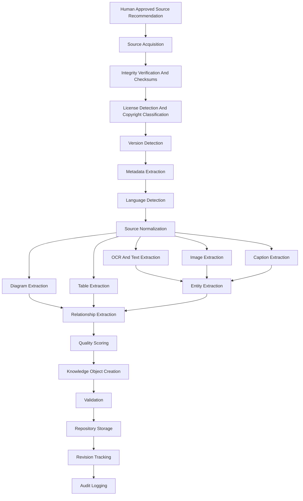

# OGM Knowledge Intake Pipeline Specification v1.0

**Status:** draft Phase 7 specification  
**Audience:** Knowledge Foundry engineers, intake operators, CKO designers, curators, validators, storage engineers, OCR/media engineers, licensing reviewers, and audit reviewers  
**Relationship to Phase 1:** produces normalized sources, Knowledge Objects, metadata, relationships, and indexes that later become Expert Packs  
**Relationship to Phase 2:** supplies source intake status, review queues, and audit records for the Agent Control Center  
**Relationship to Phase 3:** defines the receiving dock and early transformation contracts for Knowledge Foundry departments  
**Relationship to Phase 4:** gives the CKO reliable intake status, quality signals, and remediation mission triggers  
**Relationship to Phase 5:** emits ACP events for source acquisition, OCR, extraction, validation, repository storage, and failure handling  
**Relationship to Phase 6:** protects the Gold Standard pack from untrusted, untraceable, or weak source material  
**Relationship to Phase 6.5:** begins only after Coverage Matrix scope, mission generation, curator recommendation, and human approval  
**Primary purpose:** create the permanent intake standard for every piece of knowledge entering Offgrid Minds  

---

## 1. Purpose

The Offgrid Minds Knowledge Intake Pipeline is the receiving dock of the
Knowledge Foundry.

Every document, image, manual, book, map, schematic, diagram, video transcript,
audio transcript, or dataset MUST pass through this pipeline before it can
contribute to an Expert Pack.

The pipeline begins after:

```text
Coverage Matrix
  -> Mission
  -> Curator Recommendation
  -> Human Approval
  -> Knowledge Intake Pipeline
```

The pipeline does not decide scope. The Coverage Matrix defines scope, the CKO
generates missions, curators recommend sources, and humans approve intake. The
pipeline receives approved sources and transforms them into traceable,
validated, normalized knowledge artifacts.

---

## 2. Core Invariants

- The original source MUST never be overwritten.
- The original source SHOULD remain archived forever when licensing and storage
  policy allow.
- Every transformation MUST be reversible or reproducible from preserved inputs,
  tool versions, settings, and logs.
- Every derived artifact MUST link to exact upstream artifact revisions.
- Raw Sources, Normalized Sources, Knowledge Objects, Indexes, and Expert Packs
  are distinct layers.
- The pipeline MUST never skip a layer.
- License and copyright constraints MUST be recorded before redistribution or
  pack inclusion.
- Checksums MUST be recorded for every file artifact.
- Failures MUST produce explicit failure artifacts, not silent omissions.
- Human review requirements MUST be declared per stage.
- All work MUST be audit logged.

---

## 3. Supported Input Classes

Phase 7 intake MUST support or explicitly queue support for:

- PDF
- EPUB
- DOCX
- TXT
- HTML
- images
- TIFF
- JPEG
- PNG
- SVG
- CAD drawings, future
- video transcripts
- audio transcripts
- CSV
- JSON
- XML
- government datasets
- maps and geospatial datasets
- schematics
- diagrams
- tables
- books
- manuals
- technical standards
- public datasets

Unsupported or future formats MUST produce `source_blocked` or
`format_unsupported` records with remediation guidance.

---

## 4. Storage Philosophy

The pipeline has five mandatory storage layers.

```text
Raw Sources
  -> Normalized Sources
  -> Knowledge Objects
  -> Indexes
  -> Expert Packs
```

Rules:

- Raw Sources are immutable archived inputs.
- Normalized Sources are processed but still source-shaped artifacts.
- Knowledge Objects are semantic, attributed, validated units.
- Indexes are derived retrieval artifacts.
- Expert Packs are compiled products.
- No stage may write directly from Raw Sources to Expert Packs.
- No stage may treat an index as authoritative knowledge.

---

## 5. Intake Artifact Identity

Every artifact MUST have a stable ID.

Recommended prefixes:

| Prefix | Meaning |
|---|---|
| `src:` | Approved source identity |
| `raw:` | Immutable raw source artifact |
| `norm:` | Normalized source artifact |
| `extract:` | Extracted text/media/table/diagram artifact |
| `ko:` | Knowledge Object |
| `idx:` | Index artifact |
| `rev:` | Revision record |
| `intake:` | Intake job |
| `val:` | Validation result |

Example:

```yaml
source_id: "src:usfs-tree-guide-2024"
raw_artifact_id: "raw:src:usfs-tree-guide-2024:sha256:abc123"
normalized_artifact_id: "norm:src:usfs-tree-guide-2024:text-layout:v1"
```

IDs MUST NOT depend on local file paths.

---

## 6. Pipeline Overview



The exact execution graph MAY vary by source format, but all required stage
contracts MUST be satisfied or explicitly skipped with a reason.

---

## 7. Source Intake Record

Every pipeline run begins with an intake record.

```yaml
intake:
  intake_id: "intake:2026-07-06:src:usfs-tree-guide-2024"
  source_id: "src:usfs-tree-guide-2024"
  mission_id: "mission:coverage:north-american-outdoor:trees-001"
  coverage_object_ids:
    - "cov:ogm.pack.north-american-outdoor:outdoor:species:trees:acer-rubrum:eastern-us"
  curator_recommendation_id: "rec:curator:2026-07-06:001"
  human_approval_id: "approval:source-intake:2026-07-06:001"
  source_uri: "https://example.gov/tree-guide.pdf"
  expected_format: "pdf"
  intake_status: "approved_for_acquisition"
  created_at: "2026-07-06T19:30:00Z"
```

Required links:

- Coverage Object IDs
- mission ID
- curator recommendation ID
- human approval ID
- source ID
- intake job ID

---

## 8. Stage Contract Format

Every stage MUST define:

- inputs
- outputs
- logs
- failure modes
- retry rules
- required metadata
- human review requirements

Stage outputs MUST be immutable once accepted. Corrections create new revisions.

---

## 9. Source Acquisition

Purpose: obtain the approved source without changing its contents.

Inputs:

- approved intake record
- source URI, file upload, physical media record, or dataset access path
- mission permission policy
- license policy

Outputs:

- raw source artifact
- acquisition log
- source availability record
- fetch metadata

Logs:

- acquisition method
- timestamp
- operator or agent ID
- network location, if applicable
- user-supplied file provenance, if applicable
- byte count

Failure modes:

- source unavailable
- authentication required
- download timeout
- incomplete transfer
- forbidden by mission policy
- source mismatch
- physical source not yet digitized

Retry rules:

- retry transient network failures with bounded backoff
- do not retry policy failures without human action
- do not substitute alternate sources without curator/human approval

Required metadata:

- source ID
- acquisition method
- original URI or receipt path
- received timestamp
- file size
- preliminary format

Human review requirements:

- required for source substitutions
- required for acquisition from uncertain or sensitive sources
- required when the acquired file differs from the approved recommendation

---

## 10. Integrity Verification and Checksums

Purpose: prove the raw artifact is complete, stable, and identifiable.

Inputs:

- raw source artifact
- acquisition log

Outputs:

- checksum record
- file signature record
- integrity validation result

Logs:

- SHA-256 checksum
- optional BLAKE3 checksum
- file size
- MIME detection
- container metadata
- duplicate detection result

Failure modes:

- checksum mismatch
- truncated file
- corrupted file
- unexpected MIME type
- duplicate of known rejected source
- malware or unsafe file signal

Retry rules:

- reacquire on transfer corruption
- quarantine unsafe files
- require human review for source mismatch or unsafe content

Required metadata:

```yaml
integrity:
  checksum_sha256: "..."
  size_bytes: 1048576
  detected_mime_type: "application/pdf"
  file_signature: "pdf"
  duplicate_of: null
  integrity_status: "passed"
```

Human review requirements:

- required for unsafe/quarantined files
- required for duplicate conflicts
- required when detected format contradicts approved format

---

## 11. License Detection and Copyright Classification

Purpose: determine what the pipeline may extract, store, redistribute, index,
summarize, quote, and publish.

Inputs:

- raw source artifact
- source metadata
- source page metadata
- mission license policy

Outputs:

- license assessment
- copyright classification
- redistribution rights record
- extraction permission record
- human review queue item when uncertain

Logs:

- detected license text
- copyright notices
- terms of use URL
- reviewer notes
- automated classifier confidence

Failure modes:

- license unknown
- conflicting license statements
- public-domain claim uncertain
- redistribution prohibited
- extraction allowed but redistribution prohibited
- source requires attribution not yet captured

Retry rules:

- retry web metadata capture if terms page unavailable
- do not infer permissive rights from missing license
- blocked license states require human review

Required metadata:

```yaml
license:
  classification: "government_publication"
  copyright_status: "public_domain_us_federal"
  redistribution_allowed: true
  derivative_extraction_allowed: true
  excerpt_limit: "none"
  attribution_required: true
  confidence: 0.92
```

Human review requirements:

- required for marketplace-eligible sources
- required for unclear copyright
- required for commercial/proprietary manuals
- required for public-domain edge cases

---

## 12. Version Detection

Purpose: identify source edition, version, revision, publication date, and
whether a newer version exists.

Inputs:

- raw artifact
- extracted metadata
- source URI metadata
- known source catalog

Outputs:

- source version record
- duplicate/supersession record
- freshness flag

Logs:

- detected edition
- publication date
- revision date
- source catalog match
- newer-version lookup result

Failure modes:

- no version metadata
- conflicting version signals
- source superseded
- source withdrawn
- edition mismatch

Retry rules:

- retry metadata lookup when source catalog unavailable
- require human review for conflicting or superseded official sources

Required metadata:

- publication date when known
- revision date when known
- edition/version string
- supersedes/superseded_by links
- freshness status

Human review requirements:

- required for stale official sources
- required when multiple versions conflict

---

## 13. Metadata Extraction

Purpose: extract descriptive and structural metadata before semantic
transformation.

Inputs:

- raw artifact
- integrity record
- license record
- version record

Outputs:

- source metadata record
- structural map
- locator map

Logs:

- title, author, publisher, agency, date
- pages, sections, chapters
- embedded metadata
- table of contents
- figure list
- detected captions

Failure modes:

- missing title
- malformed document structure
- unreadable embedded metadata
- inconsistent page numbering
- extraction tool failure

Retry rules:

- retry with alternate metadata extractor
- escalate to human metadata correction for authoritative sources

Required metadata:

- title
- source type
- creator/agency when known
- publication date when known
- language hint
- locator strategy

Human review requirements:

- required for authoritative source catalog entries
- required when metadata affects citation or licensing

---

## 14. Language Detection

Purpose: identify source languages and route multilingual processing.

Inputs:

- raw artifact
- metadata record
- extracted text sample when available

Outputs:

- language detection record
- translation requirement flag
- locale metadata

Logs:

- detected languages
- confidence scores
- sections by language when applicable

Failure modes:

- mixed-language source
- low confidence
- unsupported language
- OCR language mismatch

Retry rules:

- retry after OCR/text extraction if initial sample is insufficient
- require human review for low-confidence language in safety-critical content

Required metadata:

- primary language
- secondary languages
- language confidence
- locale

Human review requirements:

- required for low-confidence safety, legal, medical, or regulation content

---

## 15. Source Normalization

Purpose: create a normalized source artifact while preserving the raw source.

Inputs:

- raw artifact
- metadata record
- license record
- version record
- language record

Outputs:

- normalized source artifact
- normalized locator map
- transformation manifest

Logs:

- normalization tool versions
- normalization settings
- page/section mapping
- removed boilerplate, if any
- retained original locator links

Failure modes:

- layout loss
- missing pages
- broken encoding
- unsupported container
- normalization mismatch

Retry rules:

- retry with alternate parser
- do not discard raw source
- require human review before accepting lossy normalization for high-value
  sources

Required metadata:

- normalization method
- raw artifact ID
- normalized artifact ID
- locator map
- tool/version

Human review requirements:

- required for lossy normalization
- required for sources with complex diagrams, maps, or tables

---

## 16. OCR and Text Extraction

Purpose: extract machine-readable text with source locators.

Inputs:

- raw or normalized source artifact
- language record
- locator map

Outputs:

- text extraction artifact
- OCR artifact, when needed
- confidence map
- text locator map

Logs:

- OCR engine/tool version
- language model
- page-level confidence
- text blocks
- reading order
- skipped areas

Failure modes:

- low OCR confidence
- unreadable scan
- rotated pages
- handwritten text
- complex columns
- mathematical notation
- missing pages

Retry rules:

- retry with image preprocessing
- retry with alternate OCR profile
- route low-confidence pages to human review
- never mark low-confidence OCR as authoritative

Required metadata:

- extraction method
- language profile
- confidence by page/region
- source locators

Human review requirements:

- required for low-confidence critical content
- required for medical, legal, emergency, or safety procedures extracted from
  poor scans

---

## 17. Image Extraction

Purpose: extract images as traceable media artifacts.

Inputs:

- raw or normalized source artifact
- locator map
- license permissions

Outputs:

- image artifacts
- image metadata
- image-source locator links
- derivative plan

Logs:

- extracted image count
- dimensions
- color profile
- page/section locator
- duplicate image detection

Failure modes:

- embedded image unreadable
- image extraction prohibited by license
- missing locator
- low resolution
- duplicate or decorative image

Retry rules:

- retry with alternate extractor
- skip decorative images with logged reason
- require human review for diagnostic or legal/safety images

Required metadata:

- media ID
- source ID
- locator
- dimensions
- license constraints
- diagnostic relevance

Human review requirements:

- required for images used as identification evidence
- required for medical, species, repair, map, or safety visuals

---

## 18. Diagram Extraction

Purpose: identify and extract diagrams, schematics, flow charts, maps, exploded
views, and technical drawings.

Inputs:

- raw or normalized source artifact
- image extraction artifacts
- captions
- locator map

Outputs:

- diagram artifacts
- diagram classification records
- linked caption candidates
- diagram relationship candidates

Logs:

- diagram type
- page/section locator
- related text block
- extraction confidence
- vector/raster form

Failure modes:

- diagram misclassified as image
- missing caption
- unreadable labels
- split across pages
- license prohibits reuse
- CAD/future format unsupported

Retry rules:

- retry with alternate classifier
- route unsupported CAD to future-format backlog
- require human review for technical, medical, safety, or repair diagrams

Required metadata:

- diagram type
- source locator
- linked text/caption
- required_for_answer flag candidate
- extraction confidence

Human review requirements:

- required before diagrams support official procedures or identification keys

---

## 19. Table Extraction

Purpose: extract structured tables without losing row/column meaning.

Inputs:

- raw or normalized source artifact
- OCR/text extraction
- locator map

Outputs:

- table artifacts
- schema inference records
- cell-level locator map
- table quality score

Logs:

- table count
- page/section locator
- inferred headers
- merged cells
- units
- extraction confidence

Failure modes:

- broken row alignment
- missing headers
- merged-cell ambiguity
- unit confusion
- table spans pages
- numeric extraction errors

Retry rules:

- retry with alternate table extractor
- require human review for tables used in specifications, doses, limits,
  measurements, regulations, or safety thresholds

Required metadata:

- table title/caption
- units
- locator
- confidence
- source ID

Human review requirements:

- required for safety-critical numeric tables
- required for legal/regulatory tables

---

## 20. Caption Extraction

Purpose: link figures, diagrams, tables, maps, and images to explanatory text.

Inputs:

- OCR/text extraction
- image/diagram/table artifacts
- layout map

Outputs:

- caption artifacts
- media-caption links
- caption confidence score

Logs:

- caption text
- linked media ID
- distance/layout heuristic
- confidence

Failure modes:

- wrong media-caption pairing
- missing caption
- multi-figure caption ambiguity
- caption split across lines/pages

Retry rules:

- retry with alternate layout analysis
- require human review for low-confidence pairings in high-risk content

Required metadata:

- caption text
- linked artifact ID
- locator
- confidence

Human review requirements:

- required for diagnostic images, diagrams, maps, and regulatory tables

---

## 21. Entity Extraction

Purpose: identify entities that become retrieval handles and Knowledge Object
links.

Inputs:

- text extraction artifacts
- captions
- tables
- diagrams
- existing entity catalog
- Coverage Object dimensions

Outputs:

- entity candidates
- entity match records
- new entity proposals
- ambiguity records

Logs:

- entity mentions
- normalized entity IDs
- aliases
- confidence
- unresolved mentions

Failure modes:

- synonym ambiguity
- taxonomic ambiguity
- manufacturer/model ambiguity
- place-name ambiguity
- OCR-induced false entity
- missing canonical entity

Retry rules:

- retry after OCR correction
- route unresolved high-value entities to human/entity review

Required metadata:

- entity type
- source locator
- candidate ID
- confidence
- normalization method

Human review requirements:

- required for new canonical entities in regulated, medical, species, legal, or
  equipment domains

---

## 22. Relationship Extraction

Purpose: identify structured relationships between entities, objects, media,
procedures, hazards, regions, source claims, and Coverage Objects.

Inputs:

- extracted entities
- text artifacts
- captions
- tables
- diagrams
- existing relationship graph

Outputs:

- relationship candidates
- source locator links
- confidence scores
- contradiction candidates

Logs:

- relation type
- source and target IDs
- evidence locator
- confidence
- extraction method

Failure modes:

- unsupported relationship type
- contradictory source claims
- weak evidence
- inferred relationship without explicit support
- graph cycle where forbidden

Retry rules:

- retry after entity normalization
- route contradictions and high-risk relationships to human review

Required metadata:

- relation type
- target/source IDs
- locator
- confidence
- extraction method

Human review requirements:

- required for contraindications, hazards, lookalikes, legal constraints,
  medical relationships, and repair safety dependencies

---

## 23. Quality Scoring

Purpose: score source and extraction quality before Knowledge Object creation.

Inputs:

- integrity record
- license record
- metadata record
- OCR/text extraction
- media extraction
- entity/relationship candidates

Outputs:

- source quality score
- extraction quality score
- readiness decision
- remediation recommendations

Logs:

- component scores
- blocking issues
- warnings
- stage confidence

Failure modes:

- score below threshold
- missing required artifacts
- poor OCR
- insufficient source authority
- missing license confidence

Retry rules:

- retry specific failed extraction stages before rescoring
- generate remediation mission when source quality is insufficient

Required metadata:

```yaml
quality:
  source_authority: 0.92
  extraction_quality: 0.87
  metadata_quality: 0.90
  media_quality: 0.70
  license_confidence: 0.95
  overall: 0.86
  readiness: "ready_for_object_creation"
```

Human review requirements:

- required when automated quality conflicts with source importance
- required before rejecting a hard-to-find high-priority source

---

## 24. Knowledge Object Creation

Purpose: create source-attributed Knowledge Objects from normalized, scored
artifacts.

Inputs:

- normalized source artifacts
- extracted text/media/tables/diagrams
- entities
- relationships
- Coverage Objects
- quality score

Outputs:

- Knowledge Object candidates
- object-source citation records
- object-media links
- object-coverage links
- object creation log

Logs:

- object type
- source locators
- extraction method
- confidence
- coverage object fulfilled
- generated vs extracted fields

Failure modes:

- insufficient source attribution
- unsupported object type
- missing required Coverage Object link
- conflicting source claims
- low confidence
- hallucinated/generated unsupported claim

Retry rules:

- retry after relationship/entity correction
- split oversized objects
- merge duplicates only through revision records
- route unsupported or conflicting claims to human review

Required metadata:

- object ID
- object type
- source locators
- coverage object IDs
- confidence
- provenance
- review requirement

Human review requirements:

- required for official Knowledge Object approval
- required for high-risk domains
- required when generated summaries become answerable objects

---

## 25. Validation

Purpose: confirm that artifacts are complete, traceable, licensed, and safe to
advance.

Inputs:

- raw artifact record
- normalized artifact record
- extraction artifacts
- Knowledge Object candidates
- license records
- coverage links
- provenance graph

Outputs:

- validation result
- blocking issues
- warnings
- remediation recommendations

Logs:

- checks run
- pass/fail status
- artifact versions
- validator versions
- human waivers, if any

Failure modes:

- missing provenance
- invalid schema
- license mismatch
- broken locator
- checksum missing
- coverage mismatch
- low-confidence extraction
- missing human review

Retry rules:

- retry after targeted remediation
- do not waive provenance or checksum failures
- human waivers must be logged and scoped

Required metadata:

- validation ID
- validator version
- checked artifact IDs
- result
- blocker list

Human review requirements:

- required for waivers
- required before rejecting high-priority rare sources
- required for safety, legal, medical, and regulatory validation blockers

---

## 26. Repository Storage

Purpose: store artifacts in the correct repository layer without losing
lineage.

Inputs:

- validated raw source
- normalized source
- extraction artifacts
- Knowledge Object candidates
- validation results

Outputs:

- repository commit record
- storage location records
- immutable artifact manifest
- access policy record

Logs:

- artifact IDs
- storage backend
- retention policy
- access restrictions
- encryption/compression metadata when applicable

Failure modes:

- storage write failure
- retention policy conflict
- access policy conflict
- duplicate revision conflict
- artifact manifest mismatch

Retry rules:

- retry transient storage failures
- never overwrite existing artifact revisions
- require human review for retention or access policy conflicts

Required metadata:

- storage layer
- artifact ID
- revision ID
- retention policy
- checksum
- access policy

Human review requirements:

- required for deleting, expiring, quarantining, or restricting approved source
  artifacts

---

## 27. Revision Tracking

Purpose: preserve history of every source and derived artifact.

Inputs:

- repository commit record
- source version record
- artifact manifests

Outputs:

- revision record
- lineage graph update
- supersession links

Logs:

- prior revision
- new revision
- reason for change
- changed artifact IDs
- upstream source changes

Failure modes:

- missing prior revision
- conflicting revision lineage
- duplicate revision ID
- source version mismatch

Retry rules:

- retry after repository reconciliation
- require human review for lineage conflicts

Required metadata:

```yaml
revision:
  revision_id: "rev:src:usfs-tree-guide-2024:2026-07-06:r1"
  source_id: "src:usfs-tree-guide-2024"
  supersedes: []
  changed_artifacts:
    - "norm:src:usfs-tree-guide-2024:text-layout:v1"
  reason: "initial intake"
```

Human review requirements:

- required for superseding official sources
- required when revisions affect approved Knowledge Objects

---

## 28. Audit Logging

Purpose: create a permanent, append-only record of source intake.

Inputs:

- all stage logs
- ACP messages
- work orders
- human review decisions
- artifact manifests

Outputs:

- append-only audit log
- intake summary
- trace report

Logs:

- every stage transition
- every failure
- every retry
- every human decision
- every artifact creation
- every revision

Failure modes:

- audit log write failure
- missing stage event
- mismatched artifact IDs
- inconsistent timestamps

Retry rules:

- pause pipeline if audit logging fails
- reconcile missing audit events before advancing

Required metadata:

- timestamp
- actor ID
- stage
- input artifact IDs
- output artifact IDs
- decision
- errors

Human review requirements:

- required for audit repair
- required for disputed provenance or source decisions

---

## 29. Format-Specific Requirements

### 29.1 PDF

Must support:

- embedded text extraction
- OCR for scanned pages
- page locator maps
- image extraction
- diagram extraction
- table extraction
- metadata extraction

### 29.2 EPUB, DOCX, TXT, HTML

Must support:

- structural parsing
- section locators
- metadata extraction
- embedded image extraction
- table extraction
- link/reference capture

HTML intake MUST preserve crawl date and source URL.

### 29.3 Images, TIFF, JPEG, PNG, SVG

Must support:

- checksum
- dimensions
- EXIF/metadata extraction
- OCR when text exists
- diagnostic tagging
- license attribution
- derivative generation plan

SVG MUST preserve vector structure when licensing allows.

### 29.4 CAD drawings, future

CAD support is future-scoped.

Before native support exists, CAD sources MUST be:

- archived raw
- classified as `format_unsupported`
- linked to the Coverage Object
- converted only through approved manual or future processing workflows

### 29.5 Video and audio transcripts

Must support:

- transcript source provenance
- speaker/timestamp metadata when available
- language detection
- citation locators by timestamp or segment
- quality scoring based on transcript reliability

Raw video/audio processing is outside Phase 7 unless transcript artifacts are
provided or separately approved.

### 29.6 CSV, JSON, XML, government datasets

Must support:

- schema detection
- field metadata
- units
- dataset version
- row-level or record-level locators where practical
- license and terms capture
- update/freshness rules

Government datasets MUST record issuing agency, dataset version, access date,
and update cadence.

---

## 30. Reversibility and Reproducibility

Every transformation MUST record:

- input artifact IDs and checksums
- output artifact IDs and checksums
- tool name and version
- model name/version when AI-assisted
- configuration
- timestamp
- actor ID
- logs
- deterministic settings where available

If a transformation is not perfectly reversible, it MUST be reproducible from
the raw source and transformation manifest.

Lossy transformations MUST be flagged.

---

## 31. ACP Events

Recommended ACP messages:

- `SourceAcquired`
- `SourceIntegrityVerified`
- `LicenseDetected`
- `CopyrightClassified`
- `SourceVersionDetected`
- `SourceMetadataExtracted`
- `LanguageDetected`
- `SourceNormalized`
- `OCRCompleted`
- `ImageExtracted`
- `DiagramExtracted`
- `TableExtracted`
- `CaptionExtracted`
- `EntityExtracted`
- `RelationshipExtracted`
- `SourceQualityScored`
- `KnowledgeObjectCreated`
- `ValidationPassed`
- `ValidationFailed`
- `RepositoryStored`
- `RevisionCreated`
- `AuditLogged`
- `SourceIntakeFailed`
- `SourceIntakeBlocked`

ACP messages MUST reference artifacts by ID rather than embedding large
content.

---

## 32. Human Review Gates

Human review is required for:

- source substitutions
- unclear licensing
- marketplace redistribution eligibility
- copyright uncertainty
- high-risk medical, legal, emergency, edible/toxic, firearm, hunting, fishing,
  regulation, or equipment-safety content
- low-confidence OCR or extraction used in official objects
- diagrams or tables that affect procedure correctness
- version conflicts
- source rejection for high-priority Coverage Objects
- validation waivers
- revision conflicts
- audit repair

Agents may recommend. Humans approve.

---

## 33. Repository Layout

Recommended intake repository layout:

```text
intake_repository/
  raw_sources/
    src-id/
      raw-artifact-id/
        original
        checksums.yaml
        acquisition.yaml
  normalized_sources/
    src-id/
      normalized-artifact-id/
        normalized.*
        locator-map.json
        transform-manifest.yaml
  extracted/
    text/
    images/
    diagrams/
    tables/
    captions/
    entities/
    relationships/
  knowledge_objects/
    candidates/
    approved/
  validation/
  revisions/
  audit/
    intake-events.jsonl
```

Physical layout MAY differ, but logical layers MUST remain separate.

---

## 34. First Implementation Milestone

The first implementation milestone SHOULD be a narrow, durable intake spine,
not a full extraction system.

### Milestone 1: Raw Source Vault and Intake Ledger

Build support for:

- approved intake record creation
- PDF, TXT, HTML, JPEG, PNG, CSV, JSON raw source registration
- immutable raw source archive
- SHA-256 checksums
- basic MIME detection
- source metadata stub
- license status placeholder
- append-only JSONL audit log
- revision record for initial intake
- repository layout creation
- manual human approval fields
- read-only replay of intake history

Do not build OCR, entity extraction, relationship extraction, or Knowledge
Object creation in Milestone 1.

Success criteria:

- no raw source can enter without mission, Coverage Object, curator
  recommendation, and human approval links
- every file receives stable source and raw artifact IDs
- every file has checksums and an immutable archive location
- every stage transition is logged
- the system can list sources by mission, Coverage Object, status, and license
  state
- re-running intake on the same file detects duplicate content by checksum

This milestone creates the permanent foundation. All later extraction and
normalization stages should attach to this spine rather than inventing their
own intake path.

---

## 35. Company-Level Standard

The Knowledge Intake Pipeline is the permanent receiving standard for Offgrid
Minds.

Every future source must answer:

- Why are we allowed to ingest this?
- Which Coverage Object requires it?
- Who recommended it?
- Who approved it?
- What is the original artifact?
- What are its checksums?
- What license applies?
- What version is it?
- What transformations occurred?
- What Knowledge Objects came from it?
- Can we replay or reproduce the path from source to pack?

If the answer is missing, the source is not ready to become trusted knowledge.
