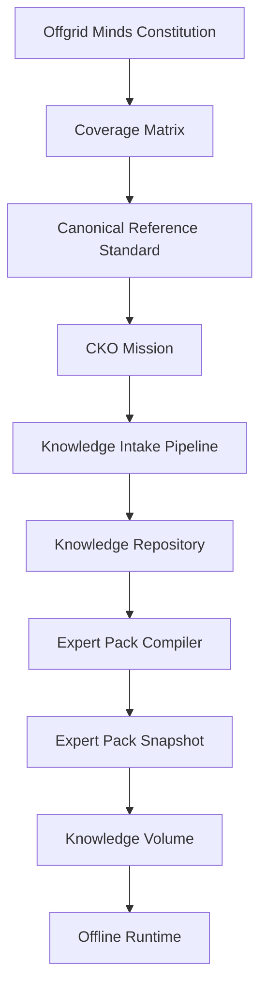

# OGM Knowledge Repository Specification v1.0

**Status:** draft Phase 8 specification  
**Audience:** Offgrid Minds founders, repository engineers, Knowledge Foundry builders, CKO designers, pack compilers, validators, marketplace architects, and future AI agents  
**Governing authority:** `docs/company/000_offgrid_minds_constitution.md`  
**Relationship to Phase 1:** extends the Knowledge Object and Expert Pack architecture by defining the upstream repository from which packs are compiled  
**Relationship to Phase 2:** supplies repository state, review queues, quality gates, and object lifecycle signals to the Agent Control Center  
**Relationship to Phase 3:** stores durable outputs of the Knowledge Foundry and provides source-of-truth objects for future production work  
**Relationship to Phase 4:** gives the CKO a permanent object graph for coverage, quality, mission generation, and Knowledge Debt  
**Relationship to Phase 5:** uses ACP messages for repository object creation, update, validation, relationship, and snapshot events  
**Relationship to Phase 6:** supplies the trusted professional library from which Gold Standard Expert Packs are compiled  
**Relationship to Phase 6.5:** fulfills Coverage Objects and evaluates completeness through the Canonical Reference Standard  
**Relationship to Phase 7:** receives validated normalized sources, evidence, media, entities, relationships, and Knowledge Object candidates from the Intake Pipeline  
**Primary purpose:** define the permanent source of truth for all structured knowledge within Offgrid Minds  

---

## 1. Purpose

The OGM Knowledge Repository is the permanent source of truth for all knowledge
within Offgrid Minds.

It is not:

- an Expert Pack
- a vector database
- a document archive
- a folder of extracted text
- a runtime cache
- a customer-editable notebook

It is the structured repository from which Expert Packs are compiled.

The repository thinks in Knowledge Objects, never documents. Documents become
evidence. Knowledge Objects become expertise.

---

## 2. Repository Philosophy

The Knowledge Repository exists to preserve trusted, attributable, versioned,
expandable, offline-capable expertise.

Rules:

- Raw Sources remain immutable.
- Knowledge Objects evolve.
- Expert Packs compile snapshots.
- Knowledge Volumes distribute compiled snapshots.
- Customers never edit repository objects directly.
- Documents are evidence, not the primary knowledge unit.
- Generated text is not authoritative unless tied to evidence and review.
- Every claim must trace back to origin.
- Optional references may enrich knowledge but never replace required
  authoritative references.

---

## 3. System Position



The repository is upstream of Expert Packs and downstream of approved intake.

---

## 4. Repository Architecture

The repository SHOULD be implemented as logical stores, even if physically
backed by one database or many.

```text
knowledge_repository/
  object_store/
  relationship_store/
  evidence_store/
  citation_store/
  source_reference_store/
  media_reference_store/
  geospatial_reference_store/
  regulation_reference_store/
  canonical_reference_store/
  version_store/
  revision_store/
  provenance_store/
  confidence_store/
  dependency_store/
  cross_reference_store/
  validation_store/
  snapshot_store/
  audit_log/
```

Required repository services:

- object identity service
- object lifecycle service
- relationship service
- evidence and citation service
- version and revision service
- provenance service
- confidence service
- dependency resolver
- CRS evaluator
- repository retrieval service
- snapshot compiler interface
- quality gate engine
- audit service

The architecture MUST allow storage backends to evolve without changing object
contracts.

---

## 5. Repository Object Identity

Repository Knowledge Objects MUST have permanent UUID-backed identities.

The repository identity is distinct from pack-local object IDs.

Recommended canonical ID:

```text
rko:<uuid>
```

Example:

```text
rko:018f4e62-93de-7c45-a4d8-bfbc2fd2d991
```

Rules:

- UUIDs MUST be globally unique.
- UUIDs MUST never encode pack ID, file path, source title, or domain.
- UUIDs MUST remain stable for the life of the logical object.
- Slugs and aliases MAY change.
- Pack object IDs MAY reference repository UUIDs.
- If an object is split, children MUST reference the parent revision.
- If objects are merged, the merged object MUST reference superseded UUIDs.

Recommended UUID strategy:

- Use UUIDv7 or another time-sortable UUID for new repository objects.
- Use deterministic migration records when importing older `ko:` objects.
- Never reuse deleted, withdrawn, or superseded UUIDs.

---

## 6. Repository Knowledge Object Schema

Every repository Knowledge Object MUST inherit from the common repository
standard.

```json
{
  "repository_object_id": "rko:018f4e62-93de-7c45-a4d8-bfbc2fd2d991",
  "schema_version": "1.0",
  "object_category": "Procedure",
  "canonical_title": "Replace front brake pads on a 1992 Ford F-150",
  "summary": "Procedure for replacing front brake pads on applicable 1992 Ford F-150 configurations.",
  "domains": [
    "automotive",
    "industrial"
  ],
  "domain_facets": {
    "automotive": {
      "manufacturer": "Ford",
      "model": "F-150",
      "year": 1992,
      "subsystem": "brakes"
    }
  },
  "body": {
    "format": "ogm.richtext.v1",
    "value": "..."
  },
  "evidence_refs": [
    "ev:018f4e65-1f3b-7d2a-b8e5-d19ac3f41f20"
  ],
  "citation_refs": [
    "cit:018f4e66-7fa8-7a49-9d49-4902fb0ea2c6"
  ],
  "relationship_refs": [
    "rel:018f4e68-574c-79b7-a070-e08f6ae00200"
  ],
  "media_refs": [
    "mediaref:018f4e69-8df8-7545-9f9c-06f6e1f0d8c3"
  ],
  "coverage_refs": [
    "cov:ogm.pack.auto-ford-f150:automotive:ford:f-150:1992:brakes"
  ],
  "canonical_reference_status": "complete",
  "confidence": {
    "overall": 0.94,
    "evidence_quality": 0.97,
    "source_authority": 0.98,
    "review_quality": 0.93,
    "freshness": 0.88
  },
  "lifecycle": {
    "status": "approved",
    "created_at": "2026-07-06T20:00:00Z",
    "updated_at": "2026-07-06T20:00:00Z",
    "approved_at": "2026-07-06T20:00:00Z"
  },
  "version": {
    "object_version": "1.0.0",
    "current_revision_id": "rev:rko:018f4e62-93de-7c45-a4d8-bfbc2fd2d991:0001"
  }
}
```

Required fields:

- `repository_object_id`
- `schema_version`
- `object_category`
- `canonical_title`
- `summary`
- `domains`
- `body`
- `evidence_refs`
- `citation_refs`
- `relationship_refs`
- `coverage_refs`
- `confidence`
- `lifecycle`
- `version`

Unknown future fields MUST be preserved by repository readers.

---

## 7. Multi-Domain Objects

Knowledge Objects MUST support multiple domains simultaneously.

Example domains:

- automotive
- marine
- industrial
- outdoor
- construction
- electrical
- medical
- agriculture
- aviation
- collectibles

Rules:

- A repository object MUST NOT belong exclusively to one Expert Pack.
- Expert Packs reference repository objects by UUID and snapshot revision.
- Domain facets describe how an object applies to each domain.
- Domain-specific metadata MUST not fork the object unless meaning differs.
- If domain meaning diverges, create related domain-specific objects with
  explicit relationships.

Example:

```yaml
repository_object_id: "rko:018f4e70-2ee1-7106-92ea-efe6699568bf"
object_category: "Connector"
canonical_title: "Anderson SB50 connector"
domains:
  - "automotive"
  - "marine"
  - "industrial"
  - "electrical"
domain_facets:
  automotive:
    use_cases: ["winch", "battery-disconnect", "auxiliary-power"]
  marine:
    use_cases: ["trolling-motor", "battery-bank"]
  industrial:
    use_cases: ["forklift", "mobile-equipment"]
```

---

## 8. Object Categories

Every category inherits from the common repository object standard.

Required initial categories:

- `Procedure`
- `Species`
- `Component`
- `Tool`
- `Vehicle`
- `Part`
- `Connector`
- `Chemical`
- `Diagram`
- `Image`
- `Map`
- `FlowChart`
- `Checklist`
- `SafetyWarning`
- `ReferenceTable`
- `Standard`
- `Regulation`
- `Specification`
- `Measurement`
- `DecisionTree`
- `FieldGuideEntry`
- `TechnicalBulletin`

Additional recommended categories:

- `ManualSection`
- `TroubleshootingTree`
- `EmergencyProtocol`
- `IdentificationKey`
- `Material`
- `Symptom`
- `Hazard`
- `Recall`
- `ServiceInterval`
- `GeospatialLayer`
- `DatasetRecord`
- `TaxonomyEntry`

Category-specific schemas MAY add fields, but MUST retain base identity,
evidence, citation, relationship, confidence, lifecycle, and version fields.

---

## 9. Category Requirements

### 9.1 Procedure

Required additions:

- preconditions
- required tools/equipment
- steps
- warnings
- stop conditions
- failure modes
- related diagrams
- source evidence

### 9.2 Species

Required additions:

- accepted scientific name
- taxonomy
- common names
- range
- habitat
- identification traits
- lookalikes
- hazards
- seasonality
- media references

### 9.3 Component, Part, Connector, Tool, Vehicle

Required additions:

- manufacturer or generic class
- model/applicability
- specifications
- compatibility
- failure modes
- related procedures
- diagrams
- standards or manuals

### 9.4 Chemical

Required additions:

- identifiers
- hazards
- handling
- storage
- incompatibilities
- regulatory references
- safety data evidence

### 9.5 Diagram, Image, Map, FlowChart

Required additions:

- media reference
- source locator
- linked object IDs
- diagnostic role
- scale or orientation where applicable
- human review status for safety-critical visuals

### 9.6 Standard, Regulation, Specification, Measurement

Required additions:

- issuing authority
- jurisdiction or applicability
- effective date
- revision/version
- units
- compliance notes
- citation requirements

### 9.7 DecisionTree, Checklist, SafetyWarning

Required additions:

- scope
- trigger conditions
- steps or branches
- stop conditions
- severity
- required supporting evidence
- review requirements

---

## 10. Relationship Specification

Repository relationships are first-class versioned records.

```json
{
  "relationship_id": "rel:018f4e68-574c-79b7-a070-e08f6ae00200",
  "schema_version": "1.0",
  "relationship_type": "requires_tool",
  "from_object_id": "rko:018f4e62-93de-7c45-a4d8-bfbc2fd2d991",
  "to_object_id": "rko:018f4e71-4f6d-76fa-8b1d-2622b4d84a31",
  "direction": "directed",
  "domains": ["automotive"],
  "evidence_refs": ["ev:018f4e65-1f3b-7d2a-b8e5-d19ac3f41f20"],
  "confidence": 0.96,
  "status": "approved",
  "created_at": "2026-07-06T20:00:00Z",
  "updated_at": "2026-07-06T20:00:00Z"
}
```

Relationship IDs:

```text
rel:<uuid>
```

Relationship records MUST NOT be hidden inside object bodies as the only source
of graph truth.

Required relationship types:

- `cites`
- `derived_from`
- `depends_on`
- `requires_tool`
- `requires_part`
- `requires_skill`
- `has_warning`
- `has_diagram`
- `has_image`
- `has_map`
- `has_table`
- `has_procedure`
- `has_specification`
- `has_measurement`
- `regulated_by`
- `conforms_to_standard`
- `applies_to`
- `compatible_with`
- `not_compatible_with`
- `replaces`
- `supersedes`
- `contradicts`
- `lookalike_of`
- `confusable_with`
- `safe_substitute_for`
- `not_safe_substitute_for`
- `part_of`
- `contains`
- `causes`
- `prevents`
- `requires_reference`

High-risk relationships MUST require human review.

---

## 11. Evidence Model

Evidence is the bridge from immutable sources to evolving knowledge.

```json
{
  "evidence_id": "ev:018f4e65-1f3b-7d2a-b8e5-d19ac3f41f20",
  "schema_version": "1.0",
  "source_id": "src:ford-f150-1992-factory-service-manual",
  "raw_artifact_id": "raw:src:ford-f150-1992-factory-service-manual:sha256:abc123",
  "normalized_artifact_id": "norm:src:ford-f150-1992-factory-service-manual:text-layout:v1",
  "locator": {
    "type": "page_section",
    "page": 312,
    "section": "Brake System"
  },
  "evidence_type": "procedure_step",
  "claim_scope": "front_brake_pad_replacement",
  "excerpt_policy": {
    "redistributable": false,
    "quote_allowed": "limited",
    "summary_allowed": true
  },
  "extraction": {
    "method": "human_verified_extraction",
    "tool_version": "intake-pipeline-v1",
    "confidence": 0.97
  }
}
```

Rules:

- Evidence MUST reference immutable raw source artifacts.
- Evidence MAY reference normalized artifacts.
- Evidence MUST include locators.
- Evidence MUST preserve license constraints.
- Evidence MUST not be treated as a Knowledge Object by itself.
- Multiple objects MAY cite the same evidence.

---

## 12. Citation Model

Citations are presentation-ready references derived from evidence.

```json
{
  "citation_id": "cit:018f4e66-7fa8-7a49-9d49-4902fb0ea2c6",
  "schema_version": "1.0",
  "source_id": "src:ford-f150-1992-factory-service-manual",
  "evidence_id": "ev:018f4e65-1f3b-7d2a-b8e5-d19ac3f41f20",
  "title": "1992 Ford F-150 Factory Service Manual",
  "publisher": "Ford Motor Company",
  "publication_date": "1991",
  "locator_display": "Brake System, p. 312",
  "citation_format": "ogm-field-citation-v1",
  "license_note": "Citation only; source text redistribution restricted."
}
```

Rules:

- Citations MUST be available offline inside compiled packs when permitted.
- Citations MUST point back to evidence.
- Citations MUST not hide uncertainty or source limitations.
- Runtime answers MUST prefer citation-backed objects.

---

## 13. Version and Revision History

Repository objects have both semantic versions and immutable revisions.

Definitions:

- **Object version:** semantic public meaning of the object.
- **Revision:** immutable repository state at a point in time.
- **Snapshot:** selected revisions compiled into an Expert Pack.

Revision record:

```json
{
  "revision_id": "rev:rko:018f4e62-93de-7c45-a4d8-bfbc2fd2d991:0001",
  "repository_object_id": "rko:018f4e62-93de-7c45-a4d8-bfbc2fd2d991",
  "object_version": "1.0.0",
  "revision_number": 1,
  "change_type": "initial_approval",
  "changed_by": "human:reviewer:automotive:001",
  "created_at": "2026-07-06T20:00:00Z",
  "supersedes_revision_id": null,
  "change_summary": "Initial approved procedure object.",
  "evidence_refs": ["ev:018f4e65-1f3b-7d2a-b8e5-d19ac3f41f20"],
  "validation_refs": ["val:repository:2026-07-06:001"]
}
```

Rules:

- Revisions are immutable.
- Approved objects change by creating new revisions.
- Breaking semantic changes SHOULD increment major version.
- Corrections SHOULD create patch revisions.
- Expert Packs MUST declare exact object revisions used.
- Withdrawn objects MUST remain auditable.

---

## 14. Provenance

Provenance records how knowledge came to exist.

Required provenance fields:

- Coverage Object IDs
- CRS requirement IDs
- mission ID
- curator recommendation ID
- human approval IDs
- intake ID
- source IDs
- evidence IDs
- extraction artifacts
- validation IDs
- reviewer IDs or reviewer roles
- object revision IDs
- ACP correlation IDs when available

The repository MUST be able to answer:

- Which sources support this object?
- Which Coverage Object required it?
- Which Canonical Reference Standard requirement does it satisfy?
- Who approved it?
- What changed?
- Which Expert Packs include it?
- Which objects depend on it?

---

## 15. Confidence

Repository confidence MUST be explicit and component-based.

```yaml
confidence:
  source_authority: 0.98
  evidence_quality: 0.96
  extraction_quality: 0.94
  relationship_quality: 0.92
  review_quality: 1.0
  freshness: 0.88
  applicability: 0.93
  overall: 0.94
  confidence_class: "high"
```

Confidence classes:

- `verified`
- `high`
- `moderate`
- `low`
- `insufficient`

Rules:

- Confidence MUST decrease when CRS requirements are missing.
- Confidence MUST decrease when evidence is stale.
- Confidence MUST be domain-scoped when applicability differs by domain.
- Low confidence MUST be visible to compilers and runtimes.
- Critical safety, medical, legal, regulation, edible/toxic, and repair content
  MUST require higher confidence thresholds.

---

## 16. Dependencies and Cross References

Dependencies are requirements that affect completeness or safe use.

Dependency schema:

```json
{
  "dependency_id": "dep:018f4e80-587d-79c1-a532-456d0da597df",
  "from_object_id": "rko:018f4e62-93de-7c45-a4d8-bfbc2fd2d991",
  "to_object_id": "rko:018f4e71-4f6d-76fa-8b1d-2622b4d84a31",
  "dependency_type": "required_for_safe_execution",
  "required": true,
  "blocking": true,
  "evidence_refs": ["ev:018f4e65-1f3b-7d2a-b8e5-d19ac3f41f20"]
}
```

Cross references are navigational links that may improve retrieval but do not
always block completeness.

Cross-reference examples:

- similar procedure
- related species
- alternate terminology
- regional variant
- compatible tool
- adjacent regulation
- supporting standard
- related field guide entry

Dependency cycles MUST be detected by validation.

---

## 17. Reference Models

### 17.1 Media references

Media references link objects to images, diagrams, maps, audio, or video
artifacts.

```yaml
media_reference:
  media_ref_id: "mediaref:018f4e69-8df8-7545-9f9c-06f6e1f0d8c3"
  media_id: "media:diagram:ford-f150-front-brake-assembly"
  media_type: "diagram"
  linked_object_id: "rko:018f4e62-93de-7c45-a4d8-bfbc2fd2d991"
  evidence_id: "ev:018f4e65-1f3b-7d2a-b8e5-d19ac3f41f20"
  role: "required_for_safe_execution"
  license_constraints: "citation_only"
```

### 17.2 Diagram references

Diagram references MUST identify whether the diagram is required, optional, or
illustrative.

Required roles:

- `required_for_safe_execution`
- `diagnostic`
- `exploded_view`
- `sequence`
- `anatomy`
- `flow_chart`
- `illustrative`

### 17.3 Table references

Table references MUST preserve units, row/column meaning, and source locator.

Tables used for measurements, specifications, medicine, regulations, or safety
limits MUST require human review.

### 17.4 Procedure references

Procedure references link objects to operational steps and must preserve:

- prerequisites
- warnings
- stop conditions
- required equipment
- diagrams
- evidence

### 17.5 Geospatial references

Geospatial references MUST include:

- geometry type
- coordinate reference system
- bounding box
- scale
- source dataset
- freshness date
- applicability

### 17.6 Regulation references

Regulation references MUST include:

- jurisdiction
- issuing authority
- effective date
- revision or access date
- expiration or review date when known
- citation
- official source URL or source artifact
- compliance warning

### 17.7 Source references

Source references MUST connect repository objects back to immutable raw sources,
normalized sources, and evidence records.

---

## 18. Canonical Reference Standard (CRS)

The OGM Canonical Reference Standard defines the minimum authoritative
references required before a Coverage Object is complete.

Optional references may enrich an object but never replace the Canonical
Reference Standard.

CRS belongs to Coverage Objects and is evaluated by the CKO and repository
quality gates.

CRS schema:

```json
{
  "crs_id": "crs:cov:ogm.pack.auto-ford-f150:1992:brakes:v1",
  "schema_version": "1.0",
  "coverage_object_id": "cov:ogm.pack.auto-ford-f150:automotive:ford:f-150:1992:brakes",
  "domain": "automotive",
  "required_references": [
    {
      "reference_type": "factory_service_manual",
      "required": true,
      "minimum_authority": "oem",
      "minimum_confidence": 0.95
    },
    {
      "reference_type": "factory_wiring_manual",
      "required": true,
      "minimum_authority": "oem",
      "minimum_confidence": 0.95
    },
    {
      "reference_type": "oem_parts_catalog",
      "required": true,
      "minimum_authority": "oem",
      "minimum_confidence": 0.95
    },
    {
      "reference_type": "technical_service_bulletin",
      "required": true,
      "minimum_authority": "oem_or_regulator",
      "minimum_confidence": 0.90
    },
    {
      "reference_type": "recall_information",
      "required": true,
      "minimum_authority": "regulator_or_oem",
      "minimum_confidence": 0.95
    }
  ],
  "optional_references": [
    "professional_repair_database",
    "training_manual",
    "expert_review"
  ],
  "completion_policy": "all_required_references"
}
```

Rules:

- Every Coverage Object SHOULD define a CRS before research begins.
- Critical Coverage Objects MUST define a CRS.
- CRS requirements MUST be source-type and authority aware.
- CRS completion MUST be evaluated separately from object count.
- Missing CRS references MUST create Coverage Debt.
- Expert Packs MUST disclose CRS gaps when compiled from incomplete coverage.

Example for 1992 Ford F-150:

```yaml
coverage_object: "1992 Ford F-150"
required_canonical_references:
  - "Factory Service Manual"
  - "Factory Wiring Manual"
  - "OEM Parts Catalog"
  - "Technical Service Bulletins"
  - "Recall Information"
optional_references:
  - "aftermarket repair manual"
  - "professional technician notes"
  - "forum-derived troubleshooting evidence"
rule: "optional references may enrich but never replace canonical references"
```

---

## 19. CRS by Domain

### 19.1 Automotive

Canonical references SHOULD include:

- factory service manual
- factory wiring manual
- OEM parts catalog
- technical service bulletins
- recall information
- official emissions or safety data when applicable

### 19.2 Marine

Canonical references SHOULD include:

- manufacturer service manual
- parts catalog
- wiring manual
- hull or engine specifications
- Coast Guard or regulator safety references where applicable
- recall or safety bulletin records

### 19.3 Outdoor

Canonical references SHOULD include:

- government publications
- university references
- professional field guides where licensed
- official maps or datasets
- NOAA/USGS references where applicable
- state/provincial regulations when legal use matters

### 19.4 Construction and Electrical

Canonical references SHOULD include:

- applicable code references
- standards
- manufacturer installation manuals
- safety bulletins
- official inspection guidance where available

### 19.5 Collectibles

Canonical references SHOULD include:

- official catalog records
- museum or archive records
- manufacturer or mint records
- professional grading references
- counterfeit/authentication references

---

## 20. Relationship to Coverage Objects

Coverage Objects define what must exist. CRS defines which authoritative
references prove it. Repository Knowledge Objects fulfill the requirement.

Flow:

```text
Coverage Object
  -> Canonical Reference Standard
  -> Required Source/Evidence
  -> Repository Knowledge Objects
  -> Coverage Completion
  -> Expert Pack Snapshot
```

The CKO MUST use CRS when determining coverage completeness.

Coverage completion MUST NOT be based only on object count. It MUST include:

- CRS completion
- required Knowledge Object completion
- evidence quality
- relationship completion
- review completion
- confidence thresholds
- freshness rules

---

## 21. Expert Pack References

Expert Packs reference repository objects.

Expert Packs MUST NOT become the permanent owner of repository objects.

Snapshot reference:

```yaml
pack_object_reference:
  pack_id: "ogm.pack.auto-ford-f150"
  pack_version: "1.0.0"
  repository_object_id: "rko:018f4e62-93de-7c45-a4d8-bfbc2fd2d991"
  repository_revision_id: "rev:rko:018f4e62-93de-7c45-a4d8-bfbc2fd2d991:0001"
  compiled_object_id: "ko:ogm.pack.auto-ford-f150:procedure:replace-front-brake-pads"
```

Rules:

- Packs compile immutable snapshots.
- Repository updates do not mutate already compiled packs.
- Pack updates select newer repository revisions.
- Knowledge Volumes distribute compiled snapshots, not the whole repository.
- Customer runtime annotations MUST NOT alter repository objects.

---

## 22. Repository Retrieval Strategy

Repository retrieval is used before building an Expert Pack and by internal
tools. It is not the same as customer runtime retrieval over a compiled pack.

The repository retrieval system SHOULD:

1. Find candidate Knowledge Objects by ID, domain, category, Coverage Object,
   CRS requirement, entity, keyword, metadata, and relationship.
2. Follow bounded relationships.
3. Retrieve supporting evidence.
4. Retrieve citations.
5. Retrieve required diagrams.
6. Retrieve required images.
7. Retrieve maps and geospatial references when spatial context matters.
8. Retrieve procedures and safety warnings.
9. Retrieve regulations and standards when compliance matters.
10. Assemble the smallest useful working set.
11. Return confidence, provenance, and missing coverage signals.

Retrieval MUST avoid loading entire documents or the whole repository.

Repository retrieval response:

```yaml
repository_retrieval_result:
  query_id: "repoqry:2026-07-06:001"
  working_set:
    object_ids:
      - "rko:018f4e62-93de-7c45-a4d8-bfbc2fd2d991"
    relationship_ids:
      - "rel:018f4e68-574c-79b7-a070-e08f6ae00200"
    evidence_ids:
      - "ev:018f4e65-1f3b-7d2a-b8e5-d19ac3f41f20"
    media_refs:
      - "mediaref:018f4e69-8df8-7545-9f9c-06f6e1f0d8c3"
  confidence_summary:
    minimum_confidence: 0.88
    missing_crs_requirements: []
  provenance_summary:
    source_count: 3
    authoritative_source_count: 3
```

The local LLM receives only the working set, not broad repository access.

---

## 23. Repository Lifecycle

Object lifecycle states:

- `candidate`
- `evidence_linked`
- `needs_review`
- `approved`
- `active`
- `deprecated`
- `superseded`
- `withdrawn`
- `quarantined`

Lifecycle rules:

- Intake may create candidate objects.
- Human review approves official objects.
- Active objects may be compiled into Expert Packs.
- Deprecated objects remain usable with warnings.
- Superseded objects point to replacements.
- Withdrawn objects MUST NOT be compiled into new packs.
- Quarantined objects MUST be isolated pending review.

---

## 24. Repository Quality Gates

Repository objects MUST pass quality gates before becoming active.

Required gates:

- schema validation
- UUID identity validation
- evidence validation
- citation validation
- CRS validation
- relationship validation
- confidence threshold validation
- provenance validation
- source license validation
- human review validation
- revision history validation
- dependency validation
- domain applicability validation
- media/diagram/table reference validation where applicable
- regulation freshness validation where applicable
- geospatial bounds validation where applicable

Blocking failures:

- missing evidence for answerable claims
- missing required CRS references
- missing raw source link
- broken citation
- license conflict
- unsupported generated claim
- unresolved high-risk contradiction
- missing human review for high-risk content
- checksum or provenance failure

Quality gates MUST prefer explicit incompleteness over false completeness.

---

## 25. Repository Versioning

The repository itself MUST be versioned.

```yaml
repository:
  repository_id: "repo:offgrid-minds:canonical"
  schema_version: "1.0"
  repository_version: "2026.07.06"
  object_count: 0
  relationship_count: 0
  evidence_count: 0
  created_at: "2026-07-06T20:00:00Z"
  updated_at: "2026-07-06T20:00:00Z"
```

Repository versions mark global schema and migration state, not the semantic
version of every object.

Rules:

- Schema migrations MUST be reversible or accompanied by archival exports.
- Object revisions MUST remain addressable after repository migrations.
- Pack snapshots MUST declare repository schema and object revisions.

---

## 26. Scalability Plan

The repository must support years of growth across domains.

Scalability principles:

- store objects, relationships, evidence, citations, and media references
  separately
- shard by UUID or domain only at the storage layer, not in IDs
- use append-only revision and audit records
- keep raw sources in immutable source storage
- index metadata before object bodies
- support graph traversal with bounded expansion
- support relationship and evidence lookup by object ID
- support domain facets without duplicating canonical objects
- support pack snapshot compilation from selected revisions
- support offline export of pack-ready subsets

The repository SHOULD support:

- millions of Knowledge Objects
- tens or hundreds of millions of relationships
- multiple Expert Packs referencing the same object
- multiple source revisions for the same evidence family
- long-term audit retention

---

## 27. Future Marketplace Compatibility

The repository must support future marketplace trust.

Marketplace-compatible metadata:

- repository object UUID
- object revision
- source authority class
- CRS completion status
- license eligibility
- attribution requirements
- confidence class
- review status
- pack snapshot inclusion
- withdrawal/supersession status
- provenance summary

Marketplace rules:

- Marketplace packs compile snapshots; they do not expose the whole repository.
- Public listings SHOULD disclose coverage and CRS gaps.
- License-restricted evidence MAY support object creation without being
  redistributed.
- Marketplace trust badges SHOULD be based on CRS, provenance, review, and
  validation, not marketing claims.

---

## 28. Security and Access

Repository access MUST be controlled.

Rules:

- Customers do not edit repository objects directly.
- Agents may propose candidate objects and relationships.
- Humans approve official objects.
- Raw source permissions must be enforced.
- License-restricted evidence must not leak into unauthorized pack outputs.
- Audit logs are append-only.
- Quarantined objects are not retrievable for compilation.

---

## 29. ACP Events

Recommended ACP messages:

- `RepositoryObjectCreated`
- `RepositoryObjectUpdated`
- `RepositoryObjectApproved`
- `RepositoryObjectDeprecated`
- `RepositoryObjectSuperseded`
- `RepositoryObjectWithdrawn`
- `RelationshipCreated`
- `RelationshipUpdated`
- `EvidenceLinked`
- `CitationCreated`
- `CRSRequirementSatisfied`
- `CRSRequirementMissing`
- `RepositoryValidationPassed`
- `RepositoryValidationFailed`
- `RepositorySnapshotCompiled`

These extend the ACP layer without replacing prior message types.

---

## 30. Implementation Roadmap

Implementation should begin after the approved architecture is frozen enough to
support a narrow vertical path.

### Milestone 1: Repository Core Spine

Build:

- repository object UUID identity service
- base Knowledge Object record
- evidence record
- citation record
- relationship record
- revision record
- append-only audit log
- simple validation gate
- read API by object ID
- write API for candidate objects only

Do not build pack compilation yet.

### Milestone 2: Intake-to-Repository Bridge

Build:

- import of validated Intake Pipeline artifacts
- source/evidence linkage
- provenance linkage
- candidate object creation from intake outputs
- human review state tracking

### Milestone 3: CRS and Coverage Integration

Build:

- CRS records
- CRS requirement evaluation
- Coverage Object fulfillment tracking
- CKO mission triggers for missing CRS requirements

### Milestone 4: Relationship Graph and Retrieval

Build:

- relationship indexes
- bounded graph traversal
- evidence retrieval
- media/reference retrieval
- smallest useful working set assembly

### Milestone 5: Snapshot Compiler Interface

Build:

- object revision selection
- pack snapshot manifest
- dependency validation
- CRS gap disclosure
- handoff to Expert Pack compiler

### Milestone 6: Marketplace-Ready Trust Metadata

Build:

- public trust summaries
- license eligibility reporting
- provenance summaries
- withdrawal/supersession propagation

---

## 31. Recommended Implementation Order

Implementation should begin in this order:

1. **Constitution-aware project rules:** make the Constitution visible to every
   future agent, spec, and implementation task.
2. **Raw Source Vault and Intake Ledger:** implement the Phase 7 first
   milestone so no source enters without checksums, approval links, and audit.
3. **Knowledge Repository Core Spine:** implement UUID objects, evidence,
   citations, relationships, revisions, and audit.
4. **Coverage Matrix and CRS records:** implement Coverage Objects and CRS
   completeness checks before broad extraction.
5. **Human review workflow:** implement review state transitions for source,
   object, CRS, and relationship approval.
6. **Minimal CKO mission generation:** generate missions from incomplete
   Coverage Objects and missing CRS requirements.
7. **Repository retrieval:** retrieve objects, relationships, evidence, and
   media as a smallest useful working set.
8. **Expert Pack snapshot compilation:** compile small, auditable snapshots from
   repository revisions.
9. **Pi 5 runtime retrieval:** optimize compiled pack retrieval for offline
   local use.
10. **Marketplace trust layer:** expose provenance, CRS, coverage, confidence,
    and license signals for future distribution.

This order builds trust before scale and preserves the distinction between raw
evidence, repository knowledge, compiled packs, and customer-owned volumes.

---

## 32. Final Architecture Boundary

The Knowledge Repository completes the pre-implementation architecture stack.

The permanent chain is:

```text
Constitution
  -> Coverage Matrix
  -> Canonical Reference Standard
  -> CKO Mission
  -> Curator Recommendation
  -> Human Approval
  -> Knowledge Intake Pipeline
  -> Knowledge Repository
  -> Expert Pack Compilation
  -> Knowledge Volume Distribution
  -> Offline Runtime
```

If future work does not improve the quality of portable expertise, it should
not be built.
