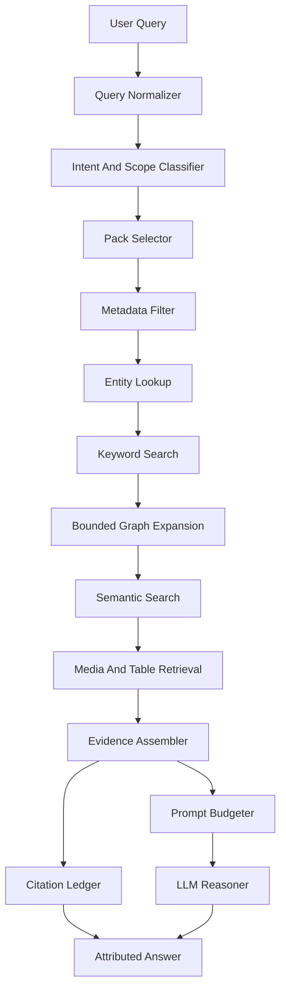

# OGM Retrieval Architecture v1.0

**Status:** draft v1.0 specification  
**Audience:** engineers implementing offline retrieval, ranking, caching, and LLM evidence assembly  
**Primary runtime target:** Raspberry Pi 5, 8 GB RAM, CPU-only, large external Knowledge Volumes  

---

## 1. Purpose

The retrieval engine is the intelligence multiplier for Offgrid Minds. Its
job is to retrieve the smallest sufficient set of trusted evidence from
large Expert Packs and user memory, then provide that evidence to a small
offline LLM for reasoning.

The LLM is not the knowledge store. Retrieval decides what the LLM is allowed
to know for a turn.

### Non-goals

- This specification does not choose one vector database.
- This specification does not require all indexes to be resident in RAM.
- This specification does not permit the LLM to browse entire packs.
- This specification does not define marketplace ranking.

---

## 2. Architecture Overview



Pipeline order is normative. Runtime implementations MAY skip unavailable
optional stages, but MUST preserve the principle that cheap deterministic
filters run before expensive broad retrieval.

---

## 3. Runtime Invariants

- Retrieval MUST happen before LLM invocation for knowledge-grounded answers.
- Retrieval MUST never load an entire Expert Pack.
- Retrieval MUST prefer source-attributed Knowledge Objects over generated
  summaries.
- Retrieval MUST keep a citation ledger for every object provided to the LLM.
- Retrieval MUST return explicit failure when evidence is insufficient.
- Retrieval MUST treat RAM as scarce and storage as expandable.
- Retrieval MUST access packs through Knowledge Volume abstractions.
- Retrieval MUST support operation with zero internet access.

---

## 4. Query Input

The retrieval engine receives a structured request, not only raw text.

```json
{
  "query_id": "qry:2026-07-06T17:00:00Z:abc123",
  "utterance": "How do I clean the carburetor jet on this mower?",
  "locale": "en-US",
  "device_profile": "pi5",
  "session_context": {
    "active_task": "mower will not start",
    "recent_entities": ["ent:small-engine:product:lawn-mower"]
  },
  "user_memory_scope": {
    "enabled": true,
    "allowed_categories": ["owned_equipment", "preferences"]
  },
  "safety_policy": {
    "conservative_domains": ["electrical", "fire_gas", "structural", "automotive_hv", "medical_invasive"]
  },
  "retrieval_budget": {
    "max_objects": 24,
    "max_chunks": 40,
    "max_media": 4,
    "max_prompt_tokens": 1200,
    "latency_target_ms": 2500
  }
}
```

Rules:

- The current user query MUST be preserved verbatim.
- Normalization MUST produce derived fields without replacing the original.
- User memory access MUST be explicit and scoped.
- Safety policy MUST be available before ranking so warnings can be promoted.

---

## 5. Stage 1: Query Normalization

The normalizer produces:

- lowercase/tokenized query terms
- lemmatized or stemmed variants when supported
- measurement normalization
- spelling variants
- locale-aware units
- candidate entities
- quoted exact phrases
- ambiguity markers

The normalizer MUST NOT rewrite user intent in a way that changes meaning.

Example output:

```json
{
  "normalized_terms": ["clean", "carburetor", "jet", "mower"],
  "exact_phrases": ["carburetor jet"],
  "candidate_units": [],
  "candidate_entities": ["carburetor", "jet", "mower"],
  "ambiguities": [
    {
      "term": "jet",
      "candidates": ["carburetor jet", "water jet", "aircraft jet"]
    }
  ]
}
```

---

## 6. Stage 2: Intent and Scope Classification

The classifier estimates query shape:

- `lookup`
- `procedure`
- `troubleshooting`
- `identification`
- `comparison`
- `safety_check`
- `specification`
- `definition`
- `parts_compatibility`
- `image_grounded`

The classifier SHOULD be deterministic or use a small local model. It MUST
be cheap enough to run before broad retrieval.

Classifier output influences:

- pack selection
- object type boosts
- warning promotion
- procedure/table/media retrieval
- answer refusal or uncertainty behavior

---

## 7. Stage 3: Pack Selection

The pack selector chooses candidate packs before opening detailed indexes.

Inputs:

- installed pack manifests
- pack taxonomy
- user-enabled pack list
- locale
- device compatibility
- license policy
- query terms and candidate entities

Rules:

- Disabled packs MUST NOT be searched.
- Incompatible packs MUST NOT be searched except for diagnostics.
- Pack selection MUST be explainable.
- Pack manifests and metadata facets SHOULD remain cached because they are
  small and frequently used.

Output example:

```json
{
  "candidate_packs": [
    {
      "pack_id": "ogm.pack.small-engine-repair",
      "reason": "taxonomy match: repair/small_engine; entity match: carburetor"
    }
  ]
}
```

---

## 8. Stage 4: Metadata Filtering

Metadata filtering narrows the search space without reading object bodies.

Filters include:

- object type
- domain taxonomy
- locale
- source trust tier
- publication or revision date
- license constraints
- safety class
- confidence threshold
- status

Rules:

- `withdrawn` and `draft` objects MUST be excluded from answer grounding.
- `superseded` objects MUST be excluded unless needed for historical context.
- Safety warnings relevant to the query MUST be retained even if they would
  otherwise rank below procedure content.
- Metadata filters MUST be applied before semantic search where possible.

---

## 9. Stage 5: Entity Lookup

Entity lookup maps query terms and session context to canonical entities.

It MUST support:

- exact canonical name lookup
- alias lookup
- abbreviations
- model numbers
- part numbers
- locale variants
- disambiguation candidates

Entity lookup output:

```json
{
  "entities": [
    {
      "entity_id": "ent:small-engine:assembly:carburetor",
      "matched": "carburetor",
      "confidence": 0.99
    },
    {
      "entity_id": "ent:small-engine:part:main-jet",
      "matched": "jet",
      "confidence": 0.82,
      "needs_disambiguation": false
    }
  ]
}
```

Rules:

- High-confidence entity matches SHOULD seed keyword, graph, and semantic
  retrieval.
- Ambiguous entities SHOULD trigger parallel candidate retrieval until
  ranking can resolve them.
- If ambiguity remains material to safety or procedure selection, the answer
  MUST ask a clarifying question.

---

## 10. Stage 6: Keyword Search

Keyword search provides deterministic, explainable recall.

Requirements:

- exact term matching
- phrase matching
- normalized token matching
- field boosts for title, aliases, summary, labels, and source headings
- object type filtering

Keyword search SHOULD return:

- object ID or chunk ID
- matched fields
- term coverage
- positional or proximity score
- source locator hints

Keyword search MUST be available in every v1 Expert Pack.

---

## 11. Stage 7: Bounded Graph Expansion

Graph expansion retrieves nearby objects that are necessary for context.

Examples:

- procedure -> warnings
- procedure -> required tools
- part -> specifications
- symptom -> troubleshooting cases
- diagram -> labeled parts
- entity -> related procedures

Rules:

- Graph traversal MUST be bounded by depth, edge type, and result count.
- Safety edges MUST be expanded before convenience edges.
- The traversal frontier MUST be memory-bounded.
- The runtime MUST avoid unbounded `related_to` expansion.

Suggested Pi 5 defaults:

```yaml
graph_expansion:
  max_depth: 2
  max_edges_examined: 5000
  max_objects_added: 32
  always_expand_edges:
    - has_warning
    - has_specification
    - requires_tool
    - has_diagram
```

---

## 12. Stage 8: Semantic Search

Semantic search is optional but strongly recommended. It should run after
metadata, entity, and keyword narrowing.

Semantic search is used for:

- paraphrased questions
- conceptual similarity
- symptom descriptions
- natural-language procedure lookup
- image captions mapped to textual concepts

Rules:

- Semantic search MUST declare embedding model compatibility.
- Semantic search MUST return object or chunk IDs with vector score.
- Semantic results MUST be source-attributed before they reach the LLM.
- Semantic results MUST NOT outrank exact high-confidence safety warnings.
- If vector indexes are unavailable, the pipeline MUST continue with lexical
  and graph retrieval.

Pi 5 guidance:

- Prefer quantized vector indexes with measured recall.
- Keep only hot vector shards resident.
- Use metadata filters to reduce vector search scope.
- Use small top-k values first, then expand only if evidence is insufficient.

---

## 13. Stage 9: Media, Diagram, Table, and Procedure Retrieval

After candidate objects are known, specialized retrieval fetches support
materials.

### Media

Media retrieval MUST first fetch:

- caption
- labels
- regions
- source locator
- thumbnail path

Full-resolution media SHOULD be loaded only if needed for display or visual
grounding.

### Diagrams

Diagram retrieval SHOULD prefer diagrams linked by graph edges or exact
labels. It MUST return label metadata and source locator before image bytes.

### Tables

Table retrieval MUST support row and column selection. The evidence
assembler SHOULD include only relevant rows, not entire large tables.

### Procedures

Procedure retrieval MUST include:

- applicability
- preconditions
- warnings
- ordered steps
- required tools/materials
- success criteria
- source citations

---

## 14. Ranking

Ranking combines signals into an evidence score.

Recommended scoring components:

```text
final_score =
  metadata_scope_score
  + entity_match_score
  + keyword_score
  + graph_score
  + semantic_score
  + source_quality_score
  + freshness_score
  + safety_priority_score
  - ambiguity_penalty
  - license_penalty
  - deprecated_penalty
```

Rules:

- Ranking MUST be deterministic for the same inputs and pack versions.
- Ranking MUST preserve component scores for debugging.
- Source quality and safety priority MUST be first-class ranking signals.
- Exact entity and part-number matches SHOULD outrank broad semantic matches.
- If top evidence conflicts, the conflict MUST be exposed to the answer
  layer.

Ranking output:

```json
{
  "object_id": "ko:...:procedure:clean-carburetor-main-jet",
  "final_score": 0.91,
  "components": {
    "entity_match": 0.22,
    "keyword": 0.18,
    "graph": 0.11,
    "semantic": 0.16,
    "source_quality": 0.17,
    "safety_priority": 0.07
  }
}
```

---

## 15. Evidence Assembly

The evidence assembler converts ranked objects into a compact evidence pack
for the LLM.

Evidence pack fields:

```json
{
  "query_id": "qry:...",
  "answer_policy": {
    "must_cite": true,
    "admit_uncertainty_if_insufficient": true,
    "max_answer_steps": 4
  },
  "evidence": [
    {
      "evidence_id": "ev:1",
      "object_id": "ko:...",
      "object_type": "procedure",
      "title": "Clean a carburetor main jet",
      "excerpt": "...",
      "warnings": ["ev:2"],
      "citations": ["cit:1"],
      "confidence": 0.94
    }
  ],
  "citations": [
    {
      "citation_id": "cit:1",
      "source_id": "src:manual-001",
      "source_title": "Service Manual",
      "locator": "page 42",
      "revision": "2019 edition",
      "license": "redistributable"
    }
  ],
  "retrieval_diagnostics": {
    "evidence_sufficient": true,
    "ambiguities": [],
    "conflicts": []
  }
}
```

Rules:

- Evidence packs MUST be small enough for the active prompt budget.
- Each evidence item MUST include at least one citation.
- Warnings MUST be included before procedural steps when relevant.
- The assembler MUST prefer relevant excerpts over full object bodies.
- The assembler MUST not hide retrieval uncertainty from the LLM.

---

## 16. LLM Invocation Gate

The LLM MAY be invoked only when:

- retrieval is complete or has failed explicitly
- evidence sufficiency has been evaluated
- citations are attached to all grounding evidence
- prompt budget has been enforced
- safety policy has been applied

If evidence is insufficient, the LLM prompt MUST instruct the model to say
what is missing instead of guessing. For high-risk topics, the system MAY
return a deterministic safety response without invoking the LLM.

---

## 17. Fallback Behavior

Retrieval failure is not an excuse to hallucinate.

Fallback order:

1. Retry with broader metadata filters.
2. Retry with aliases and spelling variants.
3. Retry keyword-only if semantic index is unavailable.
4. Retry semantic-only if keyword index is damaged and semantic is available.
5. Search installed adjacent packs if the user has enabled them.
6. Search scoped user memory if allowed.
7. Return insufficient-evidence result.

The answer layer MUST distinguish:

- no relevant pack installed
- relevant pack installed but no evidence found
- evidence found but low confidence
- evidence found but conflicting
- pack unavailable because the Knowledge Volume is missing
- capability unavailable because an optional index is absent

---

## 18. Caching

Caching MUST improve speed without becoming the knowledge authority.

Cache layers:

- manifest registry cache
- pack metadata cache
- hot entity cache
- hot keyword pages
- graph frontier cache
- vector shard cache
- evidence pack cache
- rendered answer cache, only when policy allows

Rules:

- Caches MUST be invalidated by pack ID, pack version, content revision, and
  index checksum.
- Caches MUST be discardable.
- Caches MUST NOT replace source attribution.
- User memory caches MUST be separated from Expert Pack caches.
- Removable Knowledge Volumes MUST trigger cache stale checks on mount and
  unmount.

---

## 19. Streaming

Retrieval SHOULD stream partial progress internally:

1. pack candidates
2. entity matches
3. keyword candidates
4. graph-expanded warnings
5. semantic candidates
6. assembled evidence
7. final answer

User-facing streaming MAY begin only after the LLM invocation gate has passed
or after a deterministic status response such as "I am checking the service
manual." The system MUST NOT stream speculative facts before citations are
known.

---

## 20. Memory Management

Pi 5 default retrieval budget:

```yaml
pi5_retrieval_memory_budget:
  total_retrieval_mb: 768
  manifest_registry_mb: 16
  metadata_cache_mb: 64
  entity_cache_mb: 96
  keyword_cache_mb: 128
  graph_cache_mb: 96
  vector_cache_mb: 192
  evidence_workspace_mb: 64
  media_metadata_cache_mb: 64
  emergency_free_mb: 48
```

Rules:

- The runtime MUST enforce hard memory ceilings.
- The runtime MUST drop optional caches before dropping required retrieval
  structures.
- The runtime MUST avoid loading full-resolution images unless needed.
- The runtime MUST support canceling retrieval when the user interrupts.
- The runtime MUST degrade gracefully when a large index is on slow storage.

---

## 21. Knowledge Volumes

Retrieval MUST be volume-agnostic.

Supported volume classes:

- `microsd`
- `usb_ssd`
- `internal_storage`
- `workshop_computer`
- `vehicle_dock`
- `local_nas`
- `peer_ogm_device`

The retrieval engine sees:

```json
{
  "volume_id": "vol:workshop-ssd-001",
  "class": "usb_ssd",
  "mount_state": "available",
  "latency_profile": "local_fast",
  "packs": ["ogm.pack.small-engine-repair"]
}
```

Rules:

- Pack paths MUST be resolved by the volume service.
- Volume absence MUST not corrupt pack registry state.
- Peer and NAS volumes MUST be treated as optional local resources, not
  internet dependencies.
- The runtime MUST be able to answer from locally available packs when
  remote local volumes are unavailable.

---

## 22. Personal Memory Integration

User memory is separate from Expert Pack knowledge.

Rules:

- User memory MUST be retrieved through a separate scoped request.
- User memory MUST never overwrite Expert Pack facts.
- Answers MUST distinguish personal context from expert source evidence when
  the distinction matters.
- User memory MUST remain owned by the user and exportable.
- User memory retrieval MUST obey local privacy settings.

Example:

Expert Pack evidence says the mower model uses a specific spark plug gap.
User memory may say the user owns that mower model. The answer may combine
them, but the source citation must still point to the Expert Pack.

---

## 23. Observability

Retrieval logs MUST be local and privacy-aware.

A retrieval trace SHOULD include:

- query ID
- selected packs
- filters applied
- candidate counts by stage
- top object IDs
- ranking component scores
- evidence sufficiency decision
- latency by stage
- cache hit/miss information

Logs SHOULD NOT include full user queries by default. Debug modes MAY include
redacted excerpts when explicitly enabled.

---

## 24. Validation Tests

Every pack SHOULD ship retrieval tests:

```json
{
  "test_id": "rt:clean-carburetor-jet",
  "query": "how do I clean a mower carburetor jet",
  "expected_objects": [
    "ko:ogm.pack.small-engine-repair:procedure:clean-carburetor-main-jet"
  ],
  "expected_warnings": [
    "ko:ogm.pack.small-engine-repair:warning:fuel-vapor-fire-risk"
  ],
  "minimum_confidence": 0.80
}
```

Runtime validators MUST support:

- pack-level retrieval smoke tests
- index consistency checks
- citation completeness checks
- low-memory retrieval tests
- missing-volume behavior tests
- optional-index-disabled tests

---

## 25. Long-Term Compatibility

The retrieval architecture intentionally separates:

- query planning
- pack discovery
- index access
- ranking
- evidence assembly
- LLM invocation

This allows future devices to replace storage engines, embedding models,
graph engines, and UI surfaces without changing the core contract: retrieve
small, cited, trustworthy evidence before reasoning.
